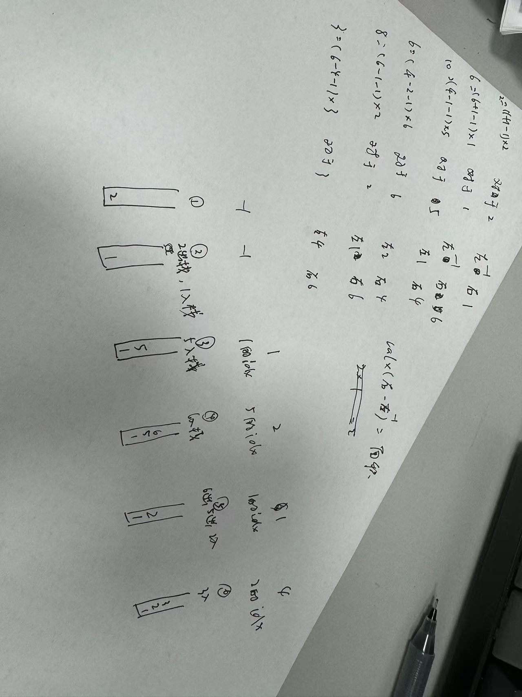
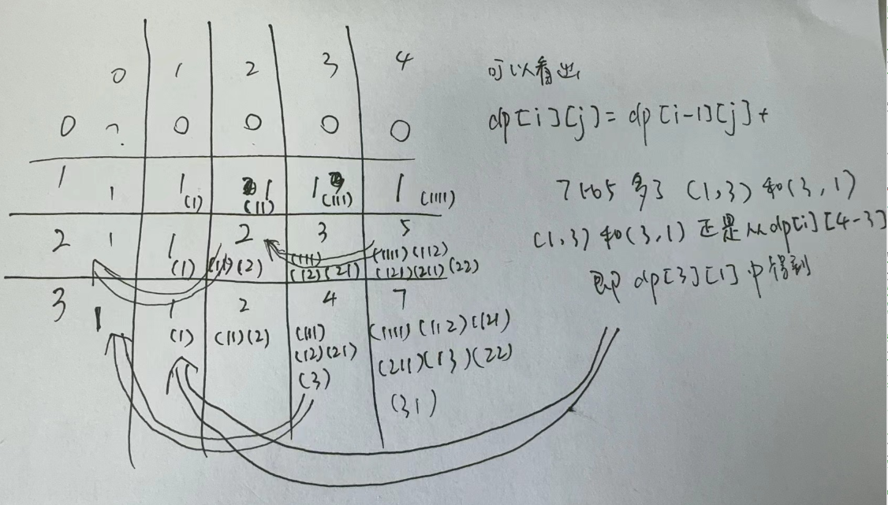

# 单调栈

# TreeMap
我的日程安排表Ⅰ
# 桶排序
LCR 057 存在重复元素Ⅲ
# 优先队列自定义
```java
使用
PriorityQueueImpl<Integer> pq = new PriorityQueueImpl<>(Integer::compare);
PriorityQueueImpl<Integer> pq = new PriorityQueueImpl<>(new Comparator<Interger>(){
    @Override
    public int compare(Integer i1,Integer i2){
        return i2-i1;
    }
});
```

# 回溯
## LCR 079 子集
选或不选
```java
//不选nums[i]
dfs(i+1);

//选nums[i]
path.add(nums[i]);
dfs(i+1);
path.remove(path.size()-1);
```
## LCR 080 组合
可以剪枝
选或不选
```java
if(i>d){//剪枝，剩余可选的数字大于需要选择的数字才进行递归，如果i=d同样不能进入递归，因为不先经过add的dfs(i-1)表示不选
    dfs(i-1);
}
cur.add(i);
dfs(i-1);
cur.remove(cur.size()-1);
```
## LCR 081 组合总和
```java
if(left==0){
    ans.add(new ArrayList<>(path));
    return;
}
if(i==candidates.length || left<0){//其中0可以替换为candidates[i]进一步剪枝
    return;
}
//选
dfs(i+1,left);

//不选 注意dfs里面是i不是i+1
path.add(candidates[i]);
dfs(i,left-candidates[i]);
path.remove(path.size()-1);
```
## LCR 082 组合总和Ⅱ
```java
if(left == 0){
    ans.add(new ArrayList<>(path));
    return;
}
for(int j = i;j<candidates.length;j++){
    if(candidates[j]>left){
        break;
    }
    if(j>i && candidates[j] == candidates[j-1]){//避免重复[1,7] [7,1],
    // 确保dfs(idx,left)  dfs(idx+1,left) , 当candidates[idx]和candidates[idx+1]相同时只递归一次
    // 只递归一次，但不能不递归，否则可能漏掉[1,1,6]这样的答案
        continue;
    }
    path.add(candidates[j]);
    dfs(j+1,left-candidates[j]);
    path.remove(path.size()-1);
}
```
## LCR 083 全排列
维护一个onPath的bool数组，onPath为true时表示被选过，记得恢复现场
```java
if(i==n){
    ans.add(new ArrayList<>(path));
    return;
}
for(int j=0;j<n;++j){
    if(!onPath[j]){
        path.set(i,nums[j]);
        onPath[j] = true;
        dfs(i+1);
        onPath[j] = false;
    }
}
```
## LCR 084 全排列Ⅱ
```java
onPath保证了不会填已经填过的数
要解决重复问题，我们只要设定一个规则，保证在填第 i 个数的时候重复数字只会被填入一次即可。而在本题解中，我们选择对原数组排序，保证相同的数字都相邻，然后每次填入的数一定是这个数所在重复数集合中「从左往右第一个未被填过的数字」

if(i==n){
    ans.add(new ArrayList<>(path));
    return;
}
for(int j=0;j<n;++j){
    //这个判断条件保证了对于重复数的集合，一定是从左往右逐个填入的。假设我们有 3 个重复数排完序后相邻，那么我们一定保证每次都是拿从左往右第一个未被填过的数字，即整个数组的状态其实是保证了 [未填入，未填入，未填入]到 [填入，未填入，未填入]，
    //再到[填入，填入，未填入]，最后到[填入，填入，填入]即[坐标为1的重复数，坐标为2的重复数，坐标为3的重复数]的过程的，因此可以达到去重的目标。
    if(onPath[j] || (j>0 && nums[j] == nums[j-1] && !onPath[j-1])){//剪枝，
                                                                    //若当前数已经被选过了，continue 没什么好说的
                                                                    //          ||后面成立的条件
                                                                    //通俗讲就是当前数和他的上一个数是重复数，
                                                                    //并且上一个数没有被选，需要continue
                                                                    //来保证当前数不会出现在上一个数之前
                                                                    //这样可以保证最左边的重复数最先被填
        continue;
    }
    //这段代码就意味着第一个重复的数第一个用，第二个重复的数第二个用，以此避免重复数不同顺序填入导致的答案重复！
    path.add(nums[j]);
    onPath[j] = true;
    dfs(i+1);
    onPath[j] = false;
    path.remove(path.size()-1);
}
```
## LCR 085 括号生成
```java
//open=左括号
if(i==n*2){
    ans.add(path.toString());
    return;
}
if(open<n){//需要选n个左括号，只要open<n就可以选左括号
    path.append("(");
    dfs(i+1,open+1);
    path.deleteCharAt(path.length()-1);
}
if(i-open<open){//可以填右括号 i-open=右括号，只要右括号<左括号就可以选右括号
    path.append(")");
    dfs(i+1,open);
    path.deleteCharAt(path.length()-1);
}
```
## LCR 086 分割回文串
```java
if (i == s.length()) {
    String[] a = new String[path.size()];       //
    for (int j = 0; j < path.size(); j++) {     //
        a[j] = path.get(j);                     //convert List into String[]
    }                                           //        path          a
    res.add(a);
    return;
}
for (int j = i; j < s.length(); j++) { // 枚举子串的结束位置
    if (isPalindrome(i, j)) {
        path.add(s.substring(i, j + 1));
        dfs(j + 1);
        path.remove(path.size() - 1); // 恢复现场
    }
}
```
## LCR 087 复原IP地址
```java
private void dfs(int i,int count){
    if(i==s.length() && count ==4){
        sb.deleteCharAt(sb.length()-1);
        ans.add(sb.toString());
        return;
    }
    if(count ==4){
        return;
    }
    for(int j=i;j<Math.min(i+3,n);j++){
        if(n-j -1 > (3-count) * 3){//剪枝，若剩余需要放入的数字大于count*3，则直接跳过
            continue;
        }
        int value = InvalidOrValue(i,j);
        if(value ==-1){
            return;
        }
        if(value!=-1){
            StringBuilder tmp = new StringBuilder(sb);
            sb.append(value+".");
            dfs(j+1,count+1);
            sb = tmp;
        }
    }
}
private int InvalidOrValue(int i, int j){//注意长度为1时 i=j
    int len = j-i+1;
    if(len>1 && s.charAt(i)=='0'){
        return -1;
    }
    int res = 0;
    for(int k=i;k<=j;k++){
        res = res*10 + s.charAt(k)-'0';
    }
    if(res >255){
        return -1;
    }
    return res;
}
```
# 动态规划
## LCR 088 爬楼梯
```java
n=9
如果最后一步爬了 1 个台阶，那么我们得先爬到 8，要解决的问题缩小成：从 0 或 1 爬到 8 的最小花费。
如果最后一步爬了 2 个台阶，那么我们得先爬到 7，要解决的问题缩小成：从 0 或 1 爬到 7 的最小花费
dfs(i)定义为从0或1爬到i的最小花费
dfs(i) = dfs(i-1) + cost[i-1]
dfs(i) = dfs(i-2) + cost[i-2]
dfs(i) = min(dfs(i-1) + cost[i-1],dfs(i-2) + cost[i-2])
递归边界dfs(0)=0,dfs(1)=0
1.超出时间限制
private int dfs(int i,int[] cost){
    if(i<=1){
        return 0;
    }
    int res1 = dfs(i-1,cost)+cost[i-1];
    int res2 = dfs(i-2,cost)+cost[i-2];
    return Math.min(res1,res2);
}
2.加缓存
private int dfs(int i,int[] memo,int[] cost){
    if(i<=1){
        return 0;
    }
    if(memo[i]!=-1){
        return memo[i];
    }
    int res1 = dfs(i-1,memo,cost)+cost[i-1];
    int res2 = dfs(i-2,memo,cost)+cost[i-2];
    return memo[i] = Math.min(res1,res2);
}
3.递推：f[i]表示从0或1爬到i的最小花费
int n = cost.length;
int[] f = new int[n+1];
for(int i =2;i<=n;i++){
    f[i] = Math.min(f[i-1]+cost[i-1],f[i-2]+cost[i-2]);
}
return f[n];
```
## LCR 089 打家劫舍
```java
public int rob(int[] nums) {
    //f[i]表示从0或1房屋开始能偷窃到的最高金额
    int n = nums.length;
    if(n==1){
        return nums[0];
    }
    int[] f = new int[n];
    f[0] = nums[0];
    f[1] = Math.max(nums[0],nums[1]);
    for(int i=2;i<n;i++){
        f[i] = Math.max(f[i-2]+nums[i],f[i-1]);
    }
    return f[n-1];
}
```
## LCR 090 打家劫舍Ⅱ
如果偷 nums[0]，那么 nums[1]和 nums[n−1]不能偷，问题变成从nums[2] 到 nums[n−2] 的非环形版本，调用 89 题的代码解决；
如果不偷 nums[0]，那么问题变成从 nums[1]到 nums[n−1] 的非环形版本，同样调用 89 题的代码解决。
```java
public int rob(int[] nums){
    int n = nums.length;
    if(n==1){
        return nums[0];
    }
    if(n==2){
        return Math.max(nums[0],nums[1]);
    }
    return Math.max(
        nums[0]+rob1(Arrays.copyOfRange(nums,2,n-1)),//此句为本题最重要部分
        rob1(Arrays.copyOfRange(nums,1,n))
        );
}
public int rob1(int[] nums) {
    int n = nums.length;
    if(n==0){
        return 0;
    }
    if(n==1){
        return nums[0];
    }
    int[] f = new int[n];
    f[0] = nums[0];
    f[1] = Math.max(nums[0],nums[1]);
    for(int i=2;i<n;i++){
        f[i] = Math.max(f[i-2]+nums[i],f[i-1]);
    }
    return f[n-1];
}
```
## LCR 091 粉刷房子
[红，蓝，绿]
看着像贪心
下面这种情况会如何呢
      i-2          i-1           i
   [1,999,999] [999,1,999] [9999,1,9999]
i-2选了红色，i-1选了蓝色，i不能选蓝色了
若dp[i-3]为[0,0,0]
那么dp[i-2]为[1,999,999]即第i-2号房子被粉刷成红色的最小花费成本为1，蓝色为999，绿色为999
dp[i-1]为[]即第i-1号房子被粉刷成红色的最小花费成本为min(999,999)+999，蓝色为min(1,999)+1，绿色为min(1,999)+999
(看到这里实际上本次粉刷已经考虑到转换上一次粉刷的颜色了，并不是贪心)
```java
public int minCost(int[][] costs) {
    int n = costs.length;
    //dp[i][j] 表示粉刷第0号房子到第i号房子且第i号房子被粉刷成第j种颜色时的最小花费成本。由于一共有n个房子和3种颜色,0<=i<n, 0<=j<3
    int[][] dp = new int[n][3];
    for(int j=0;j<3;j++){
        dp[0][j] = costs[0][j];
    }
    for(int i=1;i<n;i++){
        for(int j=0;j<3;j++){
            dp[i][j] = Math.min(dp[i-1][(j+1)%3],dp[i-1][(j+2)%3])+costs[i][j];//对第i号房子计算
                                                                                //(j+1)%3和(j+2)%3保证了涂的不是相同颜色
        }
    }
    return Arrays.stream(dp[n-1]).min().getAsInt();
}
```
## LCR 092 字符串翻转递增
```java
public int minFlipsMonoIncr(String s) {//通俗讲zero记录的是前面出现的1的次数（反转当前为0的代价）
                                        //one记录的是反转当前为1的代价
                                        //1 1 1 1 1 1 0
    int n = s.length();
    int[] zero = new int[n];//zero[i]表示当前下标转换为'0'使得0~i数组递增的最小转换次数
    int[] one = new int[n];//one[i]表示当前下标转换为'1'使得0~i数组递增的最小转换次数
    zero[0] = s.charAt(0) == '0' ? 0:1;
    one[0] = s.charAt(0) == '0' ? 1:0;
    for(int i=1;i<n;i++){
        if(s.charAt(i)=='0'){
            zero[i] = zero[i-1];//若当前为0，则转换为0不需要操作
            one[i]= Math.min(one[i-1],zero[i-1])+1;//若当前为0，将'0'转换成'1'有两种情况
                                                    //前一位为'0'转换的'1'one[i] = one[i-1] + 1
                                                    //前一位本来就为'1'，one[i] = zero[i-1] + 1
        }else if(s.charAt(i)=='1'){
            zero[i] = zero[i-1]+1;//若当前为1，将1转换为0需要+1
            one[i] = Math.min(one[i-1],zero[i-1]);//若当前为1，将当前的1转换为1本身不需要+1，也有两种情况
                                                    //前一位为'0'转换的'1'one[i] = one[i-1]
                                                    //前一位本来就为'1'，one[i] = zero[i-1]
        }
    }
    //对于   0 0 1 0 1 0来说
    //zero = 0 0 1 1 2 2
    //one  = 1 1 0 1 1 2
    return Math.min(one[n-1],zero[n-1]);
}
```
## LCR 093 最长斐波那契子序列
```java
int n = arr.length,max=0;
int[][] dp = new int[n][n];   //每个斐波那契数列都可以由其最后两位数字精准定位
                                //dp[i][j]表示以i，j为结尾的数列的长度
//每遍历到一个新的数组元素i，就对dp数组中的新的一列进行赋值
for(int i=2;i<n;i++){
    int j=0;                //第一次循环j=0 k=1 i=2 若j+k = i  dp[k][i]=3  
    int k=i-1;              //                     若j+k = i  dp[k][i]=max(dp[j][k]+1,dp[k][i])
    while(j<k){
        if(arr[j]+arr[k] == arr[i]){
            if(dp[j][k]==0){
                dp[k][i]=3;
            }else{
                dp[k][i] = Math.max(dp[j][k]+1,dp[k][i]);
            }
            max = Math.max(max,dp[k][i]);
            j++;k--;
        }
        else if(arr[j]+arr[k]<arr[i]){//只需要j+或者k-就可以找到，可以证明
            j++;
        }else{
            k--;
        }
    }
}
return max;
```
## LCR 094 分割回文串Ⅱ
可以考虑先把判断是否回文缓存到g[][]这样的二维数组中
```java
public int minCut(String s) {
    int n = s.length();
    this.s = s;
    int[] f = new int[n];//f[i]表示字符串0~i的最少分割次数
                            //f[i] = f[j]+1
                            //substring(j+1,i)为回文串，其中0<j<i
    Arrays.fill(f,Integer.MAX_VALUE);
    for(int i=0;i<n;++i){
        if(isPalindrome(0,i)){
            f[i] = 0;
        }else{
            for(int j=0;j<i;++j){
                if(isPalindrome(j+1,i)){
                    f[i] = Math.min(f[i],f[j]+1);
                }
            }
        }
    }
    return f[n-1];
}
private boolean isPalindrome(int i,int j){//长度为1时i=j
    while(i<j){
        if(s.charAt(i)!=s.charAt(j)){
            return false;
        }
        i++;j--;
    }
    return true;
}
```
## LCR 095 最长公共子序列lcs
经典中的经典
```java
int len1 = text1.length();
int len2 = text2.length();
int[][] dp = new int[len1+1][len2+1];//dp[i][j]表示text2的前i个字母和text1的前j个字母中最长子序列的长度
for(int i=1;i<=len2;i++){
    for(int j=1;j<=len1;j++){
        if(text1.charAt(j-1)==text2.charAt(i-1)){
            dp[j][i] = dp[j-1][i-1]+1;
        }else{
            dp[j][i] = Math.max(dp[j][i-1],dp[j-1][i]);
        }
    }
}
return dp[len1][len2];
```
## LCR 096 交错字符串
```java
int len1 = s1.length(),len2 = s2.length(),len3 = s3.length();
if(len1+len2!=len3)return false;

// int[] dp = new int[len3];//dp[i]表示0~i的s3字符串能否被s1和s2表示
boolean[][] dp = new boolean[len1+1][len2+1];//dp[i][j]表示s1的前i个元素和s2的前j个元素能否交织成s3的前i+j个元素
dp[0][0] = true;
for(int i=0;i<=len1;i++){
    for(int j=0;j<=len2;j++){//如果s1的第i个元素和s3的第i+j个元素相等，那么取决于s1的前i-1个元素和s2的前j个元素能否交织成s3的前i+j-1个元素
        if(i>0){
            dp[i][j] = dp[i][j] || (dp[i-1][j] && s1.charAt(i-1) == s3.charAt(i+j-1));
        }
        if(j>0){
            dp[i][j] = dp[i][j] || (dp[i][j-1] && s2.charAt(j-1) == s3.charAt(i+j-1));
        }
    }
}
return dp[len1][len2];
```
## LCR 097 不同的子序列
```java
int slen = s.length(),tlen = t.length();
if(slen<tlen)return 0;
int[][] dp = new int[slen+1][tlen+1];// int[][] dp = new int[slen+1][tlen+1];//dp[i][j]表示在s[:i]的子序列中t[:j]出现的个数
                                    //s从0到下标i的子字符串
                                    //t从0到下标j的子字符串
for(int i=0;i<=slen;i++){//将第一列置1
    dp[i][0] = 1;
}
for(int i=1;i<=slen;i++){
    for(int j=1;j<=tlen;j++){
        if(s.charAt(i-1)==t.charAt(j-1)){
            dp[i][j] = dp[i-1][j-1] + dp[i-1][j];
        }else{
            dp[i][j] = dp[i-1][j];
        }
    }
}
return dp[slen][tlen];
```

## LCR 100 三角形最小路径和
```java
//这样看 + 代表正无穷
//+ 0 + + +
//+ 2 + + +
//+ 3 4 + +
//+ 6 5 7 +
//+ 4 1 8 3
int n = triangle.size();
int[][] dp = new int[n+1][n+1];
for(int i= 0;i<=n;i++){
    dp[i][0]=Integer.MAX_VALUE;
    for(int j=i+1;j<=n;j++){
        dp[i][j] = Integer.MAX_VALUE;
    }
}
dp[0][1]=0;
for(int i= 1;i<=n;i++){
    for(int j=1;j<=i;j++){
        dp[i][j] = Math.min(dp[i-1][j-1],dp[i-1][j]) + triangle.get(i-1).get(j-1);
    }
}
return Arrays.stream(dp[n]).min().getAsInt();
```
## LCR 101 分割等和子集
0-1背包问题
```java
int target = sum/2;
if(maxNum > target){
    return false;
}
boolean[][] dp = new boolean[n][target+1];//dp[i][j]表示从数组的[0,i]下标范围内选取若干个正整数
                                            //是否存在一种选取方案使得被选取的正整数的和等于j(capacity)
                                            //dp[0][nums[0]] = true;
for(int i=0;i<n;i++){//第一列置true，因为容量为0时不选即是一种选取方案使得容量等于0
    dp[i][0]=true;
}
dp[0][nums[0]] = true;
for(int i=1;i<n;i++){
    for(int j=1;j<=target;j++){//capacity为1，2...target时是否存在
        if(j>=nums[i]){//把j理解为capacity，对于当前nums[i]可以选也可以不选
            dp[i][j] = dp[i-1][j] | dp[i-1][j-nums[i]];//dp[i-1][j]保证了若当前的上面为1，则当前为1
            //                               通俗讲也就是如果从一个班里能找出10个男生，那么班里再转来一位同学，必然也能再找出10个男生
            //              不选            选
        }else{//无法选当前nums[i]
            dp[i][j] = dp[i-1][j];
        }
    }
}
return dp[n-1][target];//capacity为target时是否存在
```

## LCR 102 目标和
设其中为正号的数的和为p，所有数的绝对值的和为s，那么其中取负号的数的和为s-p
也就是p-(s-p) = target
即p = (s+target)/2
```java
for (int x : nums) target += x;
if (target < 0 || target % 2 == 1) return 0;
target /= 2;

int n = nums.length;
int[][] dp = new int[n + 1][target + 1];
dp[0][0] = 1;
for (int i = 0; i < n; ++i)
    for (int c = 0; c <= target; ++c)
        if (c < nums[i]) 
            dp[i + 1][c] = dp[i][c];
        else 
            dp[i + 1][c] = dp[i][c] + dp[i][c - nums[i]];
return dp[n][target];
```
设要达到的目标为10，当前值为4
即f[i+1][10] = f[i][10]+f[i][10-4]
即达到10的方案数为达到6的方案数+达到4的方案数（可以简化为一维数组）

## LCR 103 零钱兑换
```java
int n = coins.length;
int[][] dp = new int[n+1][amount+1];//dp[i][j]表示当容量为j时，需要最少的硬币的数量i
                                    //当容量为0时，需要最少的硬币数量为0,即没有任何一种硬币组合能组成总金额，应该置为0
                                    //看题目示例3 coins[1] amount=0 时输出0
                                    //当硬币数量为0时，dp[0][j]也应该设为-1（为了递归设为正无穷）
for(int j=0;j<=amount;j++){
    dp[0][j] = Integer.MAX_VALUE-10;//灵神使用Integer.MAX_VALUE/2 防止溢出
}
for(int i=1;i<=n;i++){
    for(int a=1;a<=amount;a++){
        if(a>=coins[i-1]){
            dp[i][a] = Math.min(dp[i-1][a],dp[i][a-coins[i-1]]+1);//由于可以重复使用，所以左边下标为i，右边下标也为i
                                //dp[i-1][a]表示上一层，当没有选择当前硬币权力的时候，最小的硬币选择数量
        }else{
            dp[i][a] = dp[i-1][a];
        }
    }
}
return dp[n][amount]<=Integer.MAX_VALUE-100 ? dp[n][amount] : -1;//灵神使用 ans < Integer.MAX_VALUE/2
```
## LCR 104 组合总和Ⅳ
错误写法：为什么错误？ 下面这种写法只能保证不同的组合被找出来（集合）           注意是排列数而不是组合数
                    但是题目要求顺序不同的序列被视作不同的组合
```java
int n = nums.length;
int[][] dp = new int[n+1][target+1];//dp[i][j]表示当目标为j时，nums的前i个元素最多有多少种排列组合能够达到j
                                    //dp[i][0]=?，当当前目标为0时，只有不选取这种方案成立 因此为1
                                    //dp[0][j]=0，当当前没有元素时，排列组合数量为0
                                    //状态方程dp[i][j] = dp[i-1][j] + dp[i][j-nums[i]]
                                    //其中dp[i-1][j]表示没有当前数时的排列组合种数，那么加入当前数后不会有影响
for(int i=0;i<=n;i++){
    dp[i][0]=1;
}
for(int i=1;i<=n;i++){
    for(int j=1;j<=target;j++){
        if(j>=nums[i-1]){
            dp[i][j] = dp[i-1][j]+dp[i][j-nums[i-1]];
        }else{
            dp[i][j] = dp[i-1][j];
        }
    }
}
return dp[n][target];
```


正确写法：（注意他把target的循环放到了外面）
为什么下述写法考虑到了选取元素的顺序？
因为外层循环是遍历从1到target的值，内层循环是遍历数组nums的值，在计算dp[i]的值时，nums中的每个小于等于i的元素都可能作为元素之和等于i的排列的最后一个元素。例如，1和3都在数组nums中，计算dp[4]的时候，排列的最后一个元素可以是1也可以是3，因此dp[1]和dp[3]都会被考虑到，即不同的顺序都会被考虑到。
```java
int n = nums.length;
int[] dp = new int [target+1];//dp[i]表示选取的元素之和等于i的方案数，目标是求dp[target]
dp[0] =1;//当目标为0时，只有不选取任何元素这一种方案，所以为1
for(int i = 1;i<=target;i++){//如果存在一种排列，其中的元素之和等于i，则该排列的最后一个元素一定是数组nums中的一个元素
                            //假设该排列的最后一个元素是num，则一定有num<=i，对于元素之和等于i-num的每一种排列
                            //在最后添加num之后即可得到一个元素之和等于i的排列，因此在计算dp[i]时，应该计算所有的dp[i-num]之和
    for(int num:nums){
        if(num<=i){
            dp[i]+=dp[i-num];
        }
    }
}
return dp[target];
```
# 图论 
## LCR 105 岛屿最大面积
```java
// 求每个点的岛屿面积，默认0
int sum = 0;//实时变动的量
public int maxAreaOfIsland(int[][] grid) {
    int res = 0;
    for (int i = 0; i < grid.length; i++) {
        for (int j = 0; j < grid[i].length; j++) {
            // 从每个点开始遍历，若为1才考虑计算岛屿面积
            if (grid[i][j] == 1) {
                // 计算这个点的上下左右个点是否是岛屿
                getLands(grid, i, j);
                // 最大面积保存到res
                res = Math.max(sum, res);
                // 遍历完某个点后，将sum初始化0
                sum = 0;
            }
        }
    }
    return res;
}

public void getLands(int[][] grid, int i, int j) {
    // 边界条件，注意条件中的grid[i][j] != 1 我们只计算grid[i][j] == 1的岛屿面积
    if (i < 0 || i >= grid.length || j < 0 || j >= grid[0].length || grid[i][j] != 1) {
        return ;
    }
    // 未防止重复遍历某个点，当这个点是1时，变为2，同时sum++；
    grid[i][j] = 2;
    sum++;
    // 递归调用求上下左右的点
    getLands(grid, i - 1, j);
    getLands(grid, i, j - 1);
    getLands(grid, i + 1, j);
    getLands(grid, i, j + 1);
}
```
## LCR 106 判断二分图
```java
private static final int UNCOLORED = 0;
private static final int RED = 1;
private static final int GREEN = 2;
private int[] color;
private boolean valid;

public boolean isBipartite(int[][] graph) {
    int n = graph.length;
    valid = true;
    color = new int[n];
    Arrays.fill(color,UNCOLORED);
    for(int i=0;i<n && valid;++i){
        if(color[i] == UNCOLORED){
            dfs(i,RED,graph);
        }
    }
    return valid;
}
public void dfs(int node,int c,int[][] graph){
    color[node] = c;
    int cNei = c == RED ? GREEN :RED;//c的相邻节点的颜色
    for(int neighbor:graph[node]){
        if(color[neighbor]==UNCOLORED){
            dfs(neighbor,cNei,graph);
            if(!valid){
                return;
            }
        }else if(color[neighbor]!=cNei){
            valid = false;
            return;
        }//没有处理color[neighbor]==cNei的情况，因为直接放行即可
    }
}
```
# 手写排序

## 归并排序
```java
public static int[] mergeSort(int[] arr) {
    if (arr.length <= 1) {
        return arr;
    }
    int middle = arr.length / 2;
    int[] arr_1 = Arrays.copyOfRange(arr, 0, middle);
    int[] arr_2 = Arrays.copyOfRange(arr, middle, arr.length);
    return merge(mergeSort(arr_1), mergeSort(arr_2));
}
public static int[] merge(int[] arr_1, int[] arr_2) {
    int[] sorted_arr = new int[arr_1.length + arr_2.length];
    int idx = 0, idx_1 = 0, idx_2 = 0;
    while (idx_1 < arr_1.length && idx_2 < arr_2.length) {
        if (arr_1[idx_1] < arr_2[idx_2]) {
            sorted_arr[idx] = arr_1[idx_1];
            idx_1 += 1;
        } else {
            sorted_arr[idx] = arr_2[idx_2];
            idx_2 += 1;
        }
        idx += 1;
    }
    if (idx_1 < arr_1.length) {
        while (idx_1 < arr_1.length) {
            sorted_arr[idx] = arr_1[idx_1];
            idx_1 += 1;
            idx += 1;
        }
    } else {
        while (idx_2 < arr_2.length) {
            sorted_arr[idx] = arr_2[idx_2];
            idx_2 += 1;
            idx += 1;
        }
    }
    return sorted_arr;
}
```
## 快速排序
```java
入口时调用 Class.quickSort(myarray,0,myarray.length-1)

public static int partition(int[] array, int low, int high) {
    int pivot = array[high];//挑选array的最后一个元素作为pivot
    int pointer = low;//初始pointer在左侧
    for (int i = low; i < high; i++) {//遍历array，若元素小于pivot，则将其与pointer指向的元素交换，同时pointer指向下一个元素
                                        //导致的结果就是比pivot小的元素全部分布于pointer左侧
        if (array[i] <= pivot) {
            int temp = array[i];
            array[i] = array[pointer];
            array[pointer] = temp;
            pointer++;
        }
        System.out.println(Arrays.toString(array));
    }
    //                 1
    //                 1              1
    //                 1      1       1
    //                 1      1   1   1
    //                 1      1   1   1   1
    //      1          1      1   1   1   1
    //      1   1      1      1   1   1   1
    //  1   1   1      1      1   1   1   1
    //              pointer           i pivot
    int temp = array[pointer];//最后将pointer与high（也就是pivot的坐标）交换，把pivot的值换到中间
                                //导致的结果是pointer左侧的元素都比pivot小，右侧的元素都比pivot大，最后返回pointer
    array[pointer] = array[high];
    array[high] = temp;
    //                                    1
    //                                1   1
    //                        1       1   1
    //                        1   1   1   1
    //                 1      1   1   1   1
    //      1          1      1   1   1   1
    //      1   1      1      1   1   1   1
    //  1   1   1      1      1   1   1   1
    //              pointer(pivot)    i 
    return pointer;
}
public static void quickSort(int[] array, int low, int high) {
    if (low < high) {
        int position = partition(array, low, high);//position为pivot的位置
                                                    //position左右已根据array[position]大小分好
        quickSort(array, low, position - 1);
        quickSort(array, position + 1, high);
    }
}
```
## 堆排序
```java
static in heapLen;
private static void swap(int[] arr,int i,int j){
    int tmp = arr[i];
    arr[i] = arr[j];
    arr[j] = tmp;
}
private static void buildMaxHeap(int[] arr){
    for(int i=arr.length/2-1;i>=0;i--){//更新所有非叶子节点，自底向上
        heapify(arr,i);
    }
}
private static void heapify(int[] arr,int i){//保证根节点比俩叶节点大，直到到树底部
    int left = 2*i+1;
    int right = 2*i+2;
    int largest = i;
    if(right < heapLen && arr[right]> arr[largest]){
        largest = right;
    }
    if(left<heapLen && arr[left] >arr[largest]){
        largest = left;
    }
    if(largest!=i){
        swap(arr,largest,i);
        heapify(arr,largest);
    }
}
public static int[] heapSort(int[] arr){
    heapLen = arr.length;
    buildMaxHeap(arr);
    for(int i=arr.length-1;i>0;i--){
        swap(arr,0,i);//将根节点（最大值）与最后一个节点交换
        heapLen -= 1;//移除变为叶节点的最大值
        heapify(arr,0);//对放到根节点的值进行heapify
    }
    return arr;
}
```