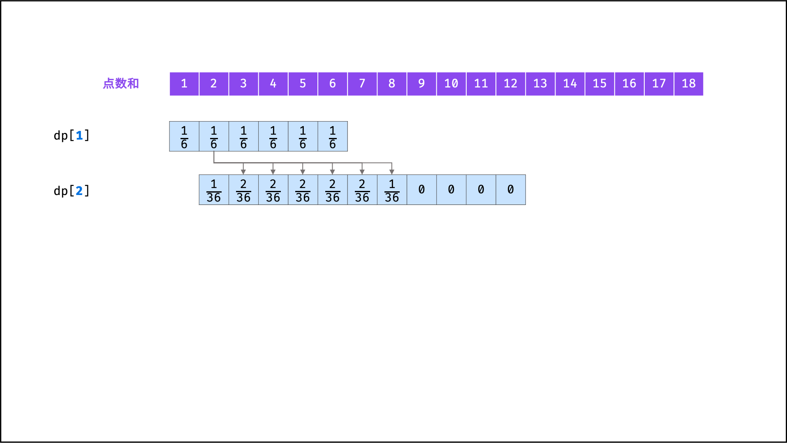

## Java集合

### Arrays静态类方法

```java
void = Arrays.sort(T[], Comparator<? super T>)  
void = Arrays.swap(Object[],int pos1,int pos2)  
boolean flag = Arrays.equals(int[],int[])
void = Arrays.fill(int[] a,int val)//fill a array with val
int[] new = Arrays.copyOf(int[] original,int newLength)//copy 0~newLength of original to new
int[] new = Arrays.copyOfRange(int[] original,int from,int to)
String str = Arrays.toString(int[])
List<T> list = Arrays.asList(T... a)
    e.g. List<String> strings = Arrays.asList("abc", "", "bc", "efg", "abcd","", "jkl");
IntStream stream = Arrays.stream(int[])//重要，返回的是IntStream对象，请看streamAPI部分
```

### String类方法

```java
String str = new String(char value[])
int length = str.length()
boolean flag = str.isEmpty();
char ch = str.charAt(int position)
boolean flag = str1.equals(str2)
boolean flag = str1.equalsIgnoreCase(str2)
boolean flag = str.startsWith(String prefix)
boolean flag = str.endsWith(String suffix)
int index = str.indexOf(int ch)//return 1 if str="hello",ch='e'
//有点奇怪这里用的是int而不是char，JDK是为了兼容Unicode，返回的是首次出现的索引坐标
//可以通过indexOf>-1判断当前字符串中是否存在当前字符
int index = str.indexOf(int ch,int fromIndex)
int index = str.indexOf(String str)//return 6 if str="hello world",ch='world'
int index = str.indexOf(String str,int fromIndex)
int index = str.lastIndexOf(int ch)//省略fromIndex版本
int index = str.lastIndexOf(String str)//省略fromIndex版本
//从后往前遍历 indexOf是从前往后遍历
String newstr = str.substring(int beginIndex)
String newstr = str.substring(int beginIndex,int endIndex)
String newstr = str.toLowerCase()
String newstr = str.toUpperCase()
String newstr = str.trim()//去除前导和后导空格
char[] chars = str.toCharArray()
String corresponding_str = valueOf(char/int/long/float/double)
//String转字符/int/long/float/double
str1.intern()==str2.intern()//比较str1和str2在字符串常量池的值
```

### StringBuilder方法

```java
StringBuilder sb = new StringBuilder(String str/int num)
StringBuilder sb = sb.append(String str/StringBuilder sb/char ch/char[] chars/int num)
StringBuilder sb = sb.delete(int start,int end)
StringBuilder sb = sb.deleteCharAt(int index)
StringBuilder sb = sb.replace(int start,int end,String str)//替换start~end为str
StringBuilder sb = sb.insert(int index,char ch/int num/long/float/double)//在指定位置插入一个基本数据类型
StringBuilder sb = sb.reverse()
StringBuilder sb = sb.toString()
    
//判断两StringBuilder是否相等
sb1.toString().equals(sb2.toString())
```

### 包装类方法

```java
装箱(valueOf)：创建包装类实例的过程
    Xxx Element = Xxx.valueOf(xxx element)//Xxx为包装类型，xxx为基本数据类型
    Character Ch = Character.valueOf(char ch)
    Integer Num = Integer.valueOf(int num)
拆箱(xxxValue)：将包装类实例转换为基本数据类型的过程
    xxx element = Element.XxxValue()
    char ch = Ch.charValue()
    int num = Num.intValue()

Character:
	String str = Character.toString(char ch)//静态方法，不需要实例，基本类型转换到String使用
    boolean flag = Character.isLetterOrDigit(char ch)
    boolean flag = Character.isLetter(char ch)
    boolean flag = Character.isDigit(char ch)
    boolean flag = Character.isLowerCase(char ch)
    boolean flag = Character.isUpperCase(char ch)
    char new_ch = Character.toLowerCase(char old_ch)
    char new_ch = Character.toUpperCase(char old_ch)
Integer:
	String str = Integer.toString(int i)//静态方法，不需要实例，基本类型转换到String使用
    int num = Integer.parseInt(String str)//静态方法，不需要实例，String转换到基本类型使用
    Integer Num = Integer.valueOf(String str)//静态方法，不需要实例，String转换到包装类使用
    String str = Num.toString()//非静态方法，需要实例，将包装类转换到String使用
```


### Comparator函数式接口

```java
函数式接口(Functional Interface)就是一个有且仅有一个抽象方法，但是可以有多个非抽象方法的接口。
函数式接口可以被隐式转换为 lambda 表达式。
Comparator的抽象方法为 int compare(T o1,T o2);

PriorityQueue<int[]> queue = new PriorityQueue<int[]>(new Comparator<int[]>(){
    public int compare(int[] m,int[] n){
        return m[1]-n[1];
    }
});

var pq = new PriorityQueue<int[]>((a,b)->a[0]-b[0]);

Arrays.sort(intervals,(interval1,interval2)-> interval1[0]-interval2[0]);
Arrays.sort(intervals,Comparator.comparingInt(a->a[0]));

var cmp = new Comparator<Integer>(){
    public int compare(Integer a,Integer b){
        if(map.containsKey(a) && map.containsKey(b)){
            return map.get(a)-map.get(b);
        }else if(map.containsKey(a)) return -1;
        else if(map.containsKey(b)) return 1;
        else return a-b;
    }
};

Arrays.sort(strs,(o1,o2)->(o1+o2).compareTo(o2+o1));
```

### Collection接口的方法

```java
size()   isEmpty()	 iterator()	  stream()    contains()
```

### ArrayList方法

```java
List<T> list = new ArrayList<T>()
boolean flag = list.isEmpty()
int size = list.size()
int index = list.indexOf(Object)//返回第一个出现的索引坐标，也可以当作contains用
int index = list.lastIndexOf(Object)
Object[] array = list.toArray()
E element = list.get(int index)
E oldValue = list.set(int index,E newValue)
//其实set是有返回值的，是oldValue，但是一般不使用
boolean flag = list.add(E element)
//add操作也是有返回值的，为true，但一般不使用，不指定位置就是在末尾插入
void = list.add(int index,E element)
E oldValue = list.remove(int index)
//remove操作同理也有一般不使用的返回值，常用场景为list.remove(list.size()-1)，即移除末尾元素
void = list.removeRange(int fromIndex,int toIndex)
void = list.clear()//移除list中所有元素
    
Iterator<E> itr = list.iterator()//得到一个list的迭代器，E是list内的元素类型
while(itr.hasNext()){
    E element = iterator.next();
    sout(element);
}
void = list.forEach(Consumer<? super E> action)//forEach用法，实际还是在用iterator
list.forEach(element->System.out.println(element));

void = list.sort(Comparator<? super E> c)//Comparator
```

### ArrayDeque方法

```java
Deque<T> deque = new ArrayDeque<T>()

add,removeLast								push,pop
		队尾	----------------------	队首
offer										poll,peek,remove
```

### HashMap方法

```java
Map<K,V> map = new HashMap();//K是key的类型，V是value的类型
int size = map.size();
boolean flag = map.isEmpty();
V value = map.get(Object key);
boolean flag = map.containsKey(Object key);
boolean flag = map.containsValue(Object value);
V oldvalue或null = map.put(K key,V value)//取决于put是覆盖操作(返回oldvalue)还是新增操作(返回null)
//put底层调用了putVal，不再进一步分析
V oldvalue或null = map.remove(Object key)//返回值取决于是否有Key为key的键
void = map.clear()
    
Set<K> keyset = map.keySet()
Collection<V> value = map.values()		//这三个方法比较重要，keyset,valueset,entryset
Set<Map.Entry<K,V>> entryset = map.entrySet()
    
V value = map.getOrDefault(Object key,V defaultValue)
V oldvalue或null = map.putIfAbsent(K key,V value)
//putIfAbsent底层也调用了putVal，putIfAbsent当遇到已存在的key时不会覆盖，只会返回oldvalue
V value = map.merge(K key,V value,BiFunction remappingFunction)//应该不用掌握
```

### StreamAPI（Stream接口方法）

pipeline中分为

中间节点intermediate（可以有多个，是懒节点，懒加载，不会立马执行，只是记录了操作，而是遇到终值节点才会执行）

终值节点terminal（只能有一个，只能放在最后面，不是懒加载的，只要执行了终值节点，那么首先会去请求上一个节点，一直迭代到请求第一个节点，聚合操作。）

如何判断中间节点还是终值节点？看方法的返回值是不是Stream流或子类，如果是，那就是中间节点。

**peek()和forEach()作用都是执行一个函数，区别在于peek是中间节点，forEach是终值节点**

影响方式：

1. 过滤(filter)
2. 转换(map)
3. 去重(distinct)

采集：

1. list（`List<T> list = ... .collect(Collectors.toList())`）toSet同理
2. map（`Map<T,E> map = ... .collect(Collectors.toMap(mapfuc1,mapfuc2))`）
3. group by（`... .collect(Collectors.groupingBy())`）
4. 数组（`T[] t = .toArray()`）
5. 求出最大值
6. 求任意值

```java
数据流的来源：可以是集合、数组
集合和数组如何创建stream流？ collection 有stream方法，通过StreamSupport来创建stream对象。

流的创建：
    appleStore.stream()
    Arrays.stream(new int[]{1,2,3,4})
    Stream.of(1,2,3,4)
演示代码初始化：
    appleStore.add(new Apple(1,"red",500,"湖南"));
    appleStore.add(new Apple(2,"red",400,"湖南"));
    appleStore.add(new Apple(3,"green",300,"湖南"));
    appleStore.add(new Apple(4,"green",200,"天津"));
    appleStore.add(new Apple(5,"green",100,"天津"));
流的不可重复使用性：
    Stream<Apple> stream1 = appleStore.stream();
    Stream<Apple> stream2 = stream1.filter(a -> a.getColor().equals("red"));
    //stream3已找不到stream1，流只能顺序执行，不能分支执行（流的不可重复使用性）
    Stream<Apple> stream3 = stream1.filter(a -> a.getWeight() > 100);
中间节点和终值节点：
    appleStore.stream().filter(a->{
        System.out.println(a.getColor());
    	return true;
	}).toArray();
	//toArray()是终值节点，一旦被执行，那么中间节点会被执行
流的执行特性：是一个数据经过管道到达终值节点，再一个数据经过管道到达终值节点
    appleStore.stream()
    	.peek(a->System.out.println(a.getColor()))
    	.peek(a->System.out.println(a.getWeight()))
    	.toArray();
	//从结果可以看出 red 500 | red 400 | green 300
	//而不是		 red red green | 500 400 300
流的执行特性：上一个节点可以影响下一个节点,影响方式有 过滤(filter) 转换(map) 去重(distinct)
    appleStore.stream()
    	.filter(a->a.getColor().equals("red"))
    	.peek(a->System.out.println(a.getColor()+":"+a.getWeight()))
    	.toArray();
	//结果为red:500 | red:400，这里就是 过滤 的影响
    appleStore.stream()
    	.filter(a->a.getColor().equals("red"))
        .map(a->a.getColor())//这里的a为Apple类型
    	.peek(a->System.out.println(a)//这里的a为String类型
    	.toArray();
	//结果为red | red，这里就是 过滤+转换 的影响
```

```java
    appleStore.stream()
    	.filter(a->a.getColor().equals("red")||a.getColor().equals("green"))
        .map(a->a.getColor())//这里的a为Apple类型
        .distinct()
    	.peek(a->System.out.println(a)//这里的a为String类型
    	.toArray();
        //输出 red | green
        //IDEA 调试图如下
```


```java
演示流的采集：
    Map<Integer,Apple> map = appleStore.stream()
    	.collect(Collectors.toMap(a->a.getId(),a->a));
```

| 方法     | 描述                                                         | 操作类型         |
| -------- | ------------------------------------------------------------ | ---------------- |
| filter   | 接受一个Boolean表达式来过滤元素<br />.filter(obj->obj.getAttribute().equals(xxx)) | 中间操作         |
| map      | 将流中元素1：1映射成另外一个元素<br />.map(obj->Integer.parseInt(obj))将流中元素映射成Integer<br />返回值是Stream<Integer>，而mapToInt返回的是IntStream | 中间操作         |
| mapToInt | 将流中元素映射成int，mapToLong、mapToDouble<br />返回值是IntStream，存的是int基本数据类型，性能高<br />sum(), average(),min(),max(),count()等是IntStream重写的方法 | 中间操作         |
| boxed    | IntStream转换为Stream<Integer>                               | 中间操作         |
| flatMap  | 处理一对多的转换，如map返回的是一个List，将会进一步拆分。<br />通过传入一个mapper函数来进行拆分<br />orders.flatMap(order -> order.getLineItems().stream())<br />Stream<String> lines = Files.lines(path, StandardCharsets.UTP_8)<br />Stream<String> words = lines.flatMap(line -> Stream.of(line.split(" +"))) | 中间操作         |
| distinct | 基于equal表达式去重                                          | 中间操作         |
| sorted   | 若无参数，如果没有实现Comparable，抛ClassCastException<br />也可以传一个Comparator作为参数 | 中间操作         |
| peek     | 参数是一个Consumer类型的action，对流中元素做一次操作<br />遍历流中所有元素，如forEach。不同在于不会结束流 | 中间操作         |
| limit    | 根据传入参数，截断流的长度                                   | 中间操作         |
| forEach  | 参数也是Consumer类型的action，遍历流中所有元素               | ==**终值操作**== |
| toArray  | 将流中元素转换成一个数组返回                                 | ==**终值操作**== |
| getAsInt | IntStream的max(),min(),reduce()操作返回一个OptionalInt<br />用OptionalInt的getAsInt()方法来转换，而sum()返回的是int，不需要操作 | ==**终值操作**== |
| reduce   | 归约合并操作，sum,min,max,average是特殊的reduce操作<br />对流中元素加和：Integer sum = intergers.reduce(0, (a,b) -> a+b) | ==**终值操作**== |
| collect  | 采集数据，返回一个新的结果<br />参数说明：<br />Supplier<R>：采集需要返回的结果<br />BiConsumer<R, ? super T>：传递结果与元素进行合并<br />BiConsumer<R,R>：在并发执行的时候 结果合并操作 | ==**终值操作**== |
| of       | 用来创建流                                                   | 初始操作         |

```java
reduce：
    参数是BinaryOperator接口，定义了一个apply方法（2输入1输出）
    负责把上次累加的结果和本次的元素进行运算，并返回累加的结果
    int sum = Stream.of(1,2,3,4,5,6,7,8,9).reduce(0,(acc,n)->acc+n);//45
    ||
	Stream<Integer> stream = ...
    int sum = 0;
	for(n : stream){
        sum = (sum,n) -> sum + n;
    }//45

	上面reduce内的0是初始值的意思，如果去掉reduce内的0，返回的是一个Optional<Integer>
	int s = Stream.of(1,2,3,4,5,6,7,8,9).reduce(1,(acc,n)->acc*n)//362880

    Optional<Integer> opt = stream.reduce((acc,n)->acc+n)
    if(opt.isPresent()){
        sout(opt.get())
    }

	将配置文件的每一行配置通过map()和reduce()操作聚合成一个Map<String,String>:
    List<String> props = List.of("profile=native", "debug=true", "logging=warn", "interval=500");
    Map<String, String> map = props.stream()
        // 把k=v转换为Map[k]=v:
        .map(kv -> {
            String[] ss = kv.split("\\=", 2);
            return Map.of(ss[0], ss[1]);
        })
        // 把所有Map聚合到一个Map:
        .reduce(new HashMap<String, String>(), (m, kv) -> {
            m.putAll(kv);
            return m;
        });
    // 打印结果:
    map.forEach((k, v) -> {
        System.out.println(k + " = " + v);
    });

collect：
    toList:
    	把Stream的每个元素收集到List的方法是调用.collect()并传入Collectors.toList()对象，它实际上是一个Collector实例，通过类似reduce()的操作，把每个元素添加到一个收集器中（实际上是ArrayList）。类似的，collect(Collectors.toSet())可以把Stream的每个元素收集到Set中。
    toMap:
        Stream<String> stream = Stream.of("APPL:Apple", "MSFT:Microsoft");
        Map<String, String> map = stream
            .collect(Collectors.toMap(
                // 把元素s映射为key:
                s -> s.substring(0, s.indexOf(':')),//mapperfunction1
                // 把元素s映射为value:
                s -> s.substring(s.indexOf(':') + 1)));//mapperfunction2
	to[]:
		List<String> list = List.of("Apple", "Banana", "Orange");
		String[] array = list.stream().toArray(String[]::new);
	groupingBy:
		List<String> list = List.of("Apple", "Banana", "Blackberry", "Coconut", "Avocado", "Cherry", "Apricots");
        Map<String, List<String>> groups = list.stream()
                .collect(Collectors.groupingBy(s -> s.substring(0, 1), Collectors.toList()));
		结果：
		{
            A=[Apple, Avocado, Apricots],
            B=[Banana, Blackberry],
            C=[Coconut, Cherry]
        }
		分组输出使用Collectors.groupingBy()，它需要提供两个函数：一个是分组的key，这里使用s -> s.substring(0, 1)，表示只要首字母相同的String分到一组，第二个是分组的value，这里直接使用Collectors.toList()，表示输出为List
		
    
ArrayList转 对应的 基本数据类型的数组
ArrayList<Integer> ans to int[]: ans.stream().mapToInt(Integer::intValue).toArray();

基本数据类型数组int[]转 List (涉及IntStream到Stream<Integer>的转换)
List<Integer> list = Arrays.stream(array).boxed().collect(Collectors.toList());

取基本数据类型数组int[] nums的最大值,和
total = Arrays.stream(nums).sum()   		是否需要加getAsInt()？ sum不需要，max需要
max = Arrays.stream(nums).max().getAsInt()
```

### 存储图论中的边
map和list均可
Map<Character,List<Character>> edges = new HashMap()
edges.putIfAbsent(c,new ArrayList<Character>())//先初始化好，防止空指针异常
List<Character> edge = edges.get(ch)

List<List<Integer>> edges = new ArrayList()
edges.add(new ArrayList<Integer>())//先初始化好，防止空指针异常
List<Integer> edge = edges.get(i)

# 位运算
## LCR 004 只出现一次的数字Ⅱ
除某个元素仅出现一次外，其余每个元素都恰出现三次
```java
int ans = 0;
for(int i =0;i<32;i++){
    int cnt1 = 0;
    for(int x:nums){
        cnt1 += ((x >> i) & 1);//所有nums数中的第i位之和（1的个数） 如果某不是目标数的元素当前位为1，那么加了3次1，模3之后必定为0
    }
    if(cnt1%3!=0){
        ans |= (1 << i);//所以模3之后为1的必是因为目标数的i位为1
    }
}
return ans;
```
## LCR 005 最大单词长度乘积
words = ["abcw","baz","foo","bar","fxyz","abcdef"]
这两个单词为 "abcw", "fxyz"。它们不包含相同字符，且长度的乘积最大。
```java
int length = words.length;
int[] masks = new int[length];
for(int i=0;i<length;i++){
    String word = words[i];
    int wordLength = word.length();
    for(int j=0;j<wordLength;j++){
        masks[i] |= 1 << (word.charAt(j)-'a');//masks记录了words数组中各位的与'a'的偏移量
    }
}
int maxProd = 0;
for(int i=0;i<length;i++){
    for(int j=i+1;j<length;j++){
        if((masks[i]&masks[j])==0){
            maxProd = Math.max(maxProd,words[i].length()*words[j].length());
        }
    }
}
return maxProd;
```
## LCR 067 数组中两个数的最大异或值

```java
int max = Arrays.stream(nums).max().getAsInt();
int highBit = 31 - Integer.numberOfLeadingZeros(max);

int ans = 0,mask=0;
Set<Integer> seen = new HashSet<>();
for(int i=highBit;i>=0;i--){//从最高位开始枚举，因为数大不大看的是最高位为1的位置是否靠前
    seen.clear();
    mask = mask | (1 << i);//mask: 0b111100000000（mask是一个高位不断置1的数）
    int newAns = ans | (1<<i);//先假设ans的第i位可以为1，保存为newAns
    for(int x:nums){//遍历所有的nums
        x = x & mask;//低于i的比特位置为0
        if(seen.contains(newAns ^ x)){
            ans  = newAns;//若ans的第i位真的可以为1，更新ans
            break;
        }
        seen.add(x);//对于i=3来说，newAns=11100 add(00000) add(01000) add(00100) add(11000)
                                //     x=          00000      01000      00100      11000
                                //newAns=11100=    11100      11100      11100      11100
                                //newAns ^ x=      11100      10100      11000      00100(与set中的元素重复)
    }
}
return ans;
```
## LCR 177 撞色搭配
```java
//因为相同的数字异或为0，任何数字与0异或结果是其本身。
//所以遍历异或整个数组最后得到的结果就是两个只出现一次的数字异或的结果：即 z = x ^ y
int z = 0;  
for(int i : nums) z ^= i;
//我们根据异或的性质可以知道：z中至少有一位是1，否则x与y就是相等的。
//我们通过一个辅助变量m来保存z中哪一位为1.（可能有多个位都为1，我们找到最低位的1即可）。
//举个例子：z = 10 ^ 2 = 1010 ^ 0010 = 1000,第四位为1.
//我们将m初始化为1，如果（z & m）的结果等于0说明z的最低为是0
//我们每次将m左移一位然后跟z做与操作，直到结果不为0.
//此时m应该等于1000，同z一样，第四位为1.
int m = 1;
while((z & m) == 0) m <<= 1;
//我们遍历数组，将每个数跟m进行与操作，结果为0的作为一组，结果不为0的作为一组
//例如对于数组：[1,2,10,4,1,4,3,3]，我们把每个数字跟1000做与操作，可以分为下面两组：
//nums1存放结果为0的: [1, 2, 4, 1, 4, 3, 3]
//nums2存放结果不为0的: [10] (碰巧nums2中只有一个10，如果原数组中的数字再大一些就不会这样了)
//此时我们发现问题已经退化为数组中有一个数字只出现了一次
//分别对nums1和nums2遍历异或就能得到我们预期的x和y
int x = 0, y = 0;
for(int i : nums) {
    //这里我们是通过if...else将nums分为了两组，一边遍历一遍异或。
    //跟我们创建俩数组nums1和nums2原理是一样的。
    if((i & m) == 0) x ^= i;
    else y ^= i;
}
return new int[]{x, y};
```
## LCR 190 加密运算
不使用四则运算符 计算两数之和


```java
while(dataB != 0){//当进位为0时跳出
    int c = (dataA & dataB) << 1;//c=进位
    dataA ^= dataB;//dataA=非进位和
    dataB = c;//dataB=进位
}
return dataA;
```
# 贪心

## HOT 100 跳跃游戏Ⅱ

```java
public int jump(int[] nums) {
    int end = 0;
    int maxPosition = 0;
    int steps = 0;
    for(int i=0;i<nums.length-1;i++){
        //找能跳的最远的
        maxPosition = Math.max(maxPosition,nums[i]+i);
        if(i==end){
            end = maxPosition;
            steps++;
        }
    }
    return steps;
}
```

# 双指针

## LCR 139 训练计划Ⅰ（将奇数放前面，偶数放后面）
1.指针left从左向右寻找偶数
2.指针right从右向左寻找技术
3.将偶数actions[i]和技术actions[j]交换
```java
int left =0,right= actions.length-1;
while(left<right){
    while(left<right && (actions[left]&1)==1)left++;
    while(left<right && (actions[right]&1)==0)right--;
    int tmp = actions[left];
    actions[left] = actions[right];
    actions[right] = tmp;
}
return actions;
```
## LCR 006 两数之和Ⅱ-输入有序数组
对于有序数组，找两数之和等于target，只需要初始化两指针不断对向移动即可，可以数学证明不会漏掉
## LCR 007 三数之和
```java
if(nums.length<=2) return new ArrayList<>();
Arrays.sort(nums);
List<List<Integer>> lists = new ArrayList<>();
for(int i=0;i<nums.length-2;i++){//首先固定一个nums[i]，后从nums[i+1]~nums[length-1]寻找（n^2）的复杂度
    if(nums[i]>0)break;
    if(i>0 && nums[i] == nums[i-1])continue;
    int l=i+1,r=nums.length-1;
    while(l<r){
        if(l>i+1 && nums[l]==nums[l-1]){
            l++;
            continue;
        }
        int lrSum = nums[l]+nums[r];
        if(lrSum == -nums[i]){
            lists.add(Stream.of(nums[i],nums[left],nums[right]).collect(Collectors.toList()));
            l++;
            r--;
        }
        else if (lrSum<-nums[i])l++;
        else r--;
    }
}
return lists;

for(int i=0;i<n-2;i++){
    if(nums[i]>0){
        break;
    }
    if(i>=1 && nums[i]==nums[i-1]){
        continue;
    }
    //简化为在i~n之间寻找和为-nums[i]的对
    int left = i+1;
    int right = n-1;
    while(left<right){
        if(nums[left]+nums[right]<-nums[i]){
            left++;
        }else if(nums[left]+nums[right]>-nums[i]){
            right--;
        }else{
            ans.add(Stream.of(nums[i],nums[left],nums[right]).collect(Collectors.toList()));
            while(left<right && nums[left]==nums[left+1])
                left++;
            left++;
            while(left<right && nums[right]==nums[right-1])
                right--;
            right--;
        }
    }
```
## LCR 009 乘积小于K的子数组
[10,5,2,6], k = 100
[10], [5], [2], [6], [10,5], [5,2], [2,6], [5,2,6]
滑动窗口
但是注意滑到[5][2][6]时，[2][6],[6]都是符合题意的
即l r符合时
l+1,r l+2,r l+3,r ... r-1,r都是符合的
所以ans+= right-left+1
```java
if(k<=1)return 0;
int ans = 0,n=nums.length,prod=1,left=0;
for(int right = 0;right<n;++right){
    prod *= nums[right];
    while(prod>=k){
        prod /= nums[left++];
    }
    ans += right-left +1;//重要
}
return ans;
```
## LCR 010 和为K的子数组
不可以使用滑动窗口，因为有负数
需要使用前缀和来防止超时，同时计算两次也会超时，所以需要边构建前缀和边判断
```java
int ans=0,n=nums.length,pre=0;
HashMap<Integer,Integer> mp = new HashMap<>();//key是sum的值，value是当前sum值出现过的次数
mp.put(0,1);//一开始我们需要初始化一个int sum=0用于统计和，自然sum=0就出现一次了
for(int i=0;i<n;i++){
    pre += nums[i];//计算前缀和
    if(mp.containsKey(pre-k)){//有点像动态规划
        ans += mp.get(pre-k);
    }
    mp.put(pre,mp.getOrDefault(pre,0)+1);
}
return ans;
```
## LCR 011 连续数组
0和1的数量相同 等价于 1的数量减去0的数量等于0
可以将数组中的0视为-1，原问题转换成 求最长的连续子数组，其元素和为0
于是需要前缀和
```java
int maxLength = 0;
Map<Integer,Integer> map = new HashMap<>();//key为前缀和，value为最早出现的坐标
int counter=0;
map.put(counter,-1);
int n = nums.length;
for(int i=0;i<n;i++){
    int num = nums[i];
    if(num==1){
        counter++;
    }else{//若为0，减1
        counter--;
    }
    if(map.containsKey(counter)){//若有值，表示当前的counter对应的坐标i，和之前第一次出现当前和为counter对应的坐标prevIndex
                                    //两个减一减为0，所以是一段有效的子数组，所以可以更新最大长度
        int prevIndex = map.get(counter);
        maxLength = Math.max(maxLength,i-prevIndex);
    }else{
        map.put(counter,i);
    }
}
return maxLength;
```
## LCR 013 二位区域和检索-矩阵不可变
由于时间要求，需要保存前缀和来实现快速检索

```java
int[][] sums;

public NumMatrix(int[][] matrix) {
    int m = matrix.length;
    if (m > 0) {
        int n = matrix[0].length;
        sums = new int[m + 1][n + 1];
        for (int i = 0; i < m; i++) {
            for (int j = 0; j < n; j++) {
                sums[i + 1][j + 1] = sums[i][j + 1] + sums[i + 1][j] - sums[i][j] + matrix[i][j];
            }
        }
    }
}

public int sumRegion(int row1, int col1, int row2, int col2) {
    return sums[row2 + 1][col2 + 1] - sums[row1][col2 + 1] - sums[row2 + 1][col1] + sums[row1][col1];
}
```
## LCR 017 最小覆盖字串
返回 s 中包含 t 的所有字符的最短子字符串
输入：s = "ADOBECODEBANC", t = "ABC"
输出："BANC" 
实际上也是一个滑动窗口
```java
Map<Character,Integer> ori = new HashMap<>();//记录了短的字符串的信息
Map<Character,Integer> cnt = new HashMap<>();

public String minWindow(String s, String t) {
    int tLen = t.length();
    for (int i=0;i<tLen;i++){
        char c = t.charAt(i);
        ori.put(c,ori.getOrDefault(c,0)+1);//获取map中key为c的值并+1，若没有，返回0并+1
    }
    int l=0,r=-1;
    int len = Integer.MAX_VALUE,ansL=-1,ansR=-1;
    int sLen = s.length();
    while(r<sLen){
        ++r;
        if(r<sLen && ori.containsKey(s.charAt(r))){//如果ori里包含则加入
            char c = s.charAt(r);
            cnt.put(c,cnt.getOrDefault(c,0)+1);
        }
        while(check() && l<=r){//满足条件并更新最小长度
            if(r-l+1<len){
                len=r-l+1;
                ansL=l;
                ansR=l+len;
            }
            char c = s.charAt(l);//滑动窗口最左侧字符
            if(ori.containsKey(c)){//如果最左侧字符在ori中，踢出最左侧字符
                cnt.put(c,cnt.getOrDefault(c,0)-1);
            }
            ++l;
        }
    }
    return ansL == -1 ? "" : s.substring(ansL,ansR);
}

public boolean check(){
    Iterator iter = ori.entrySet().iterator();//若cnt尚未达到ori 返回false
    while(iter.hasNext()){
        Map.Entry entry = (Map.Entry)iter.next();
        Character key = (Character)entry.getKey();//ori的key
        Integer val = (Integer)entry.getValue();//ori的value
        if(cnt.getOrDefault(key,0)<val){//若cnt中的key对应的value小于ori的 返回false
            return false;
        }
    }
    return true;
}
```
## LCR 019 验证回文串Ⅱ
判断删除一个字符能否得到一个回文字符串
```java
public boolean validPalindrome(String s) {
    int low=0,high=s.length()-1;
    while(low<high){
        char c1 = s.charAt(low),c2=s.charAt(high);
        if(c1==c2){//先慢慢向中心收缩
            ++low;
            --high;
        }else{//如果碰到不相等，判断去掉left是否相等，去掉right是否相等
            return validPalindrome(s,low,high-1) || validPalindrome(s,low+1,high);
        }
    }
    return true;
}
public boolean validPalindrome(String s,int low,int high) {
    for(int i=low,j=high;i<j;++i,--j){
        char c1 = s.charAt(i),c2=s.charAt(j);
        if(c1 !=c2){
            return false;
        }
    }
    return true;
}
```
## LCR 020 回文子串
s = "aaa"
6个回文子串: "a", "a", "a", "aa", "aa", "aaa"
枚举所有字串，并判断回文（复杂度太高）
中心拓展法
枚举每一个可能的回文中心，然后用两个指针分别向左右两边拓展，当两个指针指向的元素相同的时候就拓展，否则停止拓展。
需要修改一下原始字符串
"aaa"->"#a#a#a#"
 str    newstr
```java
int n=s.length(),ans=0;
for(int i=0;i<2*n-1;++i){//枚举回文中心，以i为newstr.charAt(i)为中心
    int l=i/2,r=i/2+i%2;
    while(l>=0 && r<n && s.charAt(l) == s.charAt(r)){
        --l;
        ++r;
        ++ans;
    }
}
return ans;
```
动态规划写法
```java
public int countSubstrings(String s) {
    int n=s.length();
    char sChar[]=s.toCharArray();
    int res=0;
    boolean dp[][]=new boolean [n][n];
    for(int j=0; j<n; j++){
        for(int i=j;i>=0;i--){
            if(sChar[i]==sChar[j] && (j-i<3 || dp[i+1][j-1])) {
                dp[i][j]=true;
                res++;
            }
        }
    }
    return res;
}
```
## LCR 170 交易逆序对的总数(归并排序)

```java
public int reversePairs(int[] record) {
    int len = record.length;
    if(len<2)return 0;
    //为什么官解copy？ 实际上注释掉也没关系
    // int[] copy = new int[len];
    // copy = Arrays.copyOf(record,len);
    int[] temp = new int[len];
    return reversePairs(record,0,len-1,temp);
}
private int reversePairs(int[] record,int left,int right,int[] temp){
    if(left==right)return 0;
    int mid = left+(right-left)/2;
    int leftPairs = reversePairs(record,left,mid,temp);//左边的交易逆序对
    int rightPairs = reversePairs(record,mid+1,right,temp);//右边的交易逆序对

    if(record[mid]<=record[mid+1]){//如果1<4则直接返回就可以，因为回溯时[0 1] [4 5]都已经是有序的，相当于左边最大的小于右边最小的
        //      0  1  4  5
        //      l  m m+1 r
        //   0 1          4 5     
        return leftPairs + rightPairs;
    }//这里加上else把下面包起来也是可以的
    int crossPairs = mergeAndCount(record,left,mid,right,temp);//合并两有序序列[left,mid]和[mid,right]，并计算合并产生的逆序对
    return leftPairs+rightPairs+crossPairs;
}
private int mergeAndCount(int[] record,int left,int mid,int right,int[] temp){
    for(int i=left;i<=right;i++){//复制一下原数组
        temp[i] = record[i];
    }
    int i=left;//左序列[left,mid]的头指针
    int j = mid+1;//右序列[mid+1,right]的头指针

    int count = 0;
    for(int k=left;k<=right;k++){
        if(i==mid+1){//遍历完左序列
            record[k]=temp[j];
            j++;
        }else if(j==right+1){//遍历完右序列
            record[k]=temp[i];
            i++;
        }else if(temp[i]<=temp[j]){//左侧元素小于右侧，将左侧元素添加进排序队列
            record[k]=temp[i];
            i++;
        }else{//temp[i]>=temp[j]左侧元素大于右侧，将右侧元素添加进排序队列
            record[k]=temp[j];
            j++;
            count+=(mid-i+1);
            //record[] 3 4 5 0 1 2
            //temp[]   3 4 5 0 1 2
            //         i   m j
            //record[] 0 4 5 0 1 2
            //         i   m   j    count+=(mid-i+1)=2-0+1=3(表明逆序对[3,0][3,1][3,2])
        }
    }
    return count;
}
```

## HOT 100 接雨水

```java
public int trap(int[] height) {
    int left_max=0,right_max = 0;
    int left=0,right=height.length-1;
    int ans=0;
    while(left<=right){
        left_max = Math.max(left_max,height[left]);
        right_max = Math.max(right_max,height[right]);
        if(height[left]<height[right]){
            ans+=left_max-height[left];
            ++left;
        }else{
            ans+=right_max-height[right];
            --right;
        }
    }
    return ans;
}
```

## HOT 100 找到字符串中所有字母异位词

```java
public List<Integer> findAnagrams(String s, String p) {
    int[] target = new int[26];
    int[] window = new int[26];
    int n = p.length();
    if(s.length()<n)return new ArrayList<Integer>();

    List<Integer> ans = new ArrayList();
    for(char c:p.toCharArray()){
        target[c-'a']+=1;
    }
    for(char c:s.substring(0,n).toCharArray()){
        window[c-'a']+=1;
    }
    if(Arrays.equals(target,window)){
        ans.add(0);
    }
    for(int i=0;i<s.length()-n;i++){
        window[s.charAt(i)-'a']-=1;
        window[s.charAt(i+n)-'a']+=1;
        if(Arrays.equals(target,window)){
            ans.add(i+1);
        }
    }
    return ans;
}
```

# 链表

## LCR 021 删除链表的倒数第N个节点
先得到一个领先head节点N个数的节点，再同时遍历（先走N步再一起走）
## LCR 022 环形链表Ⅱ
思路1.通过hashset记录遍历过的节点，通过contains比较
思路2.通过快慢指针，快指针每次走2步，慢指针每次走1步
设链表共有a+b个节点，其中链表头部到链表入口有a个节点，链表环有b个节点
第一次相遇：
设两指针分别走了f，s步，则有f=2s；f=s+nb；->s=nb
两式相减得s=nb，即fast和slow指针分别走了2n，n个环的周长
第二次相遇：（同速了）
此时f=0，s=nb
当f=a时，s=a+nb，此时两指针必定重合
```java
ListNode fast = head, slow = head;
while (true) {
    if (fast == null || fast.next == null) return null;
    fast = fast.next.next;
    slow = slow.next;
    if (fast == slow) break;//第一次相遇
}
fast = head;//fast从头开始
while (slow != fast) {
    slow = slow.next;
    fast = fast.next;
}
return fast;
```
## LCR 024 反转链表
```java
ListNode cur = head, pre = null;//pre=null比较重要
while(cur != null) {
    ListNode tmp = cur.next; // 暂存后继节点 cur.next
    cur.next = pre;          // 修改 next 引用指向
    pre = cur;               // pre 暂存 cur
    cur = tmp;               // cur 访问下一节点
}
return pre;
```
## LCR 025 两数相加Ⅱ
```java
Deque<Integer> stack1 = new ArrayDeque();
Deque<Integer> stack2 = new ArrayDeque();
while(l1 !=null){
    stack1.push(l1.val);
    l1=l1.next;
}
while(l2!=null){
    stack2.push(l2.val);//使用栈保存确保操作的是最低位
    l2=l2.next;
}
int carry=0;
ListNode ans = null;
while(!stack1.isEmpty() || !stack2.isEmpty() || carry!=0){
    int a = stack1.isEmpty() ? 0 : stack1.pop();
    int b = stack2.isEmpty() ? 0 : stack2.pop();
    int cur = a+b+carry;
    carry=cur/10;//重新计算carry，不需要清0
    cur%=10;
    ListNode curnode = new ListNode(cur);
    curnode.next = ans;
    ans = curnode;
}
return ans;
```
## LCR 026 重排链表
拆分成两个链表
反转一条链表
重新合并两条链表
```java
public void reorderList(ListNode head) {
    if(head == null){
        return ;
    }
    ListNode mid = middleNode(head);
    ListNode l1 = head;
    ListNode l2 = mid.next;
    mid.next = null;
    l2 = reverseList(l2);
    mergeList(l1,l2);
}
public ListNode middleNode(ListNode head){
    ListNode slow = head;
    ListNode fast = head;
    while (fast.next!=null && fast.next.next!=null){
        slow = slow.next;
        fast = fast.next.next;
    }
    return slow;
}
public ListNode reverseList(ListNode head){
    ListNode prev = null;
    ListNode curr = head;
    while(curr != null){
        ListNode tmp = curr.next;
        curr.next = prev;
        prev = curr;
        curr = tmp;
    }
    return prev;
}
public void mergeList(ListNode l1,ListNode l2){
    ListNode l1_tmp;
    ListNode l2_tmp;
    while(l1 != null && l2 != null){
        l1_tmp = l1.next;
        l2_tmp = l2.next;

        l1.next = l2;
        l1 = l1_tmp;

        l2.next=l1;
        l2 = l2_tmp;
    }
}
```
## LCR 028 扁平化多级双向链表

```java
public Node flatten(Node head){
    dfs(head);
    return head;
}
public Node dfs(Node node){
    Node cur = node;
    // 记录链表的最后一个节点
    Node last = null;

    while(cur != null){
        Node next = cur.next;
        //  如果有子节点，那么首先处理子节点
        if(cur.child!=null){
            Node childLast = dfs(cur.child);

            next = cur.next;
            //  将 node 与 child 相连
            cur.next = cur.child;
            cur.child.prev=cur;
            //  如果 next 不为空，就将 last 与 next 相连
            if(next!=null){
                childLast.next=next;
                next.prev=childLast;
            }

            cur.child=null;
            last=childLast;
        }else{
            last=cur;
        }
        cur=next;
    }
    return last;
}
```
## LCR 029 循环有序列表的插入
```java
// 1->2
// ↑  ↓
// 5<-4
// 插入3 head的位置分两种情况
//1.升序的未到3的位置
//2.升序的到3之后的位置
public Node insert(Node head, int insertVal) {
    Node node = new Node(insertVal);
    if(head==null){
        node.next = node;
        return node;
    }
    if(head.next==head){
        head.next = node;
        node.next = head;
        return head;
    }
    Node curr=head,next=head.next;
    while(next!=head){
        if(insertVal>=curr.val && insertVal <=next.val){//情况一
            break;
        }
        if(curr.val>next.val){
            if(insertVal>curr.val || insertVal<next.val){//比5大或比1小
                break;
            }
        }
        curr=curr.next;
        next=next.next;
    }
    curr.next = node;
    node.next = next;
    return head;
    
}
```
## LCR 077 排序链表
先二分再合并
```java
public ListNode sortList(ListNode head) {
    return sortList(head,null);
}
public ListNode sortList(ListNode head,ListNode tail){
    if(head == null){
        return head;
    }
    if(head.next == tail){
        head.next = null;
        return head;
    }
    ListNode slow = head,fast = head;
    while(fast!=tail){
        slow = slow.next;
        fast = fast.next;
        if(fast!=tail){
            fast = fast.next;
        }
    }
    ListNode mid = slow;
    ListNode list1 = sortList(head,mid);
    ListNode list2 = sortList(mid,tail);
    ListNode sorted = merge(list1,list2);
    return sorted;
}
public ListNode merge(ListNode head1,ListNode head2){
    ListNode dummyHead = new ListNode(0);
    ListNode temp = dummyHead,temp1 = head1,temp2 = head2;
    while(temp1!=null && temp2!=null){
        if(temp1.val<=temp2.val){
            temp.next = temp1;
            temp1 = temp1.next;
        }else{
            temp.next =temp2;
            temp2 = temp2.next;
        }
        temp = temp.next;
    }
    if(temp1!=null){
        temp.next = temp1;
    }else if(temp2!=null){
        temp.next = temp2;
    }
    return dummyHead.next;
}
```
## LCR 078 合并K个升序链表
先不断二分，直到问题变为合并2个升序链表，再从小到大合并
```java
public ListNode mergeKLists(ListNode[] lists) {
    return mergeKLists(lists,0,lists.length);
}
private ListNode mergeKLists(ListNode[] lists, int i ,int j){
    int m = j-i;
    if(m==0)return null;
    if(m==1)return lists[i];
    ListNode left = mergeKLists(lists,  i,        i+m/2);
    ListNode right = mergeKLists(lists, i+m/2,   j);
    return mergeTwoLists(left,right);
}
private ListNode mergeTwoLists(ListNode list1,ListNode list2){
    ListNode dummy = new ListNode();
    ListNode cur = dummy;
    while(list1 != null && list2 != null){
        if(list1!=null && list2!=null){
            if(list1.val<list2.val){
                cur.next = list1;
                list1 = list1.next;
            }else{
                cur.next=  list2;
                list2 = list2.next;
            }
            cur = cur.next;
        }
    }
    cur.next = list1 !=null ?list1:list2;
    return dummy.next;
}
```
## HOT 100 两数相加

```java
public ListNode addTwoNumbers(ListNode l1, ListNode l2) {
    ListNode dummy = new ListNode(); // 哨兵节点
    ListNode cur = dummy;
    int carry = 0; // 进位
    while (l1 != null || l2 != null || carry != 0) { // 有一个不是空节点，或者还有进位，就继续迭代
        if (l1 != null) carry += l1.val; // 节点值和进位加在一起
        if (l2 != null) carry += l2.val; // 节点值和进位加在一起
        cur = cur.next = new ListNode(carry % 10); // 每个节点保存一个数位
        carry /= 10; // 新的进位
        if (l1 != null) l1 = l1.next; // 下一个节点
        if (l2 != null) l2 = l2.next; // 下一个节点
    }
    return dummy.next; // 哨兵节点的下一个节点就是头节点
}
```


# 堆栈队列

## LCR 030 O(1)时间插入、删除和获取随机元素
变长数组+哈希表
插入操作时，首先判断 val 是否在哈希表中，如果已经存在则返回 false，如果不存在则插入 val，操作如下：
在变长数组的末尾添加 val；
在添加 val 之前的变长数组长度为 val 所在下标 index，将 val 和下标 index 存入哈希表；
返回 true。

删除操作时，首先判断 val 是否在哈希表中，如果不存在则返回 false，如果存在则删除 val，操作如下：
从哈希表中获得 val 的下标 index；
将变长数组的最后一个元素 last 移动到下标 index 处，在哈希表中将 last 的下标更新为 index；
在变长数组中删除最后一个元素，在哈希表中删除 val；
返回 true
```java
//remove(val)：当元素 val 存在时返回 true ，并从集合中移除该项，否则返回 false 。
public boolean remove(int val) {//取出val所在 nums 的下标 loc，然后将 nums[idx] 赋值到 loc 位置，并更新 idx（含义为将原本处于 loc 位置的元素删除），同时更新原本位于 idx 位置的数在哈希表中的值为 loc
    if (!indices.containsKey(val)) {
        return false;
    }
    int index = indices.get(val);
    int last = nums.get(nums.size() - 1);
    nums.set(index, last);
    indices.put(last, index);
    nums.remove(nums.size() - 1);
    indices.remove(val);
    return true;
}
```
## LCR 031 LRU缓存
```java
private static class Node{
    int key,value;
    Node prev,next;
    Node(int k,int v){
        key=k;
        value=v;
    }
}
private final int capacity;
private final Node dummy = new Node(0,0);
private final Map<Integer,Node> keyToNode = new HashMap<>();

public LRUCache(int capacity) {
    this.capacity = capacity;
    dummy.prev = dummy;
    dummy.next = dummy;
}

public int get(int key) {
    Node node = getNode(key);
    return node != null ? node.value:-1;
}

public void put(int key, int value) {
    Node node = getNode(key);
    if(node !=null){//有这本书
        node.value =value;//更新value
        return;
    }
    node=new Node(key,value);//新书
    keyToNode.put(key,node);
    pushFront(node);//放在最上面
    if(keyToNode.size()>capacity){//书太多了
        Node backNode = dummy.prev;
        keyToNode.remove(backNode.key);
        remove(backNode);//去掉最后一本书
    }
}
private Node getNode(int key){
    if(!keyToNode.containsKey(key)){//没有这本书
        return null;
    }
    Node node = keyToNode.get(key);//有这本书
    remove(node);
    pushFront(node);
    return node;
}
//删除一个节点（抽出一本书）
private void remove(Node x){
    x.prev.next = x.next;
    x.next.prev = x.prev;
}
//在链表头添加一个节点（把一本书放在最上面）
private void pushFront(Node x){
    x.prev = dummy;
    x.next = dummy.next;
    x.prev.next = x;
    x.next.prev = x;
}
```
## LCR 036 逆波兰表达式求值
tokens = ["10","6","9","3","+","-11","*","/","*","17","+","5","+"]
该算式转化为常见的中缀算术表达式为：
  ((10 * (6 / ((9 + 3) * -11))) + 17) + 5
= ((10 * (6 / (12 * -11))) + 17) + 5
= ((10 * (6 / -132)) + 17) + 5
= ((10 * 0) + 17) + 5
= (0 + 17) + 5
= 17 + 5
= 22
```java
public int evalRPN(String[] tokens) {
    Deque<Integer> stack = new ArrayDeque<Integer>();
    int n = tokens.length;
    for(int i =0;i<n;i++){
        String token = tokens[i];
        if(isNumber(token)){
            stack.push(Integer.parseInt(token));
        }else{
            int num2 = stack.pop();
            int num1 = stack.pop();
            switch(token){
                case "+":
                    stack.push(num1 + num2);
                    break;
                case "-":
                    stack.push(num1 - num2);
                    break;
                case "*":
                    stack.push(num1 * num2);
                    break;
                case "/":
                    stack.push(num1 / num2);
                    break;
                default:
            }
        }
    }
    return stack.pop();
}
public boolean isNumber(String token){
    return !("+".equals(token) || "-".equals(token) || "*".equals(token) || "/".equals(token));
}
```
## LCR 037 行星碰撞
对于数组中的每一个元素，其绝对值表示小行星的大小，正负表示小行星的移动方向（正表示向右移动，负表示向左移动）。每一颗小行星以相同的速度移动。
找出碰撞后剩下的所有小行星。碰撞规则：两个行星相互碰撞，较小的行星会爆炸。如果两颗行星大小相同，则两颗行星都会爆炸。两颗移动方向相同的行星，永远不会发生碰撞。
asteroids = [10,2,-5]
[10]
2 和 -5 发生碰撞后剩下 -5 。10 和 -5 发生碰撞后剩下 10
```java
Deque<Integer> stack = new ArrayDeque();
for(int aster:asteroids){//刚开始的负数可以忽略，因为他们是向左移动的
    boolean alive = true;//用来表示行星是否存活，即若行星为负，其绝对值是否大于栈内的所有元素，若没有大于，则死亡
    while(alive && aster <0 && !stack.isEmpty() && stack.peek()>0){
        alive = stack.peek()<-aster;//aster是否存在
        if(stack.peek()<=-aster){//栈顶小行星爆炸
            stack.pop();
        }
    }
    if(alive){
        stack.push(aster);
    }
}
int size = stack.size();
int[] ans = new int[size];
for(int i =size-1;i>=0;i--){
    ans[i] =stack.pop();
}
return ans;
```
## LCR 038 每日温度（单调栈）
temperatures = [73,74,75,71,69,72,76,73]
                    [1,1,4,2,1,1,0,0]

从后向前遍历
· 栈为空，将6入栈
· 3比栈顶6小，将3入栈，直接记录答案1
· 2比栈顶3小，将2入栈，直接记录答案1
· 5比栈顶2大，将2出栈，比栈顶3大，将3出栈，将5入栈，记录答案3
· 5和栈顶5相同，将旧5出栈，将新5入栈，记录答案1（这里要看题目怎么定义重复的数字）
· 3比栈顶5小，将3入栈，直接记录答案1
· 4比栈顶3大，将3出栈，将4入栈，记录答案2
· 1比栈顶4小，将1入栈，记录答案1

```java
int n = temperatures.length;
int[] ans = new int[n];
Deque<Integer> st = new ArrayDeque<>();//单调栈，栈底大栈顶小，存的是下标，非实际温度
for (int i = n - 1; i >= 0; i--) {
    int t = temperatures[i];
    while (!st.isEmpty() && t >= temperatures[st.peek()]) {//栈非空 且 当前温度比栈顶温度大
        st.pop();
    }
    if (!st.isEmpty()) {
        ans[i] = st.peek() - i;
    }
    st.push(i);
}
return ans;
```
## LCR 039 柱状图中最大的矩形（单调栈）

对于高为5的柱子来说，其左边等于下标1的柱子，右边等于下标为4的柱子

```java
//左    -1  -1  1   2   1   4
//右    1   6   4   4   6   6
//高    2   1   5   6   2   3
//面积为（右-左-1）*高
//需要构建左和右两数组
int n = heights.length;
int[] left = new int[n];
Deque<Integer> st = new ArrayDeque<>();
for (int i = 0; i < n; i++) {//构建左数组
    int x = heights[i];
    while (!st.isEmpty() && x <= heights[st.peek()]) {//栈不为空 且 当前高度小于栈顶高度
        st.pop();
    }
    left[i] = st.isEmpty() ? -1 : st.peek();
    st.push(i);
}

int[] right = new int[n];
st.clear();
for (int i = n - 1; i >= 0; i--) {//构建右数组
    int x = heights[i];
    while (!st.isEmpty() && x <= heights[st.peek()]) {
        st.pop();
    }
    right[i] = st.isEmpty() ? n : st.peek();
    st.push(i);
}

int ans = 0;
for (int i = 0; i < n; i++) {
    ans = Math.max(ans, heights[i] * (right[i] - left[i] - 1));
}
return ans;
```
## LCR 076 数组中的第K个最大元素（手写堆）

```java
public int findKthLargest(int[] nums, int k) {
    int heapSize = nums.length;
    buildMaxHeap(nums,heapSize);
    for(int i = nums.length-1;i>=nums.length-k+1;--i){
        swap(nums,0,i);
        --heapSize;
        maxHeapfy(nums,0,heapSize);
    }
    return nums[0];

}
public void buildMaxHeap(int[] a,int heapSize){
    for(int i=heapSize/2;i>=0;--i){
        maxHeapfy(a,i,heapSize);
    }
}
public void maxHeapfy(int[] a,int i,int heapSize){
    int l = i*2+1,r=i*2+2,largest = i;
    if(l<heapSize && a[l]>a[largest]){
        largest=l;
    }
    if(r<heapSize && a[r]>a[largest]){
        largest = r;
    }
    if(largest !=i ){
        swap(a,i,largest);
        maxHeapfy(a,largest,heapSize);
    }
}
public void swap(int[] a,int i,int j){
    int temp = a[i];
    a[i] = a[j];
    a[j] = temp;
}
```
## LCR 147 最小栈
要求取栈中最小元素的时间为O(1)
push,pop,top时间也为O(1)
可以用一个辅助栈
```java
Deque<Integer> A,B;
/** initialize your data structure here. */
public MinStack() {
    A = new ArrayDeque();
    B = new ArrayDeque();
}

public void push(int x) {
    A.push(x);
    if(B.isEmpty() || B.peek()>=x)
        B.push(x);
}

public void pop() {
    if(A.pop().equals(B.peek()))
        B.pop();
}

public int top() {
    return A.peek();
}

public int getMin() {
    return B.peek();
}
```
## LCR 148 验证图书取出顺序
```java
int i=0;
Deque<Integer> stack = new ArrayDeque();
for(int num:putIn){
    stack.push(num);
    while(!stack.isEmpty() && stack.peek()==takeOut[i]){
        stack.pop();
        i++;
    }
}
return stack.isEmpty();
```
## LCR 160 数据流的中位数
记得使用两个优先队列，java中PriorityQueue是小顶堆
```java
PriorityQueue<Integer> A; 
PriorityQueue<Integer> B; 
int count;

/** initialize your data structure here. */
public MedianFinder() {
    A = new PriorityQueue<>();//A的堆顶为最小值，所以A存储所有整数 大的一半
    B = new PriorityQueue<>((o1,o2)->o2-o1);//B的堆顶为最大值，所以B存储所有整数 小的一半
}

public void addNum(int num) {
    if(A.size()!=B.size()){//A中多一个元素
        A.add(num);
        B.add(A.poll());//B加入A中新排出来的最小的元素
    }else{
        B.add(num);
        A.add(B.poll());
    }
}

public double findMedian() {
    return A.size() != B.size() ? A.peek() : (A.peek()+B.peek())/2.0;
}
```
## LCR 183 望远镜中最高的海拔（同hot100 滑动窗口最大值）（单调队列）
队列中存下标也是可以的，不过比较难以理解
```java
if(limit==0)return new int[0];
int n =heights.length;
int[] ans = new int[n-limit+1];
Deque<Integer> q = new ArrayDeque();//单调队列，存的是下标
for(int i=0;i<n;i++){
    while(!q.isEmpty() && q.getLast()<heights[i]){//若队尾元素小于当前元素，队尾元素出队,这里如果队列中存的是值，
                                                    //那么q.getLast()<height[i]，不能写成<=
                                                    //比如heights=[-7,-8,7,5,7,1,6,0] limit=4  正确答案是[7,7,7,7,7]
                                                    //若为<=，则答案为[7,7,7,6,6]。原因是如果将重复元素都删除不进入队列
                                                    //那么下面==判断会把新添加的7当作旧的7删除，导致队列中没有新的7
                                                    //如果允许重复进入队列，那么队列中会有2个7，一个旧7被删除，1个新7仍存在
        q.removeLast();//维护q的单调性
        //-----------------------  方向->递增
        //   1 -> 3 -> 4 -> 5
        //-----------------------
        //Last              First
    }
    //经过上步可以保证 此处 队列是单调的
    q.addLast(heights[i]);
    if(i>=limit && heights[i-limit]==q.peekFirst()){//[7,2,4] limit=2 q:  ->7->  此时插入了4  4->7，7由于滑动窗口需要出列
                                                    //判断队首是否是最老的被移出的那个元素heights[i-limit]，同时上面把<=改成<
        q.removeFirst();//7出列
    }
    if(i>=limit-1){
        ans[i-limit+1] = q.getFirst();
    }
}
return ans;

public int[] maxSlidingWindow(int[] nums, int k) {
    Deque<Integer> queue = new ArrayDeque(k);
    int n = nums.length;
    int[] ans = new int[n-k+1];
    for(int i=0;i<n;i++){
        while(!queue.isEmpty() && nums[i]>nums[queue.peekLast()]){
            queue.removeLast();
        }
        queue.offer(i);
        if(i-queue.peek()>= k){
            queue.pop();
        }
        if(i>=k-1){
            ans[i-k+1] = nums[queue.peek()];
        }
    }
    return ans;
}
```
## LCR 184 设计自助结算系统（单调队列）(自动装箱)

```java
Deque<Integer> goods;
Deque<Integer> queue;
public Checkout() {
    goods = new ArrayDeque();
    queue = new ArrayDeque();
}

public int get_max() {
    if(queue.isEmpty())return -1;
    else return queue.peekFirst();
}

// public void add(int value) {//写法一
//     goods.offer(value);
//     queue.offer(value);
//     while(value>queue.peekFirst()){//先把value插到单调队列的尾巴上，再从头至尾 删除
//         queue.pollFirst();
//     }
// }
//上面写法错误，两种写法的区别在于
public void add(int value){//写法二
    goods.offer(value);
    while(!queue.isEmpty() && value > queue.peekLast()){//先从尾至头删除，再插在尾巴上
        queue.pollLast();
    }
    queue.offerLast(value);
}

public int remove() {
    if(goods.isEmpty())return -1;
    // if(goods.peek()==queue.peekFirst()){ //注意==是错误写法  包装类Integer在自动装箱时有缓存
    //Integer i1 = new Integer(1);Integer i2 = new Integer(1);    i1==i2 false new的话是一定会在堆空间新建变量的
    //Integer i1 = 1             ;Integer i2 = new Integer(1);    i1==i2 false 因为i1自动装箱了
    //Integer i1 = 1             ;Integer i2 = 1             ;    i1==i2 true  自动装箱有缓存机制
    if(goods.peek().equals(queue.peekFirst())){
        queue.pollFirst();
    }
    return goods.poll();
}
```
# 二分查找(满足单调递增或递减特性)
## LCR 070 有序数组中的单一元素
给定一个只包含整数的有序数组 nums ，每个元素都会出现两次，唯有一个数只会出现一次，请找出这个唯一的数字
nums = [1,1,2,3,3,4,4,8,8]
可以用异或解决，但是时间复杂度为O(n)
O(log n)需要使用二分查找
```java
//如果mid所对应的一对数字下标是(奇数，偶数)，那么目标一定在mid之前，如果下标是(偶数，奇数)，目标一定在mid之后
int low = 0, high = nums.length - 1;
while (low < high) {
    int mid = (high - low) / 2 + low;
    mid -= mid & 1;
    if (nums[mid] == nums[mid + 1]) {
        low = mid + 2;
    } else {
        high = mid;
    }
}
return nums[low];
```
## LCR 071 按权重随机选择
Solution solution = new Solution([1, 3]);
solution.pickIndex(); // 返回 1，返回下标 1，返回该下标概率为 3/4 。
solution.pickIndex(); // 返回 1
solution.pickIndex(); // 返回 1
solution.pickIndex(); // 返回 1
solution.pickIndex(); // 返回 0，返回下标 0，返回该下标概率为 1/4 。
构建一个前缀和数组，可以通过随机生成0~总和中间的随机数实现取邻近的值
```java
private final Random random = new Random();
private final int[] prefixSum;//[1,4]
private final int sum;
public Solution(int[] w) {
    prefixSum = new int[w.length];//
    int innersum=0;
    for(int i =0;i<w.length;i++){
        prefixSum[i] = innersum + w[i];
        innersum = prefixSum[i];
    }
    sum = prefixSum[w.length-1];
}

public int pickIndex() {
    //random.nextInt(sum)会等概率随机取[0,sum-1]中的任意一个数字
    int target = random.nextInt(sum) + 1;
    int left = 0,right=prefixSum.length-1;
    while(left<=right){//通过二分查找快速找到下标，因为前缀和数组是递增的
        int mid = (left+right)/2;
        if(prefixSum[mid]<target){
            left=mid+1;
        }else{
            right=mid-1;
        }
    }
    return left;
}
```
## LCR 073 爱吃香蕉的狒狒
每个小时，她将会选择一堆香蕉，从中吃掉 K 根。如果这堆香蕉少于 K 根，她将吃掉这堆的所有香蕉
返回她可以在 H 小时内吃掉所有香蕉的最小速度 K
输入: piles = [30,11,23,4,20], H = 5
输出: 30
```java
public int minEatingSpeed(int[] piles, int h) {
    //二分查找的下界是1，上界是最多的一堆中的香蕉数目，单调递增，所以可以二分查找
    int left=1;
    int right=Arrays.stream(piles).max().getAsInt();
    int k = right;
    while(left<=right){
        int mid = (right-left)/2+left;//防止溢出
        long time = getTime(piles,mid);
        if(time<=h){
            k = mid;
            right=mid-1;
        }else{
            left=mid+1;
        }
    }
    return k;
}
public long getTime(int[] piles,int speed){
    long time=0;
    for(int pile:piles){
        int curTime = (pile + speed -1)/speed;
        time+=curTime;
    }
    return time;
}
```
## HOT 100 最长有效括号(栈)

```java
//这个动态规划做法实在是看不懂
public int longestValidParentheses(String s) {
    int maxans = 0;
    Deque<Integer> stack = new ArrayDeque();
    stack.push(-1);//表示从0开始
    for(int i=0;i<s.length();i++){
        if(s.charAt(i)=='('){
            stack.push(i);//存的是下标
        }else{
            stack.pop();
            if(stack.isEmpty()){//一旦栈为空，说明遇到了无效的')'，push当前下标进去，表示从0开始
                stack.push(i);
            }else{
                maxans = Math.max(maxans,i-stack.peek());//i=6，当5pop掉之后，i-stack.peek()=2
            }
        }
    }
    return maxans;
}
```


# 其他

## LCR 034 验证外星语字典
words = ["hello","leetcode"], order = "hlabcdefgijkmnopqrstuvwxyz"
```java
int[] index = new int[26];
for(int i=0;i<order.length();++i){//首先记录字母的权重，比如h的权重为0，l的权重为1，z的权重为25
    index[order.charAt(i)-'a']=i;
}
for(int i=1;i<words.length;i++){//遍历所有单词
    boolean valid = false;
    for(int j=0;j<words[i-1].length() && j<words[i].length();j++){//遍历前后单词的所有字母，从前一个单词的第一个和当前单词的第一个开始
        int prev = index[words[i-1].charAt(j)-'a'];//前一个字符的权重
        int curr = index[words[i].charAt(j)-'a'];//当前字符的权重
        if(prev<curr){//前一个字符的权重小，所以出现在前面，放行
            valid = true;
            break;
        }else if(prev>curr){
            return false;
        }
    }
    if(!valid){
        if(words[i-1].length()>words[i].length()){
            return false;
        }
    }
}
return true;
```
## LCR 040 最大矩形


```java
//看官解图示，很清晰
int m = matrix.length;
if(m==0){
    return 0;
}
int n = matrix[0].length();
int[][] left = new int[m][n];

//left[i][j] 为矩阵第 i 行第 j 列元素的左边连续 1 的数量。
for(int i=0;i<m;i++){
    for(int j=0;j<n;j++){
        if(matrix[i].charAt(j) == '1'){
            left[i][j] = (j==0 ? 0 : left[i][j-1])+1;
        }
    }
}
int ret = 0;
//计算以i，j为右下角的矩形的面积
for(int i =0;i<m;i++){
    for(int j=0;j<n;j++){
        if(matrix[i].charAt(j)=='0'){
            continue;
        }
        int width = left[i][j];//当前行左侧连续的1的数量
        int area =width;
        for(int k =i-1;k>=0;k--){//从i行开始往上扫，height增加的过程
            width = Math.min(width,left[k][j]);
            area = Math.max(area,(i-k+1)*width);
        }
        ret = Math.max(ret,area);
    }
}
return ret;
```
# 特定知识
## LCR 020 回文字串（Manacher算法）

可以通过大蘑菇的伞盖和左边包括的小蘑菇直接推断出右侧大部分蘑菇的分布情况
## （KMP算法）
## LCR 057 存在重复元素Ⅲ（桶排序）
给你一个整数数组 nums 和两个整数 k 和 t 。请你判断是否存在 两个不同下标 i 和 j，使得 abs(nums[i] - nums[j]) <= t ，同时又满足 abs(i - j) <= k 。

如果存在则返回 true，不存在返回 false。

对于元素 x，其影响的区间为 [x−t,x+t]。于是我们可以设定桶的大小为 t+1。如果两个元素同属一个桶，那么这两个元素必然符合条件。如果两个元素属于相邻桶，那么我们需要校验这两个元素是否差值不超过 t。如果两个元素既不属于同一个桶，也不属于相邻桶，那么这两个元素必然不符合条件。

具体地，我们遍历该序列，假设当前遍历到元素 x，那么我们首先检查 x 所属于的桶是否已经存在元素，如果存在，那么我们就找到了一对符合条件的元素，否则我们继续检查两个相邻的桶内是否存在符合条件的元素。
```java
public boolean containsNearbyAlmostDuplicate(int[] nums, int k, int t) {
    int n = nums.length;
    Map<Long,Long> map = new HashMap();
    long w = (long)t+1;
    for(int i=0;i<n;i++){
        long id =  getID(nums[i],w);//每个桶的上下界范围为t
        if(map.containsKey(id)){//如果当前桶之前已存在，说明一个桶里放了两个元素
            return true;
        }
        if(map.containsKey(id-1) && Math.abs(nums[i]-map.get(id-1))<w){//如果相邻桶存在，进一步判断
            return true;
        }
        if(map.containsKey(id+1) && Math.abs(nums[i]-map.get(id+1))<w){//如果相邻桶存在，进一步判断
            return true;
        }
        map.put(id,(long)nums[i]);
        if(i>=k){
            map.remove(getID(nums[i-k],w));//移除第一个元素（队列）
        }
    }
    return false;
}
public long getID(long x,long w){//获得桶的id，是第几个桶
    if(x>=0){
        return x/w;
    }
    return (x+1)/w-1;
}
```
## LCR 058 我的日程安排表Ⅰ（线段树TreeMap）
注意放入TreeMap中的元素需要实现comparable接口
Integer实现了comparable接口
重点记忆TreeMap的floorEntry(T key)和ceilingEntry(T key)方法
MyCalendar.book(10, 20); // returns true 
MyCalendar.book(15, 25); // returns false ，第二个日程安排不能添加到日历中，因为时间 15 已经被第一个日程安排预定了
```java
TreeMap<Integer,Integer> events;
public MyCalendar() {
    events = new TreeMap<Integer,Integer>();
}
public boolean book(int start, int end) {
    Map.Entry<Integer,Integer> before = events.floorEntry(start);
    if(before!=null)
    {
        if(before.getValue()>start) return false;
    }
    Map.Entry<Integer,Integer> after = events.ceilingEntry(start);
    if(after!=null)
    {
        if(end>after.getKey()) return false;
    }
    events.put(start,end);
    return true;
}
```
## LCR 138 有效数字（有限状态自动机）
首先定义出9种状态
    0开始的空格
    1幂符号前的正负号
    2小数点前的数字
    3小数点、小数点后的数字
    4当小数点前为空格时，小数点、小数点后的数字
    5幂符号
    6幂符号后的正负号
    7幂符号后的数字
    8结尾的空格
合法的结束状态：2，3，7，8

一种状态可以根据某输入转换到另外一个状态
如
```java
new HashMap<>() {{ put(' ', 0); put('s', 1); put('d', 2); put('.', 4); }},
当输入为' '时，跳到状态0
当输入为's'时，跳到状态1
当输入为'd'时，跳到状态2
当输入为'.'时，跳到状态4
```
```java
public boolean validNumber(String s) {
    Map[] states = {
        new HashMap<>() {{ put(' ', 0); put('s', 1); put('d', 2); put('.', 4); }}, // 0.
        new HashMap<>() {{ put('d', 2); put('.', 4); }},                           // 1.
        new HashMap<>() {{ put('d', 2); put('.', 3); put('e', 5); put(' ', 8); }}, // 2.
        new HashMap<>() {{ put('d', 3); put('e', 5); put(' ', 8); }},              // 3.
        new HashMap<>() {{ put('d', 3); }},                                        // 4.
        new HashMap<>() {{ put('s', 6); put('d', 7); }},                           // 5.
        new HashMap<>() {{ put('d', 7); }},                                        // 6.
        new HashMap<>() {{ put('d', 7); put(' ', 8); }},                           // 7.
        new HashMap<>() {{ put(' ', 8); }}                                         // 8.
    };
    int p = 0;
    char t;
    for(char c : s.toCharArray()) {
        if(c >= '0' && c <= '9') t = 'd';
        else if(c == '+' || c == '-') t = 's';
        else if(c == 'e' || c == 'E') t = 'e';
        else if(c == '.' || c == ' ') t = c;
        else t = '?';
        if(!states[p].containsKey(t)) return false;
        p = (int)states[p].get(t);//states[p].get(t)表示从一种状态转换到另一种状态
    }
    return p == 2 || p == 3 || p == 7 || p == 8;
}
```
## LCR 060 前K个高频元素（Comparable和Comparator）
```java
Map<Integer,Integer> map = new HashMap();
for(Integer num :nums){
    map.put(num,map.getOrDefault(num,0)+1);
}
//int[]的第一个元素代表数组的值，第二个元素代表了该值出现的次数
PriorityQueue<int[]> queue = new PriorityQueue<int[]>(new Comparator<int[]>(){
    public int compare(int[] m,int[] n){
        return m[1]-n[1];
    }
});
for(Map.Entry<Integer,Integer> entry: map.entrySet()){//找优先队列中count高的元素
    int num = entry.getKey(),count = entry.getValue();
    if(queue.size()==k){
        if(queue.peek()[1]<count){
            queue.poll();
            queue.offer(new int[]{num,count});
        }
    }else{
        queue.offer(new int[]{num,count});
    }
}
int[] ret = new int[k];
for(int i=0;i<k;++i){
    ret[i] = queue.poll()[0];
}
return ret;
```
## LCR 061 查找和最小的K对数字（Comparable和Comparator）
输入: nums1 = [1,7,11], nums2 = [2,4,6], k = 3
nums1和nums2中各选一个，按和为序排列
输出: [1,2],[1,4],[1,6]
解释: 返回序列中的前 3 对数：
    [1,2],[1,4],[1,6],[7,2],[7,4],[11,2],[7,6],[11,4],[11,6]
```java
//当(0,0)出堆之后，需要将(1,0),(0,1)入堆
//(1,0),(0,1)出堆之后，会循环将(1,1)入堆
//怎么办？规定(i,j-1)出堆时将(i,j)入堆，而(i-1,j)出堆时什么都不做
//也就是(i,j)出堆时，只需将(i,j+1)入堆，无需将(i+1,j)入堆
//但若按照该规则，初始仅把(0,0)入堆的话，只会得到 (0,1),(0,2),⋯ 这些下标对。
//所以初始不仅要把 (0,0)入堆，(1,0),(2,0),⋯ 这些都要入堆。
int n = nums1.length,m=nums2.length;
var ans = new ArrayList<List<Integer>>(k);
var pq = new PriorityQueue<int[]>((a,b)->a[0]-b[0]);//传入comparator，其中a和b是int[3]，即含3个元素的int数组，按元素之和排序
for(int i=0;i<Math.min(n,k);i++)//(0,0)(1,0)...(n,0)入堆过程
    pq.add(new int[]{nums1[i]+nums2[0],i,0});//第一个元素为两元素之和，第二个元素为nums1坐标，第三个元素为nums2坐标
while(!pq.isEmpty() && ans.size() <k){
    var p = pq.poll();//第一次迭代时，(0,0)出堆，(0,1)入堆;第二次迭代时，(1,0)或(0,1)出堆（取决于哪个更小），(1,1)或(0,2)入堆
    int i= p[1],j=p[2];
    ans.add(List.of(nums1[i],nums2[j]));
    if(j+1<m)
        pq.add(new int[]{nums1[i]+nums2[j+1],i,j+1});//将(i,j+1)入优先队列
}
return ans;
```
## LCR 074 合并区间（Comparable和Comparator）
输入：intervals = [[1,3],[2,6],[8,10],[15,18]]
输出：[[1,6],[8,10],[15,18]]
解释：区间 [1,3] 和 [2,6] 重叠, 将它们合并为 [1,6].
```java
if(intervals.length==0){
    return new int[0][2];
}
Arrays.sort(intervals,(interval1,interval2)-> interval1[0]-interval2[0]);//第二个参数为comparator
//或
// Arrays.sort(intervals,Comparator.comparingInt(a->a[0]));
List<int[]> merged = new ArrayList();
for(int i=0;i<intervals.length;++i){
    int left = intervals[i][0],right = intervals[i][1];
    if(merged.size()==0 || merged.get(merged.size()-1)[1]<left){
        merged.add(new int[]{left,right});
    }else{
        merged.get(merged.size() - 1)[1] = Math.max(merged.get(merged.size()-1)[1],right);
    }
}
return merged.toArray(new int[merged.size()][]);
```
## LCR 075 数组的相对排序（Comparable和Comparator）
给定两个数组，arr1 和 arr2，
arr2 中的元素各不相同
arr2 中的每个元素都出现在 arr1 中
对 arr1 中的元素进行排序，使 arr1 中项的相对顺序和 arr2 中的相对顺序相同。未在 arr2 中出现过的元素需要按照升序放在 arr1 的末尾。

输入：arr1 = [2,3,1,3,2,4,6,7,9,2,19], arr2 = [2,1,4,3,9,6]
输出：[2,2,2,1,4,3,3,9,6,7,19]
```java
Map<Integer,Integer> map = new HashMap();
for(int i=0;i<arr2.length;i++)map.put(arr2[i],i);
//i为权重，为comparator作准备
var cmp = new Comparator<Integer>(){
    public int compare(Integer a,Integer b){
        if(map.containsKey(a) && map.containsKey(b)){
            return map.get(a)-map.get(b);
        }else if(map.containsKey(a)) return -1;
        else if(map.containsKey(b)) return 1;
        else return a-b;
    }
};
List<Integer> list = Arrays.stream(arr1).boxed().collect(Collectors.toList());
list.sort(cmp);
return list.stream().mapToInt(Integer::valueOf).toArray();
```
## LCR 164 破解闯关密码（Comparable和Comparator）+贪心
组合后值最小
输入: password = [15, 8, 7]
输出: "1578"
输入: password = [0, 3, 30, 34, 5, 9]
输出: "03033459"
```java
String[] strs = new String[password.length];
for(int i=0;i<password.length;i++)
    strs[i] = String.valueOf(password[i]);
Arrays.sort(strs,(o1,o2)->(o1+o2).compareTo(o2+o1));//判断方法为"o1o2" "o2o1"哪个字符串的值小
StringBuilder res = new StringBuilder();
for(String s: strs)
    res.append(s);
return res.toString();
```
## LCR 062 实现Trie（前缀树）
```java
private Trie[] children;
private boolean isEnd;
/** Initialize your data structure here. */
public Trie() {
    children = new Trie[26];
    isEnd = false;
}

/** Inserts a word into the trie. */
public void insert(String word) {
    Trie node = this;//重要
    for(int i=0;i<word.length();i++){
        char ch = word.charAt(i);
        int index = ch -'a';
        if(node.children[index]==null){
            node.children[index]=new Trie();
        }
        node = node.children[index];
    }
    node.isEnd = true;
}

/** Returns if the word is in the trie. */
public boolean search(String word) {
    Trie node = searchPrefix(word);
    return node != null && node.isEnd;
}

/** Returns if there is any word in the trie that starts with the given prefix. */
public boolean startsWith(String prefix) {
    return searchPrefix(prefix) != null;
}

public Trie searchPrefix(String prefix){
    Trie node = this;
    for(int i=0;i<prefix.length();i++){
        char ch = prefix.charAt(i);
        int index = ch-'a';
        if(node.children[index]==null){
            return null;
        }
        node = node.children[index];
    }
    return node;
}
```
## LCR 063 单词替换（前缀树）
输入：dictionary = ["cat","bat","rat"], sentence = "the cattle was rattled by the battery"
输出："the cat was rat by the bat"
```java
public boolean search(Trie root,String s){
    Trie node = root;
    for(char ch:s.toCharArray()){
        if(node.isEnd==true)break;
        if(node.children[ch-'a']==null)return false;
        node = node.children[ch-'a'];
    }
    return true;
}
Trie root = new Trie();
public String replaceWords(List<String> dictionary, String sentence) {
    String[] words = new String[dictionary.size()];
    for(int i=0;i<words.length;i++)words[i] = dictionary.get(i);
    for(String word:words){//将词根插入字典树
        insert(root,word);
    }
    String[] strs = sentence.split(" ");
    for(int i=0;i<strs.length;++i){
        //如果可以在树中找到对应单词的前缀，那么将这个单词替换为他的前缀
        if(search(root,strs[i])){
            strs[i]=replace(strs[i],root);
        }
    }
    StringBuilder sb = new StringBuilder();
    for(String s:strs){
        sb.append(s).append(" ");
    }
    sb.deleteCharAt(sb.length()-1);
    return sb.toString();
}
```
## LCR 064 实现一个魔法字典（前缀树）
如果给出一个单词，请判定能否只将这个单词中一个字母换成另一个字母，使得所形成的新单词存在于已构建的神奇字典中
```java
public boolean search(String searchWord) {
    return dfs(searchWord,root,0,false);
}
private boolean dfs(String searchWord,Trie node, int pos,boolean modified){
    if(pos==searchWord.length()){
        return modified && node.isEnd;
    }
    int idx = searchWord.charAt(pos)-'a';
    if(node.children[idx]!=null){
        if(dfs(searchWord,node.children[idx],pos+1,modified)){//如果当前层的字典树有对应值，进入
            return true;
        }
    }
    if(!modified){//如果当前层的字典树没有对应值，并且之前没有修改过，
                //修改当前值为当前层字典树所有存在的值进行dfs试一试，并把modified置为true表示只能修改一次
        for(int i=0;i<26;++i){
            if(i!=idx && node.children[i]!=null){
                if(dfs(searchWord,node.children[i],pos+1,true)){
                    return true;
                }
            }
        }
    }
    return false;
}
```
## LCR 065 单词的压缩编码（后缀树）（将字符反序后插入前缀树）
输入：words = ["time", "me", "bell"]
输出：10
解释：一组有效编码为 s = "time#bell#" 和 indices = [0, 2, 5] 。
words[0] = "time" ，s 开始于 indices[0] = 0 到下一个 '#' 结束的子字符串，如加粗部分所示 "|time|#bell#"
words[1] = "me" ，s 开始于 indices[1] = 2 到下一个 '#' 结束的子字符串，如加粗部分所示 "ti|me|#bell#"
words[2] = "bell" ，s 开始于 indices[2] = 5 到下一个 '#' 结束的子字符串，如加粗部分所示 "time#|bell|#"
```java
//反序后插入字典树
Trie trie = new Trie();
Map<Trie,Integer> nodes = new HashMap<Trie,Integer>();

for(int i =0;i<words.length;++i){
    String word = words[i];
    Trie cur = trie;
    for(int j = word.length()-1;j>=0;--j){
        cur = cur.get(word.charAt(j));//反序
    }
    nodes.put(cur,i);//cur指向字典树的叶子节点,i为每个单词的index
}
int ans = 0;
for(Trie node: nodes.keySet()){//遍历所有节点
    if(node.count==0){//只有字典树的叶子节点的count为0，（所有为后缀的单词不可能是叶子节点）
        ans += words[nodes.get(node)].length()+1;//需要重新get一下count
    }
}
return ans;
```
## LCR 066 键值映射
MapSum mapSum = new MapSum();
mapSum.insert("apple", 3);  
mapSum.sum("ap");           // return 3 (apple = 3)
mapSum.insert("app", 2);    
mapSum.sum("ap");           // return 5 (apple + app = 3 + 2 = 5)
                        a(3+2)括号中为val
                            p(3+2)
                                p(3+2)
                              l(2)
                           e(2)
```java
public void insert(String key, int val) {
    int delta = val - map.getOrDefault(key,0);//为什么使用delta而不是直接赋值？
                                            //为了让有相同前缀的值进行累加
    map.put(key,val);
    Trie node = root;
    for(char c: key.toCharArray()){
        if(node.children[c-'a']==null){
            node.children[c-'a'] = new Trie();
        }
        node = node.children[c-'a'];
        node.val += delta;//关键
    }
}

public int sum(String prefix) {
    Trie node = root;
    for(char c :prefix.toCharArray()){
        if(node.children[c-'a']==null){
            return 0;
        }
        node = node.children[c-'a'];
    }
    return node.val;//直接返回当前层对应节点的值即可
}
```
## LCR 111 除法求值（Floyd算法）（任意两个点的最短距离）（带权并查集）
题干部分在图论
### 法二 Floyd算法（用于求任意两个点的最短距离）（关键在邻接矩阵）

把每一个节点i都作为中间点更新D(i) Path(i)数组

对于查询数量很多的情形，如果为每次查询都独立搜索一次，则效率会变低，为此，我们不妨对图先做一定的预处理，随后就可以在较短的时间内回答每个查询
本题中使用Floyd算法预先计算出任意两点之间的距离
### 法三 带权并查集
## Hoffman树（hoffman编码）
编码一段字符串使得其编完的码最短（因为出现次数越多的码越短）且不出现歧义（字符都是叶子节点，c不可能出现在b的路径上（不会有包含关系），不会有前缀的发生，没有前缀就不会有歧义）
首先统计每个字符出现的次数，再按从小到大的顺序加入树中
最后将树左侧的边置0，右侧的边置1
注意：编码不一定是唯一的，但是长度一定是一样的，（所有节点的 出现次数乘以到根节点的距离 之和 是一样的）


## Dijkstra算法（求某一个点到其他点的最短路径）

## 最小生成树算法（Prim和Kruskal）无向图
Prim（加点法）：随机选一个初始点，选择值最小的边，并将相连的点加入树中。每次选择当前已选择的树中与其他未选择的节点的边的最小值，加入边相连的节点

Kruskal（加边法）：按从小到大的顺序将边加入树中，加入时需要判断加入该边前，边的两个节点是否已经属于一个连通分量，如果已经连着，那么不应该加该边（加n-1条边后结束，n为节点树）

## A*算法
## 并查集
## LCR 158 库存管理Ⅱ（摩尔投票）
返回库存表中数量大于stock.length/2的商品id
摩尔投票法找的不是众数，而是占一半以上的数
输入: stock = [6, 1, 3, 1, 1, 1]
输出: 1

```java
int x=0,votes =0;
for(int num:stock){
    if(votes==0)x=num;
    if(num==x){//遇到不相同的就-1，如果是超过半数的数，总数肯定大于被减的次数
        votes += 1;
    }else{
        votes -= 1;
    }
}
return x;
```
还有一种写法，对数组排序，中点一定为众数
hashmap不再赘述
# 优先队列自定义
```java
使用
PriorityQueueImpl<Integer> pq = new PriorityQueueImpl<>(Integer::compare);
PriorityQueueImpl<Integer> pq = new PriorityQueueImpl<>((o1,o2)->o2-o1);
PriorityQueueImpl<Integer> pq = new PriorityQueueImpl<>(new Comparator<Interger>(){
    @Override
    public int compare(Integer i1,Integer i2){
        return i2-i1;
    }
});
```

# 回溯
## LCR 079 子集
选或不选
```java
//不选nums[i]
dfs(i+1);

//选nums[i]
path.add(nums[i]);
dfs(i+1);
path.remove(path.size()-1);
```
## LCR 080 组合
可以剪枝
选或不选
```java
if(i>d){//剪枝，剩余可选的数字大于需要选择的数字才进行递归，如果i=d同样不能进入递归，因为不先经过add的dfs(i-1)表示不选
    dfs(i-1);
}
cur.add(i);
dfs(i-1);
cur.remove(cur.size()-1);
```
## LCR 081 组合总和
```java
if(left==0){
    ans.add(new ArrayList<>(path));
    return;
}
if(i==candidates.length || left<0){//其中0可以替换为candidates[i]进一步剪枝
    return;
}
//选
dfs(i+1,left);

//不选 注意dfs里面是i不是i+1
path.add(candidates[i]);
dfs(i,left-candidates[i]);
path.remove(path.size()-1);
```
## LCR 082 组合总和Ⅱ
```java
if(left == 0){
    ans.add(new ArrayList<>(path));
    return;
}
for(int j = i;j<candidates.length;j++){
    if(candidates[j]>left){
        break;
    }
    if(j>i && candidates[j] == candidates[j-1]){//避免重复[1,7] [7,1],
    // 确保dfs(idx,left)  dfs(idx+1,left) , 当candidates[idx]和candidates[idx+1]相同时只递归一次
    // 只递归一次，但不能不递归，否则可能漏掉[1,1,6]这样的答案
        continue;
    }
    path.add(candidates[j]);
    dfs(j+1,left-candidates[j]);
    path.remove(path.size()-1);
}
```
## LCR 083 全排列
维护一个onPath的bool数组，onPath为true时表示被选过，记得恢复现场
```java
if(i==n){
    ans.add(new ArrayList<>(path));
    return;
}
for(int j=0;j<n;++j){
    if(!onPath[j]){
        path.set(i,nums[j]);
        onPath[j] = true;
        dfs(i+1);
        onPath[j] = false;
    }
}
```
## LCR 084 全排列Ⅱ
```java
onPath保证了不会填已经填过的数
要解决重复问题，我们只要设定一个规则，保证在填第 i 个数的时候重复数字只会被填入一次即可。而在本题解中，我们选择对原数组排序，保证相同的数字都相邻，然后每次填入的数一定是这个数所在重复数集合中「从左往右第一个未被填过的数字」

if(i==n){
    ans.add(new ArrayList<>(path));
    return;
}
for(int j=0;j<n;++j){
    //这个判断条件保证了对于重复数的集合，一定是从左往右逐个填入的。假设我们有 3 个重复数排完序后相邻，那么我们一定保证每次都是拿从左往右第一个未被填过的数字，即整个数组的状态其实是保证了 [未填入，未填入，未填入]到 [填入，未填入，未填入]，
    //再到[填入，填入，未填入]，最后到[填入，填入，填入]即[坐标为1的重复数，坐标为2的重复数，坐标为3的重复数]的过程的，因此可以达到去重的目标。
    if(onPath[j] || (j>0 && nums[j] == nums[j-1] && !onPath[j-1])){//剪枝，
                                                                    //若当前数已经被选过了，continue 没什么好说的
                                                                    //          ||后面成立的条件
                                                                    //通俗讲就是当前数和他的上一个数是重复数，
                                                                    //并且上一个数没有被选，需要continue
                                                                    //来保证当前数不会出现在上一个数之前
                                                                    //这样可以保证最左边的重复数最先被填
        continue;
    }
    //这段代码就意味着第一个重复的数第一个用，第二个重复的数第二个用，以此避免重复数不同顺序填入导致的答案重复！
    path.add(nums[j]);
    onPath[j] = true;
    dfs(i+1);
    onPath[j] = false;
    path.remove(path.size()-1);
}
```
## LCR 085 括号生成
```java
//open=左括号
if(i==n*2){
    ans.add(path.toString());
    return;
}
if(open<n){//需要选n个左括号，只要open<n就可以选左括号
    path.append("(");
    dfs(i+1,open+1);
    path.deleteCharAt(path.length()-1);
}
if(i-open<open){//可以填右括号 i-open=右括号，只要右括号<左括号就可以选右括号
    path.append(")");
    dfs(i+1,open);
    path.deleteCharAt(path.length()-1);
}
```
## LCR 086 分割回文串
```java
if (i == s.length()) {
    String[] a = new String[path.size()];       //
    for (int j = 0; j < path.size(); j++) {     //
        a[j] = path.get(j);                     //convert List into String[]
    }                                           //        path          a
    res.add(a);
    return;
}
for (int j = i; j < s.length(); j++) { // 枚举子串的结束位置
    if (isPalindrome(i, j)) {
        path.add(s.substring(i, j + 1));
        dfs(j + 1);
        path.remove(path.size() - 1); // 恢复现场
    }
}
```
## LCR 087 复原IP地址
```java
private void dfs(int i,int count){
    if(i==s.length() && count ==4){
        sb.deleteCharAt(sb.length()-1);
        ans.add(sb.toString());
        return;
    }
    if(count ==4){
        return;
    }
    for(int j=i;j<Math.min(i+3,n);j++){
        if(n-j -1 > (3-count) * 3){//剪枝，若剩余需要放入的数字大于count*3，则直接跳过
            continue;
        }
        int value = InvalidOrValue(i,j);
        if(value ==-1){
            return;
        }
        if(value!=-1){
            StringBuilder tmp = new StringBuilder(sb);
            sb.append(value+".");
            dfs(j+1,count+1);
            sb = tmp;
        }
    }
}
private int InvalidOrValue(int i, int j){//注意长度为1时 i=j
    int len = j-i+1;
    if(len>1 && s.charAt(i)=='0'){
        return -1;
    }
    int res = 0;
    for(int k=i;k<=j;k++){
        res = res*10 + s.charAt(k)-'0';
    }
    if(res >255){
        return -1;
    }
    return res;
}
```
## LCR 157 套餐内商品的排列顺序
与全排列Ⅱ几乎完全一致（与全排列的区别是需要去掉重复），只需要在onPath条件判断时加上重复即可
```java
List<String> ans;
char[] path;
boolean[] onPath;
int n;
public String[] goodsOrder(String goods) {
    //A n n 种排列
    char[] arr = goods.toCharArray();
    Arrays.sort(arr);
    String newgoods = new String(arr);
    n = newgoods.length();
    ans = new ArrayList();
    path = new char[n];
    onPath = new boolean[n];
    dfs(0,newgoods);
    int size = ans.size();
    String[] ret = new String[size];
    for(int i=0;i<size;i++){
        ret[i] = ans.get(i);
    }
    return ret;
}
private void dfs(int i,String goods){
    if(i==n){
        ans.add(new String(path));
        return;
    }
    for(int j=0;j<n;j++){
        if(!onPath[j] && !(j>0 && !onPath[j-1] && goods.charAt(j-1)==goods.charAt(j))){
            onPath[j]=true;
            path[i] = goods.charAt(j);
            dfs(i+1,goods);
            onPath[j]=false;
        }
    }
}
```
## HOT 100 电话号码的字母组合

```java
List<String> ans = new ArrayList();
StringBuilder path = new StringBuilder();
Map<Character,String> phonebook = new HashMap();
public List<String> letterCombinations(String digits) {
    if(digits.length()==0)return ans;
    phonebook.put('2',"abc");
    phonebook.put('3',"def");
    phonebook.put('4',"ghi");
    phonebook.put('5',"jkl");
    phonebook.put('6',"mno");
    phonebook.put('7',"pqrs");
    phonebook.put('8',"tuv");
    phonebook.put('9',"wxyz");
    dfs(0,digits);
    return ans;
}
private void dfs(int i,String digits){
    if(i==digits.length()){
        ans.add(path.toString());
        return;
    }
    for(char c:phonebook.get(digits.charAt(i)).toCharArray()){
        path.append(c);
        dfs(i+1,digits);
        path.deleteCharAt(path.length()-1);
    }
}
//使用以下方式更短
private static final String[] MAPPING = new String[]{"","","abc","def", "ghi", "jkl", "mno", "pqrs", "tuv", "wxyz"};
for(char c :MAPPING[digits.charAt(i)].toCharArray())
```

## HOT 100 单词搜索

```java
public boolean exist(char[][] board, String word) {
    this.word =word;
    this.board = board;
    row = board.length;
    col = board[0].length;
    for(int i=0;i<row;i++){
        for(int j=0;j<col;j++){
            if(board[i][j] == word.charAt(0)){
                if(dfs(i,j,1))return true;
            }
        }
    }
    return false;
}
private boolean dfs(int i,int j,int length){
    if(!(i>=0 && i<row && j>=0 && j<col)){
        return false;
    }
    if(board[i][j] != word.charAt(length-1)){
        return false;
    }
    if(length==word.length()){
        return true;
    }
    board[i][j] = ' ';//不要忘了这一步，很重要
    boolean res = dfs(i+1,j,length+1) | dfs(i,j+1,length+1) | dfs(i-1,j,length+1) | dfs(i,j-1,length+1);
    board[i][j] = word.charAt(length-1);//恢复现场
    return res;
}
```

## HOT 100 N皇后

每行每列只能有一个皇后 + 行列和不能相同（左下右上 对角线） + 行列差不能相同（左上右下 对角线）

```java
List<List<String>> ans = new ArrayList();
int[] col;
boolean[] onPath;
boolean[] diag1;
boolean[] diag2;
public List<List<String>> solveNQueens(int n) {
    col = new int[n];
    onPath = new boolean[n];//				每行每列
    diag1 = new boolean[n * 2 - 1];//		/对角线
    diag2 = new boolean[n * 2 - 1];//		\对角线
    dfs(0,n);
    return ans;
}
private void dfs(int r,int n){
    if(r==n){
        List<String> board = new ArrayList(n);
        for(int c : col){
            char[] row = new char[n];
            Arrays.fill(row,'.');
            row[c] = 'Q';
            board.add(new String(row));
        }
        ans.add(board);
        return;
    }
    for(int c =0;c<n;c++){
        int rc = r-c+n-1;//+n-1的目的是防止r-c<0溢出
        if(!onPath[c] && !diag1[r+c] && !diag2[rc]){
            col[r] = c;
            onPath[c] = diag1[r+c] = diag2[rc] = true;//标记不可达的区域
            dfs(r+1,n);
            onPath[c] = diag1[r+c] = diag2[rc] = false;//恢复现场
        }
    }
}
```

# 动态规划

## LCR 088 爬楼梯
```java
n=9
如果最后一步爬了 1 个台阶，那么我们得先爬到 8，要解决的问题缩小成：从 0 或 1 爬到 8 的最小花费。
如果最后一步爬了 2 个台阶，那么我们得先爬到 7，要解决的问题缩小成：从 0 或 1 爬到 7 的最小花费
dfs(i)定义为从0或1爬到i的最小花费
dfs(i) = dfs(i-1) + cost[i-1]
dfs(i) = dfs(i-2) + cost[i-2]
dfs(i) = min(dfs(i-1) + cost[i-1],dfs(i-2) + cost[i-2])
递归边界dfs(0)=0,dfs(1)=0
1.超出时间限制
private int dfs(int i,int[] cost){
    if(i<=1){
        return 0;
    }
    int res1 = dfs(i-1,cost)+cost[i-1];
    int res2 = dfs(i-2,cost)+cost[i-2];
    return Math.min(res1,res2);
}
2.加缓存
private int dfs(int i,int[] memo,int[] cost){
    if(i<=1){
        return 0;
    }
    if(memo[i]!=-1){
        return memo[i];
    }
    int res1 = dfs(i-1,memo,cost)+cost[i-1];
    int res2 = dfs(i-2,memo,cost)+cost[i-2];
    return memo[i] = Math.min(res1,res2);
}
3.递推：f[i]表示从0或1爬到i的最小花费
int n = cost.length;
int[] f = new int[n+1];
for(int i =2;i<=n;i++){
    f[i] = Math.min(f[i-1]+cost[i-1],f[i-2]+cost[i-2]);
}
return f[n];
```
## LCR 089 打家劫舍
```java
public int rob(int[] nums) {
    //f[i]表示从0或1房屋开始到i号房屋能偷窃到的最高金额
    int n = nums.length;
    if(n==1){
        return nums[0];
    }
    int[] dp = new int[n];
    dp[0] = nums[0];
    dp[1] = Math.max(nums[0],nums[1]);
    for(int i=2;i<n;i++){
        dp[i] = Math.max(dp[i-2]+nums[i],dp[i-1]);
    }
    return dp[n-1];
}
```
## LCR 090 打家劫舍Ⅱ
如果偷 nums[0]，那么 nums[1]和 nums[n−1]不能偷，问题变成从nums[2] 到 nums[n−2] 的非环形版本，调用 89 题的代码解决；
如果不偷 nums[0]，那么问题变成从 nums[1]到 nums[n−1] 的非环形版本，同样调用 89 题的代码解决。
```java
public int rob(int[] nums){
    int n = nums.length;
    if(n==1){
        return nums[0];
    }
    if(n==2){
        return Math.max(nums[0],nums[1]);
    }
    return Math.max(
        nums[0]+rob1(Arrays.copyOfRange(nums,2,n-1)),//此句为本题最重要部分
        rob1(Arrays.copyOfRange(nums,1,n))
        );
}
public int rob1(int[] nums) {
    int n = nums.length;
    if(n==0){
        return 0;
    }
    if(n==1){
        return nums[0];
    }
    int[] f = new int[n];
    f[0] = nums[0];
    f[1] = Math.max(nums[0],nums[1]);
    for(int i=2;i<n;i++){
        f[i] = Math.max(f[i-2]+nums[i],f[i-1]);
    }
    return f[n-1];
}
```
## LCR 091 粉刷房子
[红，蓝，绿]
看着像贪心
下面这种情况会如何呢
      i-2          i-1           i
   [1,999,999] [999,1,999] [9999,1,9999]
i-2选了红色，i-1选了蓝色，i不能选蓝色了
若dp[i-3]为[0,0,0]
那么dp[i-2]为[1,999,999]即第i-2号房子被粉刷成红色的最小花费成本为1，蓝色为999，绿色为999
dp[i-1]为[]即第i-1号房子被粉刷成红色的最小花费成本为min(999,999)+999，蓝色为min(1,999)+1，绿色为min(1,999)+999
(看到这里实际上本次粉刷已经考虑到转换上一次粉刷的颜色了，并不是贪心)
```java
public int minCost(int[][] costs) {
    int n = costs.length;
    //dp[i][j] 表示粉刷第0号房子到第i号房子且第i号房子被粉刷成第j种颜色时的最小花费成本。由于一共有n个房子和3种颜色,0<=i<n, 0<=j<3
    int[][] dp = new int[n][3];
    for(int j=0;j<3;j++){
        dp[0][j] = costs[0][j];
    }
    for(int i=1;i<n;i++){
        for(int j=0;j<3;j++){
            dp[i][j] = Math.min(dp[i-1][(j+1)%3],dp[i-1][(j+2)%3])+costs[i][j];//对第i号房子计算
                                                                                //(j+1)%3和(j+2)%3保证了涂的不是相同颜色
        }
    }
    return Arrays.stream(dp[n-1]).min().getAsInt();
}
```
## LCR 092 字符串翻转递增
```java
public int minFlipsMonoIncr(String s) {//通俗讲zero记录的是前面出现的1的次数（反转当前为0的代价）
                                        //one记录的是反转当前为1的代价
                                        //1 1 1 1 1 1 0
    int n = s.length();
    int[] zero = new int[n];//zero[i]表示当前下标转换为'0'使得0~i数组递增的最小转换次数
    int[] one = new int[n];//one[i]表示当前下标转换为'1'使得0~i数组递增的最小转换次数
    zero[0] = s.charAt(0) == '0' ? 0:1;
    one[0] = s.charAt(0) == '0' ? 1:0;
    for(int i=1;i<n;i++){
        if(s.charAt(i)=='0'){
            zero[i] = zero[i-1];//若当前为0，则转换为0不需要操作
            one[i]= Math.min(one[i-1],zero[i-1])+1;//若当前为0，将'0'转换成'1'有两种情况
                                                    //前一位为'0'转换的'1'one[i] = one[i-1] + 1
                                                    //前一位本来就为'1'，one[i] = zero[i-1] + 1
        }else if(s.charAt(i)=='1'){
            zero[i] = zero[i-1]+1;//若当前为1，将1转换为0需要+1
            one[i] = Math.min(one[i-1],zero[i-1]);//若当前为1，将当前的1转换为1本身不需要+1，也有两种情况
                                                    //前一位为'0'转换的'1'one[i] = one[i-1]
                                                    //前一位本来就为'1'，one[i] = zero[i-1]
        }
    }
    //对于   0 0 1 0 1 0来说
    //zero = 0 0 1 1 2 2
    //one  = 1 1 0 1 1 2
    return Math.min(one[n-1],zero[n-1]);
}
```
## LCR 093 最长斐波那契子序列
```java
int n = arr.length,max=0;
int[][] dp = new int[n][n];   //每个斐波那契数列都可以由其最后两位数字精准定位
                                //dp[i][j]表示以i，j为结尾的数列的长度
//每遍历到一个新的数组元素i，就对dp数组中的新的一列进行赋值
for(int i=2;i<n;i++){
    int j=0;                //第一次循环j=0 k=1 i=2 若j+k = i  dp[k][i]=3  
    int k=i-1;              //                     若j+k = i  dp[k][i]=max(dp[j][k]+1,dp[k][i])
    while(j<k){
        if(arr[j]+arr[k] == arr[i]){
            if(dp[j][k]==0){
                dp[k][i]=3;
            }else{
                dp[k][i] = Math.max(dp[j][k]+1,dp[k][i]);
            }
            max = Math.max(max,dp[k][i]);
            j++;k--;
        }
        else if(arr[j]+arr[k]<arr[i]){//只需要j+或者k-就可以找到，可以证明
            j++;
        }else{
            k--;
        }
    }
}
return max;
```
## LCR 094 分割回文串Ⅱ
可以考虑先把判断是否回文缓存到g[][]这样的二维数组中
```java
public int minCut(String s) {
    int n = s.length();
    this.s = s;
    int[] f = new int[n];//f[i]表示字符串0~i的最少分割次数
                            //f[i] = f[j]+1
                            //substring(j+1,i)为回文串，其中0<j<i
    Arrays.fill(f,Integer.MAX_VALUE);
    for(int i=0;i<n;++i){
        if(isPalindrome(0,i)){
            f[i] = 0;
        }else{
            for(int j=0;j<i;++j){
                if(isPalindrome(j+1,i)){
                    f[i] = Math.min(f[i],f[j]+1);
                }
            }
        }
    }
    return f[n-1];
}
private boolean isPalindrome(int i,int j){//长度为1时i=j
    while(i<j){
        if(s.charAt(i)!=s.charAt(j)){
            return false;
        }
        i++;j--;
    }
    return true;
}
```
## LCR 095 最长公共子序列LCS
经典中的经典
```java
int len1 = text1.length();
int len2 = text2.length();
int[][] dp = new int[len1+1][len2+1];//dp[i][j]表示text2的前i个字母和text1的前j个字母中最长子序列的长度
for(int i=1;i<=len2;i++){
    for(int j=1;j<=len1;j++){
        if(text1.charAt(j-1)==text2.charAt(i-1)){
            dp[j][i] = dp[j-1][i-1]+1;
        }else{
            dp[j][i] = Math.max(dp[j][i-1],dp[j-1][i]);
        }
    }
}
return dp[len1][len2];
```
## LCR 096 交错字符串
```java
int len1 = s1.length(),len2 = s2.length(),len3 = s3.length();
if(len1+len2!=len3)return false;

// int[] dp = new int[len3];//dp[i]表示0~i的s3字符串能否被s1和s2表示
boolean[][] dp = new boolean[len1+1][len2+1];//dp[i][j]表示s1的前i个元素和s2的前j个元素能否交织成s3的前i+j个元素
dp[0][0] = true;
for(int i=0;i<=len1;i++){
    for(int j=0;j<=len2;j++){//如果s1的第i个元素和s3的第i+j个元素相等，那么取决于s1的前i-1个元素和s2的前j个元素能否交织成s3的前i+j-1个元素
        if(i>0){
            dp[i][j] = dp[i][j] || (dp[i-1][j] && s1.charAt(i-1) == s3.charAt(i+j-1));
        }
        if(j>0){
            dp[i][j] = dp[i][j] || (dp[i][j-1] && s2.charAt(j-1) == s3.charAt(i+j-1));
        }
    }
}
return dp[len1][len2];
```
## LCR 097 不同的子序列
```java
int slen = s.length(),tlen = t.length();
if(slen<tlen)return 0;
int[][] dp = new int[slen+1][tlen+1];// int[][] dp = new int[slen+1][tlen+1];//dp[i][j]表示在s[:i]的子序列中t[:j]出现的个数
                                    //s从0到下标i的子字符串
                                    //t从0到下标j的子字符串
for(int i=0;i<=slen;i++){//将第一列置1
    dp[i][0] = 1;
}
for(int i=1;i<=slen;i++){
    for(int j=1;j<=tlen;j++){
        if(s.charAt(i-1)==t.charAt(j-1)){
            dp[i][j] = dp[i-1][j-1] + dp[i-1][j];
        }else{
            dp[i][j] = dp[i-1][j];
        }
    }
}
return dp[slen][tlen];
```

## LCR 100 三角形最小路径和
```java
//这样看 + 代表正无穷
//+ 0 + + +
//+ 2 + + +
//+ 3 4 + +
//+ 6 5 7 +
//+ 4 1 8 3
int n = triangle.size();
int[][] dp = new int[n+1][n+1];
for(int i= 0;i<=n;i++){
    dp[i][0]=Integer.MAX_VALUE;
    for(int j=i+1;j<=n;j++){
        dp[i][j] = Integer.MAX_VALUE;
    }
}
dp[0][1]=0;
for(int i= 1;i<=n;i++){
    for(int j=1;j<=i;j++){
        dp[i][j] = Math.min(dp[i-1][j-1],dp[i-1][j]) + triangle.get(i-1).get(j-1);
    }
}
return Arrays.stream(dp[n]).min().getAsInt();
```
## LCR 101 分割等和子集（HOT 100）
0-1背包问题
```java
int target = sum/2;
if(maxNum > target){
    return false;
}
boolean[][] dp = new boolean[n][target+1];//dp[i][j]表示从数组的[0,i]下标范围内选取若干个正整数
                                       //是否存在一种选取方案使得被选取的正整数的和等于j(capacity)
                                            //dp[0][nums[0]] = true;
for(int i=0;i<n;i++){//第一列置true，因为容量为0时不选即是一种选取方案使得容量等于0
    dp[i][0]=true;
}
dp[0][nums[0]] = true;
for(int i=1;i<n;i++){
    for(int j=1;j<=target;j++){//capacity为1，2...target时是否存在
        if(j>=nums[i]){//把j理解为capacity，对于当前nums[i]可以选也可以不选
            dp[i][j] = dp[i-1][j] | dp[i-1][j-nums[i]];//dp[i-1][j]保证了若当前的上面为1，则当前为1
            //  通俗讲也就是如果从一个班里能找出10个男生，那么班里再转来一位同学，必然也能再找出10个男生
            //              不选            选
        }else{//无法选当前nums[i]
            dp[i][j] = dp[i-1][j];
        }
    }
}
return dp[n-1][target];//capacity为target时是否存在

//建议复习时忽略下面的优化

boolean[] dp = new boolean[target+1];//dp[i]表示 使用nums中的元素 能否找到和为i 的子序列
dp[0] = true;
for(int num : nums){
    for(int j = target;j>=num;--j){//j只能倒序遍历，因为参考的是上一行和左边的值
        dp[j] |= dp[j-num];
    }
}
return dp[target];
```

## LCR 102 目标和
设其中为正号的数的和为p，所有数的绝对值的和为s，那么其中取负号的数的和为s-p
也就是p-(s-p) = target
即p = (s+target)/2
```java
for (int x : nums) target += x;
if (target < 0 || target % 2 == 1) return 0;
target /= 2;

int n = nums.length;
int[][] dp = new int[n + 1][target + 1];
dp[0][0] = 1;
for (int i = 0; i < n; ++i)
    for (int c = 0; c <= target; ++c)
        if (c < nums[i]) 
            dp[i + 1][c] = dp[i][c];
        else 
            dp[i + 1][c] = dp[i][c] + dp[i][c - nums[i]];
return dp[n][target];
```
设要达到的目标为10，当前值为4
即f[i+1][10] = f[i][10]+f[i][10-4]
即达到10的方案数为达到6的方案数+达到4的方案数（可以简化为一维数组）

## LCR 103 零钱兑换
```java
int n = coins.length;
int[][] dp = new int[n+1][amount+1];//dp[i][j]表示当容量为j时，需要最少的硬币的数量i
                                    //当容量为0时，需要最少的硬币数量为0,即没有任何一种硬币组合能组成总金额，应该置为0
                                    //看题目示例3 coins[1] amount=0 时输出0
                                    //当硬币数量为0时，dp[0][j]也应该设为-1（为了递归设为正无穷）
for(int j=0;j<=amount;j++){
    dp[0][j] = Integer.MAX_VALUE-10;//灵神使用Integer.MAX_VALUE/2 防止溢出
}
for(int i=1;i<=n;i++){
    for(int a=1;a<=amount;a++){
        if(a>=coins[i-1]){
            dp[i][a] = Math.min(dp[i-1][a],dp[i][a-coins[i-1]]+1);//由于可以重复使用，所以左边下标为i，右边下标也为i
                                //dp[i-1][a]表示上一层，当没有选择当前硬币权力的时候，最小的硬币选择数量
        }else{
            dp[i][a] = dp[i-1][a];
        }
    }
}
return dp[n][amount]<=Integer.MAX_VALUE-100 ? dp[n][amount] : -1;//灵神使用 ans < Integer.MAX_VALUE/2

int[] dp = new int[amount+1];//dp[i]表示凑成amount为i需要的最少的硬币个数

dp[0] = 0;
for(int i=1;i<=amount;i++)dp[i]=Integer.MAX_VALUE/2;

for(int capacity=1;capacity<=amount;capacity++){
    for(int coin: coins){
        if(capacity>=coin){
            dp[capacity] = Math.min(dp[capacity-coin]+1,dp[capacity]);
        }
    }
}
return dp[amount] == Integer.MAX_VALUE/2 ? -1 : dp[amount];
```
## LCR 104 组合总和Ⅳ
错误写法：为什么错误？ 下面这种写法只能保证不同的组合被找出来（集合）           注意是排列数而不是组合数
                    但是题目要求顺序不同的序列被视作不同的组合
```java
int n = nums.length;
int[][] dp = new int[n+1][target+1];//dp[i][j]表示当目标为j时，nums的前i个元素最多有多少种排列组合能够达到j
                                    //dp[i][0]=?，当当前目标为0时，只有不选取这种方案成立 因此为1
                                    //dp[0][j]=0，当当前没有元素时，排列组合数量为0
                                    //状态方程dp[i][j] = dp[i-1][j] + dp[i][j-nums[i]]
                                    //其中dp[i-1][j]表示没有当前数时的排列组合种数，那么加入当前数后不会有影响
for(int i=0;i<=n;i++){
    dp[i][0]=1;
}
for(int i=1;i<=n;i++){
    for(int j=1;j<=target;j++){
        if(j>=nums[i-1]){
            dp[i][j] = dp[i-1][j]+dp[i][j-nums[i-1]];
        }else{
            dp[i][j] = dp[i-1][j];
        }
    }
}
return dp[n][target];
```


正确写法：（注意他把target的循环放到了外面）
为什么下述写法考虑到了选取元素的顺序？
因为外层循环是遍历从1到target的值，内层循环是遍历数组nums的值，在计算dp[i]的值时，nums中的每个小于等于i的元素都可能作为元素之和等于i的排列的最后一个元素。例如，1和3都在数组nums中，计算dp[4]的时候，排列的最后一个元素可以是1也可以是3，因此dp[1]和dp[3]都会被考虑到，即不同的顺序都会被考虑到。
```java
int n = nums.length;
int[] dp = new int [target+1];//dp[i]表示选取的元素之和等于i的方案数，目标是求dp[target]
dp[0] =1;//当目标为0时，只有不选取任何元素这一种方案，所以为1
for(int i = 1;i<=target;i++){//如果存在一种排列，其中的元素之和等于i，则该排列的最后一个元素一定是数组nums中的一个元素
                            //假设该排列的最后一个元素是num，则一定有num<=i，对于元素之和等于i-num的每一种排列
                            //在最后添加num之后即可得到一个元素之和等于i的排列，因此在计算dp[i]时，应该计算所有的dp[i-num]之和
    for(int num:nums){
        if(num<=i){
            dp[i]+=dp[i-num];
        }
    }
}
return dp[target];
```
## LCR 137 模糊搜索验证
```java
public boolean articleMatch(String s, String p) {
                            //article   input
    //dp[i][j]表示  s[:i] p[:j]能否匹配
    //下一状态： 添加一个字符s[i+1]后能否匹配   dp[i+1][j]
    //          或添加字符p[j+1]后能否匹配     dp[i][j+1]
    //当添加的字符p[j-1]='*'时，dp[i][j]在当以下任一情况为true时等于true
    //dp[i][j-2]: 将字符组合   p[j-2]*   看作出现0次时，能否匹配
    //dp[i-1][j]且s[i-1] = p[j-2]   :让字符p[j-2]多出现1次时，能否匹配
    //dp[i-1][j]且p[j-2]='.'        :让字符'.'多出现1次时，能否匹配
    int m = s.length() +1,n = p.length()+1;
    boolean[][] dp = new boolean[m][n];
    dp[0][0] = true;
    for(int j=2;j<n;j+=2)
        dp[0][j] = dp[0][j-2] && p.charAt(j-1) =='*';
    for(int i=1;i<m;i++){
        for(int j=1;j<n;j++){//这行表示是在p中添加一个字符
            if(p.charAt(j-1) =='*'){
                //字符串s的前i个字符和p的前j-2个字符匹配，当前要判断的是p字符串添加?后dp[i][j]是否为true
                //                                 毫无疑问?可以并到*中，所以为true
                //s="a  b  c  d  e" p="a  b   *  ?"
                //      i                j-2 j-1 j 
                if(dp[i][j-2]) dp[i][j] =true;
                //字符串s的前i-1个字符和p的前j个字符匹配，并且p的j-1号字符为'*',
                //让字符p[j-2]多出现1次时，能否匹配，若能匹配，那么当前向p中插入第j号字符为true
                //s="a  b  c  d  e" p="a  b   *  ?"
                //           i-1         j-2 j-1 j 
                else if(dp[i-1][j] && s.charAt(i-1) ==p.charAt(j-2)) dp[i][j]=true;
                //字符串s的前i-1个字符和p的前j个字符匹配，并且p的j-1号字符为'*',
                //让字符'.'多出现1次时，能否匹配，若能匹配，那么当前向p中插入第j号字符为true
                else if(dp[i-1][j] && p.charAt(j-2) =='.')dp[i][j]=true;
            }else{
                //字符串 s 的前 i-1 个字符和 p 的前 j -1个字符匹配, 且s的第i个字符等于p的第j个字符;
                if(dp[i-1][j-1] && s.charAt(i-1)==p.charAt(j-1))dp[i][j]=true;
                //字符串 s 的前 i-1 个字符和 p 的前 j -1个字符匹配, 且p的第j个字符为'.';
                else if(dp[i-1][j-1] && p.charAt(j-1)=='.')dp[i][j]=true;
            }
        }
    }
    return dp[m-1][n-1];
}
```
## LCR 162 数字1的个数
```java
public int digitOneInNumber(int num) {
    // int[] f = new int[num+1];//f[i]表示小于等于i的非负整数中数字1出现的个数
    // f[0]=0;
    // for(int i=1;i<=num;i++){
    //     f[i] = f[i-1] + one_self(i);
    // }
    // return f[num];
    
    //上述代码第一次超出内存限制，需要改造
    if(num==0)return 0;
    int curr = 0;//f[0]=0
    for(int i=1;i<=num;i++){
        curr += one_self(i);
    }
    return curr;
    
}
private int one_self(int i){
    int count =0;
    while(i!=0){
        if(i%10==1)count++;
        i/=10;
    }
    return count;
}
//上述代码第二次超出内存限制，仍需要改造
```
归结原因是计算某个数字是1的时间太久了。其实这题考察的dp不是前一个和后一个的关系，而是给定的n这个数，所有小于等于他的各个数位1出现的次数之和
举例n=2304
1. 所有小于等于2304的正整数中，个位出现1的次数.
2. 所有小于等于2304的正整数中，十位出现1的次数.
3. 所有小于等于2304的正整数中，百位出现1的次数.
4. 所有小于等于2304的正整数中，千位出现1的次数.
动态规划的是1 2 3 4之间的关系

以 n=1234567 为例，我们需要统计「百位」上数字 1 出现的次数。我们知道，对于从 000 开始每 100010001000 个数，「百位」上的数字 1 都会出现 100 次，即数的最后三位每 1000 个数都呈现 [000,999] 的循环，其中的 [100,199] 在「百位」上的数字为 1，共有 100 个。
n 拥有 1234 个这样的循环，每个循环「百位」上都出现了 100 次 1，这样就一共出现了 1234×1001234  次 1。如果使用公式表示，那么这部分出现的 1 的次数为：
[n/1000] * 100
对于剩余不在完整的循环中的部分，最后三位为 [000,567]，其中 567 可以用 n mod 1000 表示
0~100 百位不会出现1     100<=n<200  百位上出现1的范围为[100,n]，所以出现了n-100+1次1        200~百位上出现了全部100次1
于是百位上1的出现次数为min(max(n-100+1,0),100)
此时，我们就得到了[0,n]中百位上数字1出现 的次数为[n/1000]*100 + min(max((n mod 1000) -100 +1,0),100)
归纳为其他数位k=0,1,2分别表示个位 十位 百位
[n/10^(k+1)]*10^k+ min(max((n mod 10^(k+1))-10^k + 1,0),10^k)
```java
// mulk 表示 10^k
// 在下面的代码中，可以发现 k 并没有被直接使用到（都是使用 10^k）
// 但为了让代码看起来更加直观，这里保留了 k
long mulk = 1;
int ans = 0;
for (int k = 0; n >= mulk; ++k) {
    ans += (n / (mulk * 10)) * mulk + Math.min(Math.max(n % (mulk * 10) - mulk + 1, 0), mulk);
    mulk *= 10;
}
return ans;
```
## LCR 165 解密数字
数字 0-25 分别对应字母 a-z
输入: ciphertext = 216612
输出: 6
解释: 216612 解密后有 6 种不同的形式，分别是 "cbggbc"，"vggbc"，"vggm"，"cbggm"，"cqggbc" 和 "cqggm" 
```java
String src = String.valueOf(ciphertext);
int[] dp = new int[src.length()+1];//dp[i]表示前i个字母有多少种解密结果,只有当出现了 10~25 ，解密结果才会比之前多
                                    //考虑第i位单独解密f(i-1)和前一位连接起来再解密f(i-2)   对f(i)的贡献
                                    //f(i)=f(i-1)+f(i-2)[i-1>=0,10<=x<=25]
                                    //dp[-1]=0,dp[0]=1
dp[0]=1;
for(int i=1;i<src.length();++i){
    dp[i] = dp[i-1];
    String pre = src.substring(i-1,i+1);
    if(pre.compareTo("25")<=0 && pre.compareTo("10")>=0){
        if(i==1){
            dp[i]+=1;//当string第0位和第1位位于10和25之间时，很明显d[1]=2
            continue;
        }
        dp[i]+=dp[i-2];
    }
}
return dp[src.length()-1];
```
## LCR 168 丑数
```java
//每个丑数都可以由其他较小的丑数通过乘以 2 或 3 或 5 得到
int a = 0,b=0,c=0;
int[] res = new int[n];//用res[]保存所有从0开始的丑数
res[0]=1;
for(int i=1;i<n;i++){
    int n2 = res[a] * 2,n3 = res[b]*3,n5=res[c]*5;
    res[i] = Math.min(Math.min(n2,n3),n5);//res[i]为n2 n3 n5的最小值
    if(res[i]==n2)a++;//速度为2的马跑1次
    if(res[i]==n3)b++;//速度为3的马跑1次
    if(res[i]==n5)c++;//速度为5的马跑1次
                        //让最慢的马跑1次，但是不能写成if else，因为丑数会重复
}
return res[n-1];
```
## LCR 185 统计结果概率

因此概率 f(n−1,x) 仅与 f(n,x+1) , f(n,x+2), ... , f(n,x+6) 相关。因而，遍历 f(n−1) 中各点数和的概率，并将其相加至 f(n) 中所有相关项，即可完成 f(n−1) 至 f(n) 的递推。



```java
double[] dp = new double[6];
Arrays.fill(dp,1.0/6.0);
for(int i=2;i<=num;i++){
    double[] tmp = new double[5*i + 1];//6n - n +1
    for(int j=0;j<dp.length;j++){
        for(int k=0;k<6;k++){
            tmp[j+k]+=dp[j]/6.0;
        }
    }
    dp=tmp;
}
return dp;
```
## HOT 100 和为K的子数组（由于存在负数无法滑动窗口）

```java
cnt.merge(preSum,1,Integer::sum);
//key：需要插入或更新的键。
//value：与键关联的新值。
//remappingFunction：一个在键已存在时用于计算新值的函数。
cnt.put(preSum,cnt.getOrDefault(preSum,0)+1);

public int subarraySum(int[] nums, int k) {
    int ans = 0;
    int preSum = 0;
    Map<Integer,Integer> cnt = new HashMap<>(nums.length+1);
    cnt.put(0,1);
    for(int num:nums){
        preSum += num;
        ans += cnt.getOrDefault(preSum-k,0);
        if(cnt.containsKey(preSum)==false)cnt.put(preSum,1);//可以用merge简化，或者getOrDefault
        else cnt.put(preSum,cnt.get(preSum)+1);
    }
    return ans;
}
```

## HOT 100 完全平方数

```java
int[] dp = new int[n+1];//dp[i]表示数i最少能被几个完全平方数表示
Arrays.fill(dp,Integer.MAX_VALUE);//难点在于对于某个数n，快速找到一个最大的完全平方数小于n
dp[0]=0;
for(int i=1;i*i<=n;i++){
    for(int j=i*i;j<=n;j++){//解决方法就是从某个完全平方数开始遍历
        dp[j] = Math.min(dp[j],dp[j-i*i]+1);
    }
}
return dp[n];
```

## HOT 100 单词拆分

```java
public boolean wordBreak(String s, List<String> wordDict) {
    Set<String> wordDictSet = new HashSet(wordDict);
    boolean[] dp = new boolean[s.length()+1];//dp[i]表示0~i可以被字典中的单词表示
    dp[0] = true;
    for(int i=1;i<=s.length();i++){
        for(int j=0;j<i;j++){
            if(dp[j] && wordDictSet.contains(s.substring(j,i))){
                dp[i] = true;//当d[j]可以被表示，并且j~i在字典中，那么d[i]可以被表示
                break;
            }
        }
    }
    return dp[s.length()];
}
```

## HOT 100 最长递增子序列LIS

```java
public int lengthOfLIS(int[] nums) {
    int n = nums.length;
    int[] dp = new int[n];//dp[i]表示以0~i为范围，最长递增子序列的长度
    Arrays.fill(dp,1);
    for(int i=0;i<n;i++){
        for(int j=0;j<i;j++){//遍历0~i中所有的子序列，通过Math.max求一个最长的子序列长度，从i->0遍历也是可以的
            if(nums[j]<nums[i]){//如果nums[i]>nums[j]，而i又在j的右边，那么dp[i]有可能是  dp[j]+1  或者  dp[i]本身（dp[i]本身可能是遍历0~i中出现的其他更长的子序列）
                dp[i] = Math.max(dp[i],dp[j]+1);
            }
        }
    }
    return Arrays.stream(dp).max().getAsInt();
}
```

## HOT 100 乘积最大子数组

```java
//说一下遇到0的情况，即nums[i]=0，imax = Math.max(imax*nums[i],nums[i])会等于0
//若nums[i+1]不为0，那么imax = Math.max(0*nums[i+1],nums[i+1])，相当于从i+1重新开始，和从0开始是一样的
public int maxProduct(int[] nums) {
    int max = Integer.MIN_VALUE,imax = 1,imin=1;
    for(int i=0;i<nums.length;i++){
        if(nums[i]<0){
            int tmp = imax;
            imax = imin;
            imin = tmp;
        }
        imax = Math.max(imax*nums[i],nums[i]);
        imin = Math.min(imin*nums[i],nums[i]);

        max = Math.max(max,imax);
    }
    return max;
}

//动态规划写法
public int maxProduct(int[] nums) {
    int[] dp_max = new int[nums.length+1];
    int[] dp_min = new int[nums.length+1];
    if(nums.length == 0) return 0;
    int max = Integer.MIN_VALUE;
    // 由于存在负数，所以需要维护两个数组
    // dp_max[i] 指的是以第 i 个数结尾的 乘积最大 的连续子序列
    // dp_min[i] 指的是以第 i 个数结尾的 乘积最小 的连续子序列
    dp_max[0] = 1;
    dp_min[0] = 1;
    for (int i = 1;i <= nums.length;i++){
        // 如果数组的数是负数，那么会导致 max 变成 min，min 变成 max
        // 故需要交换dp 
        if(nums[i-1] < 0){
            int temp = dp_min[i-1];
            dp_min[i-1] = dp_max[i-1];
            dp_max[i-1] = temp;
        }
        dp_min[i] = Math.min(nums[i-1],dp_min[i-1]*nums[i-1]);
        dp_max[i] = Math.max(nums[i-1],dp_max[i-1]*nums[i-1]);
        max = Math.max(max,dp_max[i]);
    }
    return max;
}
```


# 图论 

## LCR 105 岛屿最大面积
```java
// 求每个点的岛屿面积，默认0
int sum = 0;//实时变动的量
public int maxAreaOfIsland(int[][] grid) {
    int res = 0;
    for (int i = 0; i < grid.length; i++) {
        for (int j = 0; j < grid[i].length; j++) {
            // 从每个点开始遍历，若为1才考虑计算岛屿面积
            if (grid[i][j] == 1) {
                // 计算这个点的上下左右个点是否是岛屿
                getLands(grid, i, j);
                // 最大面积保存到res
                res = Math.max(sum, res);
                // 遍历完某个点后，将sum初始化0
                sum = 0;
            }
        }
    }
    return res;
}

public void getLands(int[][] grid, int i, int j) {
    // 边界条件，注意条件中的grid[i][j] != 1 我们只计算grid[i][j] == 1的岛屿面积
    if (i < 0 || i >= grid.length || j < 0 || j >= grid[0].length || grid[i][j] != 1) {
        return ;
    }
    // 未防止重复遍历某个点，当这个点是1时，变为2，同时sum++；
    grid[i][j] = 2;
    sum++;
    // 递归调用求上下左右的点
    getLands(grid, i - 1, j);
    getLands(grid, i, j - 1);
    getLands(grid, i + 1, j);
    getLands(grid, i, j + 1);
}
```
## LCR 106 判断二分图
```java
private static final int UNCOLORED = 0;
private static final int RED = 1;
private static final int GREEN = 2;
private int[] color;
private boolean valid;

public boolean isBipartite(int[][] graph) {
    int n = graph.length;
    valid = true;
    color = new int[n];
    Arrays.fill(color,UNCOLORED);
    for(int i=0;i<n && valid;++i){
        if(color[i] == UNCOLORED){
            dfs(i,RED,graph);
        }
    }
    return valid;
}
public void dfs(int node,int c,int[][] graph){
    color[node] = c;
    int cNei = c == RED ? GREEN :RED;//c的相邻节点的颜色
    for(int neighbor:graph[node]){
        if(color[neighbor]==UNCOLORED){
            dfs(neighbor,cNei,graph);
            if(!valid){
                return;
            }
        }else if(color[neighbor]!=cNei){
            valid = false;
            return;
        }//没有处理color[neighbor]==cNei的情况，因为直接放行即可
    }
}
```
## LCR 107 01矩阵（广度优先搜索）
```java
static int[][] dirs = {{-1, 0}, {1, 0}, {0, -1}, {0, 1}};

public int[][] updateMatrix(int[][] matrix) {
    int m = matrix.length, n = matrix[0].length;
    int[][] dist = new int[m][n];
    boolean[][] seen = new boolean[m][n];
    Queue<int[]> queue = new LinkedList<int[]>();
    // 将所有的 0 添加进初始队列中
    for (int i = 0; i < m; ++i) {
        for (int j = 0; j < n; ++j) {
            if (matrix[i][j] == 0) {
                queue.offer(new int[]{i, j});
                seen[i][j] = true;
            }
        }
    }

    // 广度优先搜索
    while (!queue.isEmpty()) {
        int[] cell = queue.poll();
        int i = cell[0], j = cell[1];
        for (int d = 0; d < 4; ++d) {
            int ni = i + dirs[d][0];
            int nj = j + dirs[d][1];
            if (ni >= 0 && ni < m && nj >= 0 && nj < n && !seen[ni][nj]) {
                dist[ni][nj] = dist[i][j] + 1;
                queue.offer(new int[]{ni, nj});
                seen[ni][nj] = true;
            }
        }
    }

    return dist;
}
```
## LCR 108 单词接龙（广度优先搜索）
最短转换序列的长度，看到最短首先想到的是广度优先搜索，想到广度优先搜索自然而然的就能想到图
每个单词抽象为点，相差为一个字母的用一条双向边连起来
还有另一种双向广度优先搜索的方法。一边从beginWord开始，另一边从endWord开始。当发现某一时刻两边都访问过同一顶点时就停止，它可以可观地减少搜索空间大小。（未实现）

```java
Map<String,Integer> wordId = new HashMap();//以当前插入图中的是第几个节点Integer来唯一索引String
List<List<Integer>> edge = new ArrayList<List<Integer>>();//edge.get(唯一索引)的所有元素，为该唯一索引对应的节点所有连接的边
int nodeNum = 0;
public int ladderLength(String beginWord, String endWord, List<String> wordList) {
    //依据朴素的思路，我们可以枚举每一对单词的组合，判断它们是否恰好相差一个字符，以判断这两个单词对应的节点是否能够相连。
    //但是这样效率太低，我们可以优化建图(使用虚拟节点*)
    for(String word : wordList){//建图
        addEdge(word);
    }
    addEdge(beginWord);
    if (!wordId.containsKey(endWord)) {//剪枝，如果结果不在图中直接返回0
        return 0;
    }
    int[] dis = new int[nodeNum];
    Arrays.fill(dis, Integer.MAX_VALUE);
    int beginId = wordId.get(beginWord), endId = wordId.get(endWord);
    dis[beginId] = 0;

    Queue<Integer> que = new LinkedList<Integer>();
    que.offer(beginId);
    while (!que.isEmpty()) {
        int x = que.poll();//取出所有的相邻节点，第一次取出的都是虚拟节点，第二次取出的是真实节点
        if (x == endId) {
            return dis[endId] / 2 + 1;//需要除以2，因为有虚拟节点的存在
        }
        for (int it : edge.get(x)) {
            if (dis[it] == Integer.MAX_VALUE) {
                dis[it] = dis[x] + 1;
                que.offer(it);
            }
        }
    }
    return 0;
}
public void addEdge(String word){
    addWord(word);
    int id1 = wordId.get(word);
    char[] array = word.toCharArray();
    int length = array.length;
    for(int i=0;i<length;i++){//对于单词 hit，我们创建三个虚拟节点 *it、h*t、hi*，并让 hit 向这三个虚拟节点分别连一条边
        char tmp = array[i];
        array[i] = '*';
        String newWord = new String(array);
        addWord(newWord);
        int id2 = wordId.get(newWord);
        edge.get(id1).add(id2);//id1:hit   id2: *it、h*t、hi*. 如果一个单词能够转化为 hit，那么该单词必然会连接到这三个虚拟节点之一
        edge.get(id2).add(id1);//对于每一个单词，我们枚举它连接到的虚拟节点，把该单词对应的 id 与这些虚拟节点对应的 id 相连即可
        array[i]=tmp;//注意因为添加了虚拟节点，所以我们得到的距离为实际最短路径长度的两倍
    }
}
public void addWord(String word){//对于"hot":"*ot"  "h*t"  "ho*"都会被添加进来
    if(!wordId.containsKey(word)){
        wordId.put(word,nodeNum++);
        edge.add(new ArrayList<Integer>());
    }
}
```
## LCR 109 开密码锁
输入：deadends = ["0201","0101","0102","1212","2002"], target = "0202"
输出：6
解释：
可能的移动序列为 "0000" -> "1000" -> "1100" -> "1200" -> "1201" -> "1202" -> "0202"。
注意 "0000" -> "0001" -> "0002" -> "0102" -> "0202" 这样的序列是不能解锁的，因为当拨动到 "0102" 时这个锁就会被锁定。
```java
public int openLock(String[] deadends, String target) {
    if ("0000".equals(target)) {//若密码为初始的0000，直接返回
        return 0;
    }

    Set<String> dead = new HashSet<String>();
    for (String deadend : deadends) {
        dead.add(deadend);
    }
    if (dead.contains("0000")) {//若死锁里面包含起点，直接返回
        return -1;
    }

    int step = 0;
    Queue<String> queue = new LinkedList<String>();
    queue.offer("0000");
    Set<String> seen = new HashSet<String>();
    seen.add("0000");//以0000为起点开始bfs

    while (!queue.isEmpty()) {
        ++step;
        int size = queue.size();
        for (int i = 0; i < size; ++i) {
            String status = queue.poll();//取出当前字符串
            for (String nextStatus : get(status)) {
                if (!seen.contains(nextStatus) && !dead.contains(nextStatus)) {
                    if (nextStatus.equals(target)) {
                        return step;
                    }
                    queue.offer(nextStatus);
                    seen.add(nextStatus);
                }
            }
        }
    }

    return -1;
}

public char numPrev(char x) {//返回上一个数字
    return x == '0' ? '9' : (char) (x - 1);
}

public char numSucc(char x) {//返回下一个数字
    return x == '9' ? '0' : (char) (x + 1);
}

// 枚举 status 通过一次旋转得到的数字
public List<String> get(String status) {
    List<String> ret = new ArrayList<String>();
    char[] array = status.toCharArray();
    for (int i = 0; i < 4; ++i) {
        char num = array[i];
        array[i] = numPrev(num);
        ret.add(new String(array));
        array[i] = numSucc(num);
        ret.add(new String(array));
        array[i] = num;
    }
    return ret;
}
```
## LCR 110 所有可能的路径（栈+深度优先搜索/广度优先搜索）

输入：graph = [[4,3,1],[3,2,4],[3],[4],[]]
输出：[[0,4],[0,3,4],[0,1,3,4],[0,1,2,3,4],[0,1,4]]
```java
List<List<Integer>> ans = new ArrayList();
Deque<Integer> stack = new ArrayDeque();
//因为是有向无环图DAG，搜索过程中不会反复遍历同一个点，因此无需判断当前点是否遍历过
public List<List<Integer>> allPathsSourceTarget(int[][] graph) {
    stack.offer(0);
    dfs(graph,0,graph.length-1);//第一个和第三个参数是固定的
    return ans;
}
public void dfs(int[][] graph,int x,int n){
    if(x==n){
        ans.add(new ArrayList<Integer>(stack));
        return;
    }
    for(int y:graph[x]){//遍历所有出度
        stack.offer(y);//栈中记录了路径
        dfs(graph,y,n);
        stack.pollLast();//恢复现场
    }
}
```
BFS写法（此题效率较低）
```java
public List<List<Integer>> allPathsSourceTarget(int[][] graph) {
    int n = graph.length;
    // 队列
    ArrayDeque<List<Integer>> queue = new ArrayDeque<List<Integer>>();
    // 起始路径 [0]
    List<Integer> start = new ArrayList<>();
    start.add(0);
    queue.offer(start);
    List<List<Integer>> ans = new ArrayList<>();
    while (!queue.isEmpty()) {
        List<Integer> p = queue.poll();//用来记录路径
        Integer lastNode = p.get(p.size() - 1);//取出当前路径最后一个节点
        // 如果路径最后一个加入的节点是n-1，说明我们找到了一条可行的路径
        if (lastNode == n - 1) {
            ans.add(p);
            continue;
        }
        for (int next : graph[lastNode]) {
            // 将当前路径最后一个节点的所有邻居加入到新的路径中
            List<Integer> nextPath = new ArrayList<>(p);
            nextPath.add(next);//相当于多个p.add(next)
            queue.addLast(nextPath);//将来作为p被取出
        }
    }
    return ans;
}
```
## LCR 111 除法求值（广度优先搜索）
给定条件，让我们求出abc的值（实际不一定需要求值，比如求a/c只需要a/b * b/c）并且返回queries中的结果

输入：equations = [["a","b"],["b","c"]], values = [2.0,3.0], queries = [["a","c"],["b","a"],["a","e"],["a","a"],["x","x"]]
输出：[6.00000,0.50000,-1.00000,1.00000,-1.00000]
解释：
条件：a / b = 2.0, b / c = 3.0
问题：a / c = ?, b / a = ?, a / e = ?, a / a = ?, x / x = ?
结果：[6.0, 0.5, -1.0, 1.0, -1.0 ]
法一：广度优先搜索（法二Floyd算法和法三并查集在**特定知识**部分）
建图，给定图中的一些点（变量），以及某些边的权值（两个变量的比值），试对任意两点（两个变量）求出其路径长（两个变量的比值）

```java
class Solution {
    public double[] calcEquation(List<List<String>> equations, double[] values, List<List<String>> queries) {
        int nvars = 0;//记录了所有equations中出现过的节点
        Map<String,Integer> variables = new HashMap<String,Integer>();

        int n = equations.size();
        for(int i=0;i<n;i++){//遍历equations数组
            if(!variables.containsKey(equations.get(i).get(0))){
                variables.put(equations.get(i).get(0),nvars++);//[a,0]  ([b,2]不会进去，因为已经存在)
            }
            if(!variables.containsKey(equations.get(i).get(1))){
                variables.put(equations.get(i).get(1),nvars++);//[b,1]  [c,2]
            }
        }
        List<Pair>[] edges = new List[nvars];
        for(int i=0;i<nvars;i++){
            edges[i] = new ArrayList<Pair>();
        }
        for(int i=0;i<n;i++){
            int va = variables.get(equations.get(i).get(0)),vb = variables.get(equations.get(i).get(1));//va vb表示边的两个节点
            edges[va].add(new Pair(vb,values[i]));//edges[va]中包含了va这个节点所有的相邻节点信息(包括另一个节点的值和他俩的商)
            edges[vb].add(new Pair(va,1.0 / values[i]));//表示图是双向的，即无向图，需要判断是否访问过
        }
        int queriesCount = queries.size();
        double[] ret = new double[queriesCount];
        for(int i =0;i<queriesCount;i++){
            List<String> query = queries.get(i);
            double result = -1.0;
            if(variables.containsKey(query.get(0)) && variables.containsKey(query.get(1))){//如果当前query的两节点都在图中有记录
                int ia = variables.get(query.get(0)),ib = variables.get(query.get(1));//取到ia,ib两节点的值
                if(ia==ib){//必须两值都在图中才返回1，如果是不在图中的任意数x，返回的是-1
                    result=1.0;
                }else{
                    Queue<Integer> points = new ArrayDeque();
                    points.offer(ia);//以ia为起点向ib终点广度优先搜索
                    double[] ratios = new double[nvars];
                    Arrays.fill(ratios,-1.0);//先赋值为-1，表示无法确定的答案，也表示没有访问过
                    ratios[ia] = 1.0;

                    while(!points.isEmpty() && ratios[ib] <0){
                        int x = points.poll();
                        for(Pair pair: edges[x]){
                            int y = pair.index;
                            double val = pair.value;
                            if(ratios[y]<0){//等同于没有访问过
                                ratios[y] = ratios[x]*val;//x为当前节点，y为x的所有相邻节点
                                points.offer(y);
                            }
                        }
                    }
                    result = ratios[ib];//若能到达ib，则ib的值一定被更新，若不能到达，则返回-1
                }
            }
            ret[i] = result;
        }
        return ret;
    }
}
class Pair {
    int index;
    double value;

    Pair(int index,double value){
        this.index = index;
        this.value = value;
    }
}
```
## LCR 112 矩阵中的最长递增路径（记忆化DFS）

将矩阵看成一个有向图，每个单元格对应图中的一个节点，如果相邻的两个单元格的值不相等，则在相邻的两个单元格之间存在一条从较小值指向较大值的有向边。问题转化成在有向图中寻找最长路径
```java
public int[][] dirs = {{-1, 0}, {1, 0}, {0, -1}, {0, 1}};
public int rows, columns;

public int longestIncreasingPath(int[][] matrix) {
    if (matrix == null || matrix.length == 0 || matrix[0].length == 0) {
        return 0;
    }
    rows = matrix.length;
    columns = matrix[0].length;
    int[][] memo = new int[rows][columns];//若memo[i][j]为0，表示没访问过
                                        //若memo[i][j]不为0，表示已经计算过，可以直接取，相当于缓存
                                        //若不为0，表示的是以i，j为起点可得到的最长递增路径的长度
    int ans = 0;
    for (int i = 0; i < rows; ++i) {
        for (int j = 0; j < columns; ++j) {
            ans = Math.max(ans, dfs(matrix, i, j, memo));//如果使用朴素深度优先搜索，时间复杂度是指数级，会超出时间限制
        }
    }
    return ans;
}
//朴素深度优先搜索的时间复杂度过高的原因是进行了大量的重复计算，同一个单元格会被访问多次，每次访问都要重新计算。
//由于同一个单元格对应的最长递增路径的长度是固定不变的，因此可以使用记忆化的方法进行优化。
//用矩阵 memo 作为缓存矩阵，已经计算过的单元格的结果存储到缓存矩阵中。
public int dfs(int[][] matrix, int row, int column, int[][] memo) {
    if (memo[row][column] != 0) {
        return memo[row][column];
    }
    ++memo[row][column];
    for (int[] dir : dirs) {
        int newRow = row + dir[0], newColumn = column + dir[1];
        if (newRow >= 0 && newRow < rows && newColumn >= 0 && newColumn < columns && matrix[newRow][newColumn] > matrix[row][column]) {
            memo[row][column] = Math.max(memo[row][column], dfs(matrix, newRow, newColumn, memo) + 1);
        }
    }
    return memo[row][column];
}
```
## LCR 113 课程表Ⅱ（经典BFS 入度）
```java
public int[] findOrder(int numCourses, int[][] prerequisites) {
    List<List<Integer>> edges = new ArrayList();
    List<Integer> path = new ArrayList();
    int[] indeg = new int[numCourses];
    for(int i=0;i<numCourses;i++)
        edges.add(new ArrayList<Integer>());
    for(int[] edge:prerequisites){
        edges.get(edge[1]).add(edge[0]);
        ++indeg[edge[0]];
    }
    Deque<Integer> queue = new ArrayDeque();
    //将所有入度为0的节点放入队列中
    for(int i=0;i<numCourses;++i){
        if(indeg[i]==0){
            queue.offer(i);
        }
    }
    while(!queue.isEmpty()){
        int cur = queue.poll();
        path.add(cur);
        for(int node:edges.get(cur)){
            --indeg[node];
            //如果相邻节点node的入度为0，就可以选v对应的课程了
            if(indeg[node]==0){
                queue.offer(node);
            }
        }
    }
    int[] res = path.stream().mapToInt(Integer::intValue).toArray();
    return path.size()==numCourses ? res : new int[0];
}
```
## LCR 114 火星字典
words已按火星字典序排列，输出一种可能的字典，若不存再返回空
输入：words = ["wrt","wrf","er","ett","rftt"]
输出："wertf"
"wrt","wrf"看出t在f前面
"er","ett"看出r在t前面
"wrf","er"看出w在e前面
"ett","rftt"看出e在r前面
外星文字典中的字母和字母顺序可以看成有向图，字典顺序即为所有字母的一种排列，满足每一条有向边的起点字母和终点字母的顺序都和这两个字母在排列中的顺序相同，该排列即为有向图的拓扑排序。

只有当有向图中无环时，才有拓扑排序，且拓扑排序可能不止一种

两种非法情况：
存在由至少2个字母组成的环  words=["a","b","a"]
相邻两个单词满足后面的单词是前面的单词的前缀，且后面的单词的长度小于前面的单词的长度   words=["ab","a"]

```java
Map<Character,List<Character>> edges = new HashMap();
Map<Character,Integer> indegrees = new HashMap();
boolean valid = true;
public String alienOrder(String[] words) {
    int length = words.length;
    for(String word: words){
        int wordLength = word.length();
        for(int j=0;j<wordLength;j++){
            char c = word.charAt(j);
            edges.putIfAbsent(c,new ArrayList<Character>());
        }
    }
    for(int i=1;i<length && valid;i++){
        addEdge(words[i-1],words[i]);
    }
    if(!valid)return "";
    Deque<Character> queue = new ArrayDeque();
    Set<Character> letterSet = edges.keySet();
    for(char u: letterSet){
        if(!indegrees.containsKey(u)){
            queue.offer(u);
        }
    }
    StringBuffer order = new StringBuffer();
    while(!queue.isEmpty()){
        char u = queue.poll();
        order.append(u);
        List<Character> adjacent = edges.get(u);
        for(char v:adjacent){
            indegrees.put(v,indegrees.get(v)-1);
            if(indegrees.get(v)==0){
                queue.offer(v);
            }
        }
    }
    return order.length() ==edges.size() ? order.toString() : "";

}
public void addEdge(String before,String after){
    int length1 = before.length(),length2 = after.length();
    int length = Math.min(length1,length2);
    int index = 0;
    while(index<length){
        char c1 = before.charAt(index),c2 = after.charAt(index);
        if(c1!=c2){
            edges.get(c1).add(c2);//若不相同，根据字典序，前面的比后面的大，所以c1指向c2
            indegrees.put(c2,indegrees.getOrDefault(c2,0)+1);//c2的入度加1
            break;
        }
        index++;
    }
    if(index==length && length1>length2){
        valid=false;
    }
}
```
## LCR 115 序列重建(BFS)
我的思路是建图完毕后，存在超过1个出度不为0的节点则超序列不唯一（好像这种想法是错的）

唯一的意思是每次只有一个入度为0的节点被选取（正确的）

每一轮拓扑排序时，队列中的元素个数表示可以作为超序列下一个数字的元素个数，根据队列中的元素个数，执行如下操作。
如果队列中的元素个数大于 1，则超序列的下一个数字不唯一，因此 nums 不是唯一的最短超序列，返回 false。
如果队列中的元素个数等于 1，则超序列的下一个数字是队列中唯一的数字。将该数字从队列中取出，将该数字指向的每个数字的入度减 1，并将入度变成 0 的数字添加到队列中。

证明：如果拓扑排序的过程中，有一轮的队列中的元素个数大于 1，则由于超序列的下一个数字有多种可能，因此 nums 不是唯一的最短超序列，这一点颇为直观。
当队列为空时，完整的拓扑排序结束，nums 是唯一的最短超序列。
```java
int n = nums.length;
int[] indeg = new int[n+1];
List<Set<Integer>> graph = new ArrayList();
for(int i=0;i<n;i++){
    graph.add(new HashSet<Integer>());
}
for(int[] edge:sequences){//对于sequences=[[1,2],[1,3][1,2,3]]来说
    for(int i=0;i<edge.length-1;i++){
        int from=edge[i],to=edge[i+1];//第一轮from=1 to=2 第二轮from=1 to=3 第三轮from=1 to=2; from=2 to=3
        if(graph.get(from-1).add(to)){
            ++indeg[to];
        }
    }
}
Deque<Integer> queue = new ArrayDeque();
for(int i=1;i<=n;i++){
    if(indeg[i]==0){
        queue.offer(i);//indeg[1]=0 indeg[2]=1 indeg[3]=2
    }//graph.get(0)
}
while(!queue.isEmpty()){
    if(queue.size()>1){//需要保证每一次在队列中的数都唯一，以保证超序列唯一
        return false;
    }
    int num = queue.poll();
    Set<Integer> set = graph.get(num-1);
    for(int next :set){//第一轮set包含2 和 3；第二轮set包含 3；没有第三轮了
        indeg[next]--;
        if(indeg[next]==0){
            queue.offer(next);
        }
    }
}
return true;
```
## LCR 116 省份数量

输入：isConnected = [[1,1,0],[1,1,0],[0,0,1]]
输出：2
题目给出的条件已经可以表示一个有向图（并且必定互联），直接bfs即可，因为是有向图并且存在互联，所以需要使用visited来记录
```java
int cities = isConnected.length;
boolean[] visited = new boolean[cities];
int provinces=0;
Queue<Integer> queue = new ArrayDeque();
for(int i=0;i<cities;i++){
    if(!visited[i]){
        queue.offer(i);
        while(!queue.isEmpty()){
            int j = queue.poll();
            visited[j] = true;
            for(int k=0;k<cities;k++){
                if(isConnected[j][k]==1&&!visited[k]){
                    queue.offer(k);
                }
            }
        }
        provinces++;
    }
}
return provinces;
```
## LCR 117 相似字符串组（并查集）无向图
并查集写法
```java
for(int i=0;i<n;i++){//注意i<=n 视题目而定
    f[i]=i;
}
//union是路径压缩过程
public int find(int x){
    if(f[x]==x){
        return x;
    }
    // return find(f[x]);没有路径压缩
    f[x] = find(f[x]);
    return f[x];//有路径压缩
}
//或
public int find(int x){
    // return f[x]==x ? x : find(f[x]);没有路径压缩
    return f[x]==x ? x : f[x] = find(f[x]);有路径压缩
}
```
如果交换字符串 X 中的两个不同位置的字母，使得它和字符串 Y 相等，那么称 X 和 Y 两个字符串相似
关联组：要确定一个单词在组中，只需要这个词和该组中至少一个单词相似

首先需要明白，为什么字母异位词不一定属于一个相似字符串组，因为交换是同时操作两个字符
使用for遍历两字符串相同位置的字符，不相同的次数一定是偶数。若为奇数，则一定不属于一个字符串组
比如tars和arts，不相同的字符数为4，而tars和arts不相同的字符数为3

我们把每一个字符串看作点，字符串之间是否相似看作边，那么可以发现本题询问的是给定的图中有多少连通分量。于是可以想到使用并查集维护节点间的连通性。
```java
int[] f;
public int numSimilarGroups(String[] strs) {
    int n = strs.length;
    f = new int[n];
    for(int i=0;i<n;i++){
        f[i]=i;
    }
    for(int i=0;i<n;i++){
        for(int j=i+1;j<n;j++){
            int fi = find(i),fj=find(j);//找到i和j的终极父亲
            if(fi==fj){//
                continue;
            }
            if(check(strs[i],strs[j])){//判断两字符串是否相似
                f[fi]=fj;//若相似，则fi可以通过并查集f找到父亲fj            Union()过程 路径压缩
                //fi与fj相似f[fi]=fj，若fj与fk相似f[fj]=fk，则fi应该与fk属于同一个连通分量
                //即find[fi]==find[fk],find[fi]首先返回find[fj],find[fj]返回find[fk]
            }
        }
    }
    int ret = 0;
    for(int i=0;i<n;i++){
        if(f[i]==i){//找有几个终极父亲节点即为连通分量个数
            ret++;
        }
    }
    return ret;
}
public int find(int x){
    if(f[x]==x){
        return x;
    }
    f[x] = find(f[x])
    return f[x];
}
public boolean check(String a,String b){
    int num = 0;
    int len = a.length();
    for(int i=0;i<len;i++){
        if(a.charAt(i)!=b.charAt(i)){
            num++;//由于保证了strs中都是字母异位词，通过交换得到的相似字符串num一定为2
            if(num>2){
                return false;
            }
        }
    }
    return true;
}
```
## LCR 冗余连接（多余的边）（并查集 无向图）
初始时，每个节点都属于不同的连通分量。遍历每一条边，判断这条边连接的两个顶点是否属于相同的连通分量。
如果两个顶点属于不同的连通分量，则说明在遍历到当前的边之前，这两个顶点之间不连通，因此当前的边不会导致环出现，合并这两个顶点的连通分量。
（关键）如果两个顶点属于相同的连通分量，则说明在遍历到当前的边之前，这两个顶点之间已经连通，因此当前的边导致环出现，为多余的边，将当前的边作为答案返回。

问题：题目要求是返回最后那条边，题解看着好像是找到了就返回，是不是有问题啊？

因为这道题就给了n条边，n个节点的树是n - 1条边，等于说只有一条边是多余的
```java
public int[] f;
public int[] findRedundantConnection(int[][] edges) {
    //删除后连通分量仍为1
    int n = edges.length;
    f =new int[n+1];
    for(int i=0;i<=n;i++)
        f[i]=i;
    for(int[] edge:edges){//根据题意edge[0]比edge[1]小，所以find(edge[1])=edge[0]
        int fi = find(edge[0]),fj = find(edge[1]);
        if(fi!=fj){
            f[fj]=fi;
        }else{
            return edge;
        }
    }
    return new int[]{0,0};
}
public int find(int x){
    return f[x]==x ? x : (f[x] = find(f[x]));
}
```
## HOT 100 腐烂的橘子(BFS)

```java
private static final int[][] DIRECTIONS = new int[][]{{0,1},{1,0},{-1,0},{0,-1}};
public int orangesRotting(int[][] grid) {
    int row = grid.length;
    int col = grid[0].length;
    int fresh = 0;
    List<int[]> q = new ArrayList();
    for(int i=0;i<row;i++){
        for(int j=0;j<col;j++){
            if(grid[i][j]==2){
                q.add(new int[]{i,j});// 一开始就腐烂的橘子
            }else if(grid[i][j]==1){
                fresh++;
            }
        }
    }
    int ans = -1;
    while(!q.isEmpty()){
        ans++;// 经过一分钟
        List<int[]> temp = q;
        q = new ArrayList();
        for(int[] pos:temp){// 已经腐烂的橘子
            for(int[] d : DIRECTIONS){
                int i = pos[0]+d[0];
                int j = pos[1]+d[1];
                if(0<=i && i<row && 0 <= j && j < col && grid[i][j] == 1){// 新鲜橘子
                    fresh--;
                    grid[i][j] = 2;// 变成腐烂橘子
                    q.add(new int[]{i,j});
                }
            }
        }
    }
    return fresh > 0 ? -1 : Math.max(ans,0);
}
```

# 聪明题

## LCR 119 最长连续序列 
```java
Set<Integer> num_set = new HashSet<Integer>();
for(int num:nums){
    num_set.add(num);
}
int longestStreak = 0;
for(int num:num_set){
    if(!num_set.contains(num-1)){
        int currentNum = num;
        int currentStreak = 1;
        while(num_set.contains(currentNum+1)){
            currentNum+=1;
            currentStreak+=1;
        }
        longestStreak=Math.max(longestStreak,currentStreak);
    }
}
return longestStreak;
```
## LCR 120 寻找文件副本
可以利用好0 ≤ documents[i] ≤ n-1这个条件
```java
int i=0;
while(i<documents.length){
    if(documents[i]==i){
        i++;
        continue;
    }
    if(documents[documents[i]]==documents[i]) return documents[i];
    int tmp = documents[i];
    documents[i] = documents[tmp];
    documents[tmp] = tmp;
}
return -1;
```
## LCR 121 寻找目标值
以矩阵右上角或左下角开始，转换为二叉搜索树
```java
int i = plants.length - 1, j = 0;
while(i >= 0 && j < plants[0].length)
{
    if(plants[i][j] > target) i--;
    else if(plants[i][j] < target) j++;
    else return true;
}
return false;
```
## LCR 125 图书整理Ⅱ
用两个栈实现队列（只有当B为空时才将A中元素全部压入B中实现A中元素的倒叙）
```java
LinkedList<Integer> A,B;
public CQueue() {
    A = new LinkedList<Integer>();
    B = new LinkedList<Integer>();
}

public void appendTail(int value) {
    A.addLast(value);
}

public int deleteHead() {
    if(!B.isEmpty())return B.removeLast();
    if(A.isEmpty()) return -1;
    while(!A.isEmpty())
        B.addLast(A.removeLast());
    return B.removeLast();
}
```
## LCR 129 字母迷宫
```java
public boolean wordPuzzle(char[][] grid, String target) {
    char[] words = target.toCharArray();
    for(int i=0;i<grid.length;i++){
        for(int j=0;j<grid[0].length;j++){
            if(dfs(grid,words,i,j,0))return true;
        }
    }
    return false;
}
private boolean dfs(char[][] grid,char[] target,int i,int j,int k){
    if(i>=grid.length||i<0 || j>=grid[0].length||j<0||grid[i][j]!=target[k]) return false;
    if(k==target.length-1)return true;
    grid[i][j] = '\0';//标记当前节点已遍历
    boolean res = dfs(grid,target,i+1,j,k+1) || dfs(grid,target,i-1,j,k+1) ||
                dfs(grid,target,i,j+1,k+1) || dfs(grid,target,i,j-1,k+1);
    grid[i][j] = target[k];//恢复现场
    return res;
}
```
## LCR 130 衣橱整理
```java
public int wardrobeFinishing(int m, int n, int cnt) {
    boolean[][] visited = new boolean[m][n];
    return dfs(0, 0, m, n, cnt, visited);
}
public int dfs(int i, int j, int m, int n, int k, boolean[][] visited) {
    if(i >= m || j >= n || k < getSum(i) + getSum(j) || visited[i][j]) {
        return 0;
    }
    visited[i][j] = true;
    return 1 + dfs(i + 1, j, m, n, k, visited) + dfs(i, j + 1, m, n, k, visited);
}

private int getSum(int a) {
    int sum = a % 10;
    int tmp = a / 10;
    while(tmp > 0) {
        sum += tmp % 10;
        tmp /= 10;
    }
    return sum;
}
```
## LCR 131 砍竹子Ⅰ（砍竹子Ⅱ只能使用数学）
数学推论：（贪心做法）
1.为使乘积最大，只有长度为2和3的竹子不应再切分，且3比2更优
```java
if(bamboo_len<=3)return bamboo_len-1;
int a = bamboo_len/3,b=bamboo_len%3;
if(b==0)return (int)Math.pow(3,a);
if(b==1)return (int)Math.pow(3,a-1)*4;
return (int)Math.pow(3,a)*2;
```
dp做法更为通用
```java
int[] dp = new int[bamboo_len+1];//dp[i]表示正整数i拆分成至少两个正整数的和之后，这些正整数的最大乘积
dp[0]=0;
dp[1]=0;
// dp[2]=1;
for(int i=2;i<=bamboo_len;i++){
    int curMax = 0;
    for(int j=1;j<i;j++){
        curMax = Math.max(curMax,Math.max(j*(i-j),j*dp[i-j]));
    }
    dp[i] = curMax;
}
return dp[bamboo_len];
```
## LCR 134 快速幂
```java
if(x == 0.0f) return 0.0d;
long b = n;
double res = 1.0;
if(b < 0) {
    x = 1 / x;
    b = -b;
}
while(b > 0) {
    if((b & 1) == 1) res *= x;//这条判断是为了解决3*3*3*3*3 -> 9*9*3的问题
    x *= x;
    b >>= 1;
    //有点像把2*2*2*2 变成4*4
}
return res;
```
## LCR 163 找到第k位数字
输入：k = 12
输出：1
解释：第 12 位数字在序列 0, 1, 2, 3, 4, 5, 6, 7, 8, 9, 10, 11, ... 里是 1 ，它是 11 的一部分。
```java
//个位数0~9  k_1=0+10*1
//十位数10~99  k_2=k_1+90*2
//百位数100~999 k_3=k_2+900*3
//千位数1000~9999 k_4=k_3+9000*4    base+=10^exp * 9 * exp
//首先找到在哪个区间
if(k<=9)return k;
List<Long> intervals = new ArrayList();
intervals.add(0L);
long base = 10;
int exp=1;
while(k>=base){
    intervals.add((long)base);
    exp++;
    base+=exp*Math.pow(10,exp-1)*9;
}
//程序运行到此处
//k=12,intervals=[10],base=190,exp=2
long start = intervals.get(intervals.size()-1);//start=10
long offset = k-start;//offset=2
long num = offset/exp + 1;//第几个数字 据题意应为11中的前一个数字，而11是第2个数字  1 0 | 1 1 | 1 2 | 1 3
long math_num = (int)Math.pow(10,exp-1) + num - 1;//如何根据10（区间的左限10,100,1000） 第2个数字，拿到11？
                            //注意base是[10,190,2890]
int num_no = (int)offset%exp;
String num_str = String.valueOf(math_num);
//取math_num的第num_no位
return num_str.charAt(num_no)-'0';
```
## LCR 187 破冰游戏(约瑟夫环)

从8个人开始，每次杀掉一个人，去掉被杀的人，然后把杀掉那个人之后的第一个人作为开头重新编号
                                                                (当前位置-隔几个) mod 当前总人数 = 下一个位置
                                                                                        N
第一次C被杀掉，人数变成7，D作为开头，（最终活下来的G的编号从6变成3）(6-3) mod 7=3
第二次F被杀掉，人数变成6，G作为开头，（最终活下来的G的编号从3变成0）(3-3) mod 6=3
第三次A被杀掉，人数变成5，B作为开头，（最终活下来的G的编号从0变成3）(0-3) mod 4=3
                                                       3    0  (3-3) mod 3 = 0
                                                       0    1  (0-3) mod 2 = 1
                                                       1    1  (1-3) mod 1 = 1
                                                       1    0  (1-3) mod 0 = 0
                                                            列
                                                            6 3 0 3 0 1 1 0即为绿色存活的人所有的下标
以此类推，当只剩一个人时，他的编号必定为0！（重点！）

开始反推

如何才能将N=7的排列变回到N=8呢？
我们先把被杀掉的C补充回来，然后右移m个人，发现溢出了，再把溢出的补充在最前面

因此我们可以推出递推公式f(8,3)=[f(7,3)+3]%8
进行推广泛化，即f(n,m)=[f(n−1,m)+m]%n
```java
public int iceBreakingGame(int num, int target) {
    int x= 0;
    for(int i=2;i<=num;i++){
        x = (x+target) % i;
    }
    return x;
}
```
## LCR 189 设计机械累加器
不允许使用 乘除、if-else、switch-case、for 循环、while 循环，及条件判断语句
答：使用递归，并且通过位运算而不是if写出回溯终止条件

```java
int res = 0;
public int mechanicalAccumulator(int target) {
    boolean x = target > 1 && mechanicalAccumulator(target - 1) > 0;
    res += target;
    return res;
}
```
## LCR 192 把字符串转换成整数(atoi函数)
```java
int res = 0,bndry = Integer.MAX_VALUE/10;
int i=0,sign=1,length=str.length();
if(length==0)return 0;
while(str.charAt(i)==' ')
    if(++i==length) return 0;
if(str.charAt(i) == '-')sign=-1;
if(str.charAt(i) == '-' || str.charAt(i)=='+')i++;
for(int j=i;j<length;j++){
    if(str.charAt(j) < '0' || str.charAt(j) > '9')break;
    if(res > bndry || res == bndry && str.charAt(j) > '7')
        return sign == 1 ? Integer.MAX_VALUE : Integer.MIN_VALUE;
    res = res *10 +(str.charAt(j)-'0');
}
return sign * res;
```
# 树
## LCR 043 完全二叉树插入器
只有倒数第二层最右侧的若干个节点以及最后一层的全部节点可以再添加子节点，用candidate数组存储
```java
Queue<TreeNode> candidate;
TreeNode root;

public CBTInserter(TreeNode root) {
    this.candidate = new ArrayDeque<TreeNode>();
    this.root = root;

    Queue<TreeNode> queue = new ArrayDeque<TreeNode>();
    queue.offer(root);

    while (!queue.isEmpty()) {
        TreeNode node = queue.poll();
        if (node.left != null) {
            queue.offer(node.left);
        }
        if (node.right != null) {
            queue.offer(node.right);
        }
        if (!(node.left != null && node.right != null)) {//若node不具有2个子节点，则进入candidate
            candidate.offer(node);
        }
    }
}

public int insert(int val) {
    TreeNode child = new TreeNode(val);
    TreeNode node = candidate.peek();
    int ret = node.val;
    if (node.left == null) {
        node.left = child;
    } else {
        node.right = child;
        candidate.poll();//若candidate的左节点为空，那么在其右节点插入，并且弹出，因为他不再是candidate
    }
    candidate.offer(child);//将candidate新插入的右节点入candidate数组
    return ret;
}

public TreeNode get_root() {
    return root;
}
```
## LCR 047 二叉树剪枝
还是树形dp简单
```java
if (root == null) {
    return null;
}
root.left = pruneTree(root.left);
root.right = pruneTree(root.right);
if (root.left == null && root.right == null && root.val == 0) {
    return null;
}
return root;
```
最需要注意的一点是递推时栈区变量和堆区变量的区别
```java
if(root ==null){
    return null;
}
Deque<TreeNode> stack = new ArrayDeque();
TreeNode curNode = root;
TreeNode prevNode = null;
while(curNode != null || !stack.isEmpty()){
    while(curNode != null){//先遍历到最左节点，并将路径存起来
        stack.offerLast(curNode);//offerLast==offer==add==addLast
        curNode = curNode.left;
    }
    curNode = stack.peekLast();
    if(curNode.right != null && curNode.right != prevNode) {
        curNode = curNode.right;
    } else {//curNode的右节点为空
        curNode = stack.pollLast();//pollLast==removeLast(peekLast的取出版)
        if(curNode.val == 0 && curNode.left == null && curNode.right == null){
            //curNode为栈区变量，直接修改curNode对堆区的树没有影响，需要找到他的上一个节点
            //curNode = null;

            if(!stack.isEmpty()){
                //tmpNode为栈区变量,tmpNode.left和tmpNode.right为堆区变量，修改left和right会修改树的节点
                TreeNode tmpNode = stack.peekLast();
                if(tmpNode.left == curNode){
                    tmpNode.left = null;
                } else if(tmpNode.right == curNode){
                    tmpNode.right = null;
                }
            } else {
                return null;
            }
        }
        prevNode = curNode;
        curNode = null;
    }
}
return root;
```
## LCR 048 二叉树的序列化与反序列化
```java
// Encodes a tree to a single string.
public String serialize(TreeNode root) {
    return rserialize(root,"");
}

// Decodes your encoded data to tree.
public TreeNode deserialize(String data) {
    String[] dataArray = data.split(",");
    Deque<String> dataList = new ArrayDeque<String>(Arrays.asList(dataArray));
    return rdeserialize(dataList);
}

public String rserialize(TreeNode root,String str){
    if(root==null){
        str+="None,";
    }else{
        str += str.valueOf(root.val)+",";//先序
        str = rserialize(root.left,str);
        str = rserialize(root.right,str);
    }
    return str;
}

public TreeNode rdeserialize(Deque<String> dataList){
    if(dataList.peek().equals("None")){
        dataList.poll();
        return null;
    }
    TreeNode root = new TreeNode(Integer.valueOf(dataList.peek()));//取出第一个，即根节点
    //dataList.remove(0);
    dataList.poll();//先序
    root.left = rdeserialize(dataList);
    root.right = rdeserialize(dataList);
    return root;
}
```
## LCR 050 路径总和Ⅲ
求节点值之和等于targetSum的路径的数目
```java
public int pathSum(TreeNode root, int targetSum) {
    Map<Long, Integer> prefix = new HashMap<Long, Integer>();
    prefix.put(0L, 1);
    return dfs(root, prefix, 0, targetSum); 
}//把问题转化为以某个节点为 根节点的路径总和数 等于他 左节点 和 右节点的路径总和 数

public int dfs(TreeNode root, Map<Long, Integer> prefix, long curr, int targetSum) {
    if (root == null) {
        return 0;
    }

    int ret = 0;
    curr += root.val;//curr：当前节点到根节点的前缀和（包含当前节点）

    ret = prefix.getOrDefault(curr - targetSum, 0);//curr-targetSum：搜索一下之前保存的路径和里面有没有相等的 若有就是n条路径
                                                    //其中n为hashmap中curr-targetSum对应的value
    prefix.put(curr, prefix.getOrDefault(curr, 0) + 1);//根据当前节点做更新，若没有则为1，若有则为curr对应的value+1
    ret += dfs(root.left, prefix, curr, targetSum);
    ret += dfs(root.right, prefix, curr, targetSum);
    prefix.put(curr, prefix.get(curr) - 1);//恢复现场
    return ret;
}
```
## 543 二叉树的直径
原问题：求最大路径长度，即以某个节点为中心，左子树和右子树的最大长度之和，
可以递归到以左子树的根节点为中心，左子树的左子树和右子树的最大长度之和
要注意 直径=左最大长度+右最大长度
而递归时需要长度
```java
int max=-1;
public int diameterOfBinaryTree(TreeNode root) {
    dfs(root);
    return max;
}
private int dfs(TreeNode root){
    if(root==null)return -1;
    int left = dfs(root.left)+1;
    int right = dfs(root.right)+1;
    max = Math.max(max,left+right);
    return Math.max(left,right);
}
```
## LCR 051 二叉树中的最大路径和
```java
int ans=Integer.MIN_VALUE;
public int maxPathSum(TreeNode root) {
    //讨论左子树的最大链和，和右子树的最大链和
    dfs(root);
    return ans;
}
private int dfs(TreeNode root){
    if(root==null)return 0;
    int left = dfs(root.left);
    int right = dfs(root.right);
    ans = Math.max(ans,left+right+root.val);
    return Math.max(Math.max(left,right)+root.val,0);
}
```
## LCR 052 递增顺序搜索树
中序遍历之后生成新的树（这种方法太简单不提）
法二：先创建一个resNode，他的第一个右节点为原树的中序遍历的第一个节点，随着回溯，不断在右节点上插入中序遍历的节点
```java
private TreeNode resNode;
public TreeNode increasingBST(TreeNode root) {
    TreeNode dummyNode = new TreeNode(-1);
    resNode = dummyNode;
    inorder(root);
    return dummyNode.right;
}
public void inorder(TreeNode node){
    if(node==null)return;
    inorder(node.left);
    //在中序遍历的过程中修改节点指向
    resNode.right = node;
    node.left=null;
    resNode=node;//随着回溯，resNode在不断变长

    inorder(node.right);
}
```
## LCR 053 二叉搜索树中的中序后继
利用中序遍历，并保留上一个节点
```java
Deque<TreeNode> stack = new ArrayDeque();
TreeNode prev = null, curr=root;
while(!stack.isEmpty() || curr !=null){
    while(curr!=null){
        stack.push(curr);
        curr = curr.left;
    }
    curr = stack.pop();
    if(prev==p)return curr;
    prev = curr;
    curr = curr.right;
}
return null;
```
利用二叉搜索树性质，直接找p右子树的最左节点
如果p没有右子树，从root出发，找到第一个小于p的节点，找他的最右节点
```java
TreeNode successor = null;
if (p.right != null) {
    successor = p.right;
    while (successor.left != null) {
        successor = successor.left;
    }
    return successor;
}
TreeNode node = root;
while (node != null) {
    if (node.val > p.val) {
        successor = node;
        node = node.left;
    } else {
        node = node.right;
    }
}
return successor;
```
## LCR 054 把二叉搜索树转换为累加树
利用反序中序遍历可以得到单调递减的有序序列
```java
int sum=0;
public TreeNode convertBST(TreeNode root) {
    if(root!=null){
        convertBST(root.right);
        sum+=root.val;
        root.val=sum;
        convertBST(root.left);
    }
    return root;
}
```
Morris中序反序遍历
1.如果当前节点的右子节点为空，处理当前节点，并遍历当前节点的左子节点；
2.如果当前节点的右子节点不为空，找到当前节点右子树的最左节点（该节点为当前节点中序遍历的前驱节点）；
· 如果最左节点的左指针为空，将最左节点的左指针指向当前节点，遍历当前节点的右子节点；
· 如果最左节点的左指针不为空，将最左节点的左指针重新置为空（恢复树的原状），处理当前节点，并将当前节点置为其左节点；
3.重复步骤 1 和步骤 2，直到遍历结束。
Morris中序正序遍历
1.如果当前节点的左子节点为空，处理当前节点，并遍历当前节点的右子节点；
2.如果当前节点的左子节点不为空，找到当前节点左子树的最右节点（该节点为当前节点中序遍历的前驱节点）；
· 如果最右节点的右指针为空，将最右节点的右指针指向当前节点，遍历当前节点的右子节点；
· 如果最右节点的右指针不为空，将最右节点的右指针重新置为空（恢复树的原状），处理当前节点，并将当前节点置为其右节点；
3.重复步骤 1 和步骤 2，直到遍历结束。
https://www.bilibili.com/video/BV17H4y1p7DD/?spm_id_from=333.337.search-card.all.click&vd_source=5466fdbfab4e60957fa343b3b2dbd463
## LCR 055 二叉搜索树迭代器
先进行一次中序遍历放入数组中，每次取数组的下一个（太简单不提）
迭代法
```java
private TreeNode cur;
private Deque<TreeNode> stack;

public BSTIterator(TreeNode root) {
    cur = root;
    stack = new ArrayDeque();
}

public int next() {
    while(cur != null){
        stack.push(cur);
        cur = cur.left;
    }
    cur = stack.pop();
    int ret = cur.val;
    cur = cur.right;
    return ret;
}

public boolean hasNext() {
    return cur !=null || !stack.isEmpty();
}
```
## LCR 143 子结构判断
```java
public boolean isSubStructure(TreeNode A, TreeNode B) {
    //用于找到A中子结构和B相同的根节点
    if(B==null || A==null){
        return false;
    }
    if(A.val ==B.val && (dfs(A.left,B.left)&&dfs(A.right,B.right))){
        return true;
    }
    return isSubStructure(A.left,B) || isSubStructure(A.right,B);
}
private boolean dfs(TreeNode A,TreeNode B){
    //用于判断以相同根节点出发的两颗树是否完全相同
    if(B==null)return true;
    if(A==null)return false;
    if(A.val == B.val){
        return dfs(A.left,B.left)&&dfs(A.right,B.right);
    }else{
        return false;
    }
}
```
## LCR 152 验证二叉搜索树的后序遍历
```java
public boolean verifyTreeOrder(int[] postorder) {
    return recur(postorder,0,postorder.length-1);
}
private boolean recur(int[] postorder,int i ,int j){
    if(i>=j)return true;
    int p = i;
    while(postorder[p]<postorder[j])p++;
    int m=p;
    while(postorder[p]>postorder[j])p++;
    return p==j && recur(postorder,i,m-1) && recur(postorder,m,j-1);
}
```
## LCR 153 二叉树中和为目标值的路径
输出从根节点开始到叶节点结束所有路径
```java
List<List<Integer>> ans = new ArrayList();
List<Integer> path = new ArrayList();
public List<List<Integer>> pathTarget(TreeNode root, int target) {
    dfs(root,target);
    return ans;
}
private void dfs(TreeNode root , int target){
    if(root ==null) return;
    path.add(root.val);//
    target-=root.val;
    if(target==0&&root.left==null&&root.right==null)
        ans.add(new ArrayList(path));
    dfs(root.left,target);
    dfs(root.right,target);
    path.removeLast();//删除最后一个元素的时候使用LinkedList和ArrayList都可以，但是需要删除第一个元素的时候使用LinkedList
                    //本题使用ArrayList比使用LinkedList少使用了许多内存，因为LinkedList需要保存前后节点的指针
                    //但注意ArrayList是动态扩容的，数据量极大时容易造成内存浪费
}
```
## LCR 154 复杂链表的复制

输入：head = [[3,null],[3,0],[3,null]]
输出：[[3,null],[3,0],[3,null]]
注意节点的值是可以重复的，因此将节点值Integer作为hashmap的key是不行的
并且输入中的第二位，即random指向的是 下标 而不是 下标对应节点的值
```java
if(head==null)return null;
Node cur = head;
Map<Node,Node> map = new HashMap();
//复制各节点，并建立"原节点->新节点"的Map映射
while(cur != null){
    map.put(cur,new Node(cur.val));
    cur = cur.next;
}
cur = head;
//构建新链表的next和random指向
while(cur!=null){
    map.get(cur).next = map.get(cur.next);
    map.get(cur).random = map.get(cur.random);
    cur = cur.next;
}
//返回新链表的头节点
return map.get(head);
```
## LCR 155 将二叉搜索树转换为排序的双向链表
```java
Node pre,head;
public Node treeToDoublyList(Node root) {
    if(root == null)return null;
    dfs(root);

    head.left = pre;
    pre.right = head;//进行头节点和尾节点的互相指向，这两句的顺序也是可以颠倒的

    return head;
}
private void dfs(Node cur){
    if(cur==null) return;
    dfs(cur.left);

    //pre用于记录双向链表中位于cur左侧的节点，即上一次迭代中的cur，当pre=null时，cur左侧没有节点，即此时cur为双向链表的头节点
    if(pre==null)head = cur;
    //反之，pre!=null时，cur左侧存在节点pre，需要进行pre.right=cur的操作
    else pre.right = cur;

    cur.left = pre;//pre是否为null对这句没有影响,且这句放在上面两句if else之前也是可以的。
    
    pre = cur;//pre指向当前的cur
    dfs(cur.right);//全部迭代完成后，pre指向双向链表中的尾节点
}
```
## LCR 176 判断是否为平衡二叉树
```java
//语句编写顺序
public boolean isBalanced(TreeNode root) {
    return getHeight(root)!=-1;//7
}
private int getHeight(TreeNode root){
    if(root==null)return 0;             //1
    int l = getHeight(root.left);       //2
    if(l==-1)return -1;                 //6
    int r = getHeight(root.right);      //3
    if(r==-1 || Math.abs(r-l)>1)return -1;//5 先判断Math.abs(r-l)>1 再写r==-1 ||加快回溯 再写6
    return Math.max(l,r)+1;             //4
}
```
# 手写排序

## 归并排序
```java
public static int[] mergeSort(int[] arr) {
    if (arr.length <= 1) {
        return arr;
    }
    int middle = arr.length / 2;
    int[] arr_1 = Arrays.copyOfRange(arr, 0, middle);
    int[] arr_2 = Arrays.copyOfRange(arr, middle, arr.length);
    return merge(mergeSort(arr_1), mergeSort(arr_2));
}
public static int[] merge(int[] arr_1, int[] arr_2) {
    int[] sorted_arr = new int[arr_1.length + arr_2.length];
    int idx = 0, idx_1 = 0, idx_2 = 0;
    while (idx_1 < arr_1.length && idx_2 < arr_2.length) {
        if (arr_1[idx_1] < arr_2[idx_2]) {
            sorted_arr[idx] = arr_1[idx_1];
            idx_1 += 1;
        } else {
            sorted_arr[idx] = arr_2[idx_2];
            idx_2 += 1;
        }
        idx += 1;
    }
    if (idx_1 < arr_1.length) {
        while (idx_1 < arr_1.length) {
            sorted_arr[idx] = arr_1[idx_1];
            idx_1 += 1;
            idx += 1;
        }
    } else {
        while (idx_2 < arr_2.length) {
            sorted_arr[idx] = arr_2[idx_2];
            idx_2 += 1;
            idx += 1;
        }
    }
    return sorted_arr;
}
```
## 快速排序
```java
入口时调用 Class.quickSort(myarray,0,myarray.length-1)

public static int partition(int[] array, int low, int high) {
    int pivot = array[high];//挑选array的最后一个元素作为pivot
    int pointer = low;//初始pointer在左侧
    for (int i = low; i < high; i++) {//遍历array，若元素小于pivot，则将其与pointer指向的元素交换，同时pointer指向下一个元素
                                        //导致的结果就是比pivot小的元素全部分布于pointer左侧
        if (array[i] <= pivot) {
            int temp = array[i];
            array[i] = array[pointer];
            array[pointer] = temp;
            pointer++;
        }
        System.out.println(Arrays.toString(array));
    }
    //                 1
    //                 1              1
    //                 1      1       1
    //                 1      1   1   1
    //                 1      1   1   1   1
    //      1          1      1   1   1   1
    //      1   1      1      1   1   1   1
    //  1   1   1      1      1   1   1   1
    //              pointer           i pivot
    int temp = array[pointer];//最后将pointer与high（也就是pivot的坐标）交换，把pivot的值换到中间
                                //导致的结果是pointer左侧的元素都比pivot小，右侧的元素都比pivot大，最后返回pointer
    array[pointer] = array[high];
    array[high] = temp;
    //                                    1
    //                                1   1
    //                        1       1   1
    //                        1   1   1   1
    //                 1      1   1   1   1
    //      1          1      1   1   1   1
    //      1   1      1      1   1   1   1
    //  1   1   1      1      1   1   1   1
    //              pointer(pivot)    i 
    return pointer;
}
public static void quickSort(int[] array, int low, int high) {
    if (low < high) {
        int position = partition(array, low, high);//position为pivot的位置
                                                    //position左右已根据array[position]大小分好
        quickSort(array, low, position - 1);
        quickSort(array, position + 1, high);
    }
}
```
## 堆排序
```java
static in heapLen;
private static void swap(int[] arr,int i,int j){
    int tmp = arr[i];
    arr[i] = arr[j];
    arr[j] = tmp;
}
private static void buildMaxHeap(int[] arr){
    for(int i=arr.length/2-1;i>=0;i--){//更新所有非叶子节点，自底向上
        heapify(arr,i);
    }
}
private static void heapify(int[] arr,int i){//保证根节点比俩叶节点大，直到到树底部
    int left = 2*i+1;
    int right = 2*i+2;
    int largest = i;
    if(right < heapLen && arr[right]> arr[largest]){
        largest = right;
    }
    if(left<heapLen && arr[left] >arr[largest]){
        largest = left;
    }
    if(largest!=i){
        swap(arr,largest,i);
        heapify(arr,largest);
    }
}
public static int[] heapSort(int[] arr){
    heapLen = arr.length;
    buildMaxHeap(arr);
    for(int i=arr.length-1;i>0;i--){
        swap(arr,0,i);//将根节点（最大值）与最后一个节点交换
        heapLen -= 1;//移除变为叶节点的最大值
        heapify(arr,0);//对放到根节点的值进行heapify
    }
    return arr;
}
```